- [Linux与Unix的关系](#linux与unix的关系)
  - [Unix](#unix)
  - [Linux](#linux)
  - [Unix to Linux](#unix-to-linux)
- [目录结构](#目录结构)
  - [常见目录](#常见目录)
- [Vim](#vim)
  - [三种模式](#三种模式)
  - [Vim快捷键](#vim快捷键)
- [关机重启](#关机重启)
  - [关机](#关机)
  - [重启](#重启)
  - [同步](#同步)
  - [运行级别](#运行级别)
- [用户管理](#用户管理)
- [常用指令](#常用指令)
  - [文件目录指令](#文件目录指令)
  - [时间日期指令](#时间日期指令)
  - [搜索查找指令](#搜索查找指令)
  - [压缩解压指令](#压缩解压指令)
- [组管理和权限管理](#组管理和权限管理)
  - [组管理](#组管理)
  - [rwx权限](#rwx权限)
  - [修改rwx权限](#修改rwx权限)
  - [修改所有者和所在组](#修改所有者和所在组)
- [定时任务调度](#定时任务调度)
  - [`crond`任务调度](#crond任务调度)
  - [`at`定时任务](#at定时任务)
- [磁盘和分区](#磁盘和分区)
  - [分区](#分区)
  - [增加硬盘并挂载](#增加硬盘并挂载)
  - [磁盘查询](#磁盘查询)
- [网络配置](#网络配置)
- [进程管理](#进程管理)
  - [基础](#基础)
  - [服务管理](#服务管理)
- [软件包管理](#软件包管理)
- [Shell编程](#shell编程)
  - [Shell入门](#shell入门)
  - [Shell变量](#shell变量)
  - [设置环境变量](#设置环境变量)
  - [位置参数变量](#位置参数变量)
  - [预定义变量](#预定义变量)
  - [运算符与表达式](#运算符与表达式)
  - [条件判断](#条件判断)
  - [case语句](#case语句)
  - [for循环](#for循环)
  - [while循环](#while循环)
  - [read获取输入](#read获取输入)
  - [系统函数](#系统函数)
  - [自定义函数](#自定义函数)
- [日志管理](#日志管理)
- [备份与恢复](#备份与恢复)
- [Linux可视化管理工具](#linux可视化管理工具)


# Linux与Unix的关系

## Unix

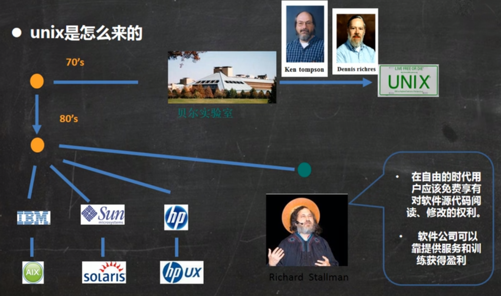

## Linux

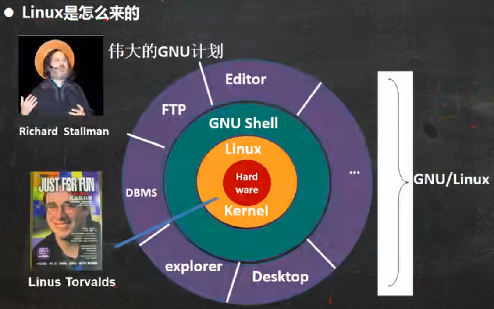

## Unix to Linux

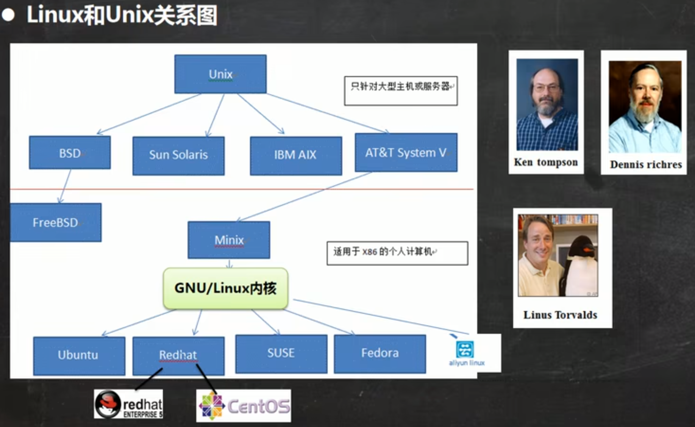

# 目录结构

在Linux的世界里，一切皆文件。

## 常见目录

- `/`：根目录
- `/bin`(`/usr/bin`， `/usr/local/bin`)：存放常用命令
- `/sbin`(`/usr/sbin`， `/usr/local/sbin`)：Super User管理员的命令
- `/home`：普通用户的主目录
- `/root`：管理员的主目录
- `/lib`：动态链接库
- `/lost+found`：当系统非法关机后这里会存放一些文件，一般为空
- `/etc`：配置文件
- `/usr`：应用程序
- `/boot`：启动文件
- `/proc`， `/srv`， `/sys`：系统相关的文件
- `/tmp`：临时文件
- `/dev`：类似设备管理器，对应硬件
- `/media`：U盘、光驱等
- `/mnt`：挂载别的文件系统
- `/var`：存放一些经常修改的内容，比如日志

# Vim

## 三种模式

- 一般模式：用vim打开一个文件后就是一般模式，在此模式下可以使用复制、粘贴、删除整行等功能。
- 插入模式：在一般模式下输入`i`即可进入插入模式，在此模式下对文件进行编辑。
- 命令行模式：在插入模式下，先按`esc`键退出插入模式，然后输入`:`即可进入命令行模式（在一般模式下直接输入`:`即可），在此模式下可以进行保存、退出、设置显示行号等操作。

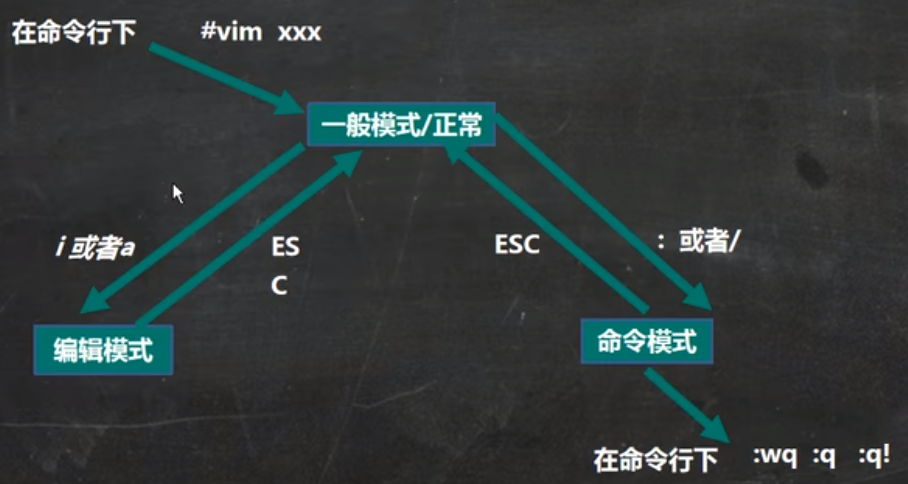

## Vim快捷键

- 复制当前行：`yy`
- 向下复制n行：`nyy`
- 粘贴：`p`
- 删除当前行：`dd`
- 向下删除n行：`ndd`
- 查找关键词： `/keyword`
- 定位首行：`gg`
- 定位第n行：`ngg`
- 定位末行： `G`
- 撤销：`u`
- 显示/不显示行号：`set nu/nonu`

# 关机重启

## 关机

最常用的关机命令是shutdown，用法如下：
`shutdown -h now` 马上关机
`shutdown -h 5` 5分钟后关机
`shutdown -r now` 马上重启
除了`shutdown`之外这几个命令也可以关机，但有细微区别：`halt`，`poweroff`，`init 0`。

## 重启

`shutdown -r now` 或 `reboot`

## 同步

`sync`：把内存中的数据同步到磁盘
一般在关机或重启前应当先运行`sync`命令以防数据丢失，但目前`shutdown/reboot/halt`等命令在关机前均会先调用`sync`命令。

## 运行级别

0：关机
1：单用户（可在此模式下找回密码）
2：多用户，但没有网络服务
3：多用户，且有网络服务
4：系统保留
5：图形界面
6：系统重启
常用的运行级别是3和5，通过`init 0/1/2/3/4/5/6`指令可以切换运行级别。

# 用户管理

- 添加用户：`useradd -m username`（带`-m`参数以自动生成`/home/username`目录）
- 修改用户密码：`passwd username`
- 删除用户：`userdel (-r) username`（不带`-r`参数时删除用户但保留`/home/username`文件夹，带`-r`参数则连同文件夹一起删除）
- 查询用户信息：`id username`
- 切换用户：`su (-) username`（若不带`-`仅切换用户，带`-`同时将当前目录切换到`/home/username`）
- 新增用户组：`groupadd groupname`
- 删除用户组：`groupdel groupname`
- 修改用户所属组：`usermod -g groupname username`（在添加用户时可以通过`-g`参数直接指定所属组，即 `useradd -g groupname username`，若没有指定组，则系统会自动新建一个和`username`同名的组）
- 相关文件：用户信息保存在/etc/passwd，密码信息保存在/etc/shadow，组的信息保存在/etc/group。

# 常用指令

## 文件目录指令

- `pwd`：显示当前目录的绝对路径
- `ls`：显示当前目录下的文件（带`-a`参数显示隐藏文件，带`-l`参数以列表形式显示）
- `mkdir (-p) dirname`：创建文件夹，带`-p`参数才能创建多级目录
- `rmdir dirname`：删除空目录
- `rm -rf dirname`：删除非空目录
- `touch filename`：创建一个空文件
- `cp (-r) source dest`：拷贝文件(`-r`参数表示递归)
- `mv source/oldName dest/newName`：移动文件或者重命名文件
- `cat (-n) filename`：以只读方式查看文件（带`-n`参数显示行号）
- `less filename`：按页显示文件内容，适合用来查看较大的文件
- `echo`：输出内容到terminal，例如`echo \$PATH`查看环境变量
- `tail filename`：显示文件末尾10行 `tail -f filename`：实时监控文件内容更新
- `>`和`>>`：输出重定向，将本该输出到terminal的内容写入文件，例如`echo 'something' > filename`。 区别在于`>`是覆盖，`>>`是追加。
- `ln -s source dest`：创建软链接
- `history`：查看执行过的指令

## 时间日期指令

`date`：显示时间日期信息，也可通过添加参数格式化输出
`cal`：显示本月日历

## 搜索查找指令

- `find dirname -name filename`：在`dirname`目录下查找`filename`文件，输出其路径
- `locate filename`：功能和`find`类似，也是输出`filename`文件的路径，但`locate`指令比`find`指令快得多，因为`locate`指令并不会真的扫描文件目录，而是在一个数据库中查找`filename`对应的路径。系统会每天自动更新该数据库，所以如果用`locate`指令查找刚刚创建的文件会找不到，或者查找刚刚删除的文件仍显示出删除前的路径。为避免这种情况，可以在`locate`前使用`updatedb`指令手动更新数据库。
- `which cmdname`：查看某个指令所在的路径，如`which ls`
- `grep`：搜索关键词，常和管道符号`|`一起使用，如`cat filename | grep keyword`

## 压缩解压指令

- `gzip`/`gunzip`：`gzip filename`压缩文件（只能压缩为`.gz`），`gunzip filename.gz`解压文件
- `zip`/`unzip`：`zip`常用选项`-r`递归压缩，`unzip`常用选项`-d`指定解压文件存放目录
- `tar`：压缩用`tar -zcvf filename.tar.gz files2zip`，解压用`tar -zxvf filename.tar.gz`

# 组管理和权限管理

## 组管理

在Linux中每个用户必须属于一个组，不能独立存在。对于Linux中的文件有所有者、所在组、其他组三个概念。通过`chown username filename`可以修改文件的所有者；通过`chgrp groupname filename` 可以修改文件所在组；通过`usermod -g groupname username`可以修改用户所属的组。

## rwx权限

当我们在某个路径下执行`ls -l`命令时，对于每个文件和目录，我们会得到类似下图所示的信息：

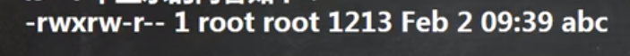

其中前10位（`-rwxrw-r--`）代表了该文件/目录的权限信息，具体含义如下：
- 第1位（`-`、`d`、`l`、`c`、`b`）表示文件类型：`-`代表普通文件，`d`表示目录，`l`表示链接，`c`表示字符设备文件（键盘、鼠标等），`b`表示块文件（硬盘等）。
- 第2~4位表示该文件/目录所有者的权限。
- 第5~7位表示该文件/目录所在组的权限。
- 第8~10位表示该文件/目录其他组的权限。
- 权限信息后的数字表示此目录下的子目录的个数（只算目录不算文件），如果是文件而非目录，则该数字为1。对于目录还需要注意，因为任何一个目录默认包含`./`和`../`两个子目录，因此对一个空文件夹，该数字为2。

文件的rwx权限：
`r`：可以读取，查看；
`w`：可以修改，但是不代表可以删除该文件，删除一个文件需要对该文件所在的目录拥有`w`权限；
`x`：可以被执行。

目录的rwx权限：
`r`：可以读取，即可以用`ls`查看内容；
`w`：可以修改，即可以在目录内创建、删除文件或者重命名目录；
`x`：可执行，即可以`cd`进入该目录。

rwx也可以用数字来表示（`r`=4， `w`=2， `x`=1），因此`rwx`=4+2+1=7。

## 修改rwx权限

`chmod`：修改文件或目录的权限，具体使用方法如下。
通过`u`(所有者)、`g`(所在组)、`o`(其他用户)、`a`(所有用户)和`+`、`-`、`=`组合的方式修改权限。例如：`chmod u=rwx，g=rx，o=r filename/dirname`， `chmod u+x filename/dirname`等。
通过数字修改权限。前文已经提到过，rwx也可以用数字来表示（r=4， w=2，
x=1）。因此， `chmod u=rwx，g=rx，o=r filename/dirname`也可以写成 `chmod 754 filename/dirname`。

## 修改所有者和所在组

修改所有者：`chown newowner filename/dirname`
修改所有者和所在组：`chown newowner:newgroup filename/dirname`
修改所在组：`chgrp newgroup filename/dirname`

# 定时任务调度

## `crond`任务调度

基本语法：`crontab [option]`
`-e`：编辑crontab定时任务
`-l`：列出crontab任务
`-r`：删除当前用户的所有crontab任务
时间格式：`m`(minute) `h`(hour) `dom`(dayOfMonth) `mon`(month) `dow`(dayOfWeek)

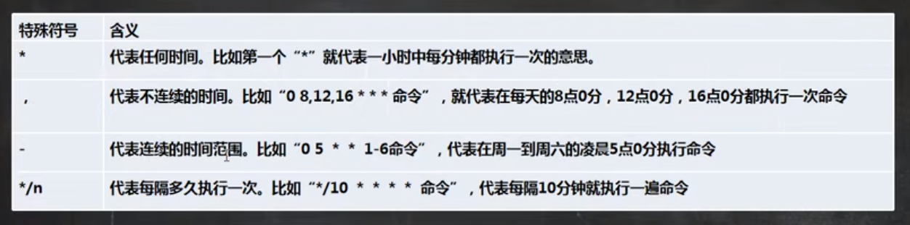

使用`crond`定时执行脚本时，要确认对该脚本有执行权限。
重启`crond`服务：`service crond restart`

## `at`定时任务

`at`指令是一次性定时任务，执行完一次后便不再执行。`at`的守护进程`atd`会以后台模式运行，默认情况下`atd`守护进程每60s检查一次作业队列。在使用`at`指令时，一定要保证`atd`进程已启动。
at命令格式：`at [option] [time]`

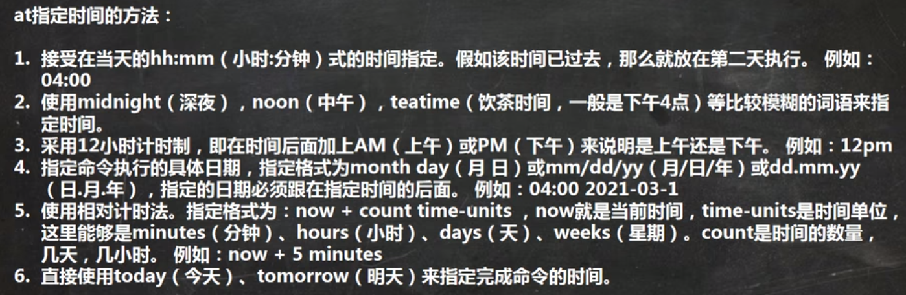

用`atq`命令可以查看还未执行的任务，用`atrm+任务编号`可以删除任务。

# 磁盘和分区

## 分区

Linux的文件目录结构是独立且唯一的，比如只有一个根目录`/`，在根目录下面有一些必须的目录等。Linux通过“载入”的方式将磁盘的一个分区和一个目录联系起来，这个目录就叫这个分区的挂载点。

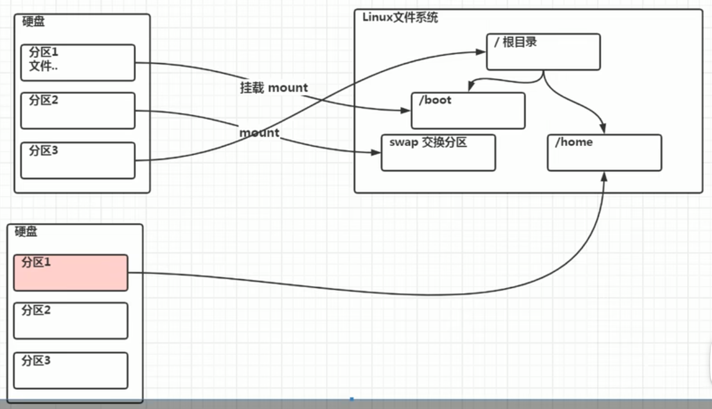

- Linux硬盘分为IDE硬盘和SCSI硬盘，目前基本是SCSI硬盘。
- 对于IDE硬盘，驱动器标识符为`hdx~`。其中`hd`表示IDE硬盘；`x`为盘号（`a`为基本盘，`b`为基本从属盘，`c`为辅助主盘，`d`为辅助从属盘）；`~`表示分区，前四个分区用数字1到4表示，他们是主分区或扩展分区，从5开始是逻辑分区。例如：`hda3`，`hdb2`。
- SCSI硬盘的驱动器标识符格式为`sdx~` ，其中`sd`表示SCSI硬盘，其余部分的含义与IDE硬盘相同。
- 查看设备挂载情况：`lsblk` 或 `lsblk -f`（可以显示UUID）

## 增加硬盘并挂载

- 磁盘分区：`fdisk /dev/sdx`（根据实际情况看是`sdb`还是`sdc`还是`sdd`等等），在分区最后需要输入`w`使分区生效
- 格式化分区：`mkfs -t ext4 /dev/sdx~`
- 挂载：`mount [分区名称] [挂载点]`，例如 `mount /dev/sdb1 /newdisk`
- 卸载：`umount [分区名称]` 或 `umount [挂载点]`
注意，使用`mount`挂载的分区重启后会失效，如果需要开机时自动挂载，需要修改`/etc/fstab`文件。

## 磁盘查询

- 查询系统磁盘整体使用情况：`df -h`
- 查询某个文件或某个目录的磁盘使用情况：`du -h filename/dirname`
- 用树状形式显示目录结构：`tree dirname`

# 网络配置

- 查看网络配置信息：`ifconfig`
- 测试主机之间网络连通性：`ping 目的主机`
- 配置静态IP：修改`/etc/netplan/01-network-manager-all.yaml`文件

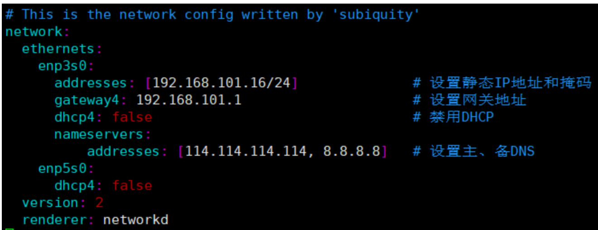

修改完之后用`sudo netplan apply`应用网络配置。
- 查看当前主机名：`hostname`
- 修改主机名：编辑`/etc/hostname`文件
- 设置hosts映射： 编辑`/etc/hosts`文件

# 进程管理

## 基础

- 查看进程信息：`ps -aux` 或 `ps -ef`（显示内容略有不同）
- 通过pid终止进程：`kill [-9] pid`（选项`-9`表示强制终止，可以不带）
- 通过进程名终止进程：`killall 进程名`（支持通配符）
- 查看进程树：`pstree [-pu]`（选项`p`表示显示进程的pid，选项`u`表示显示进程的所属用户）

## 服务管理

- 定义：服务（service）本质上就是进程，但是是运行在后台的，通常会监听某个端口，等待其他程序的请求，因此又称为守护进程，比如`mysqld`、`sshd`、防火墙等。
- 服务管理指令：`service serviceName start|stop|restart|reload|status`
- 查看系统运行级别(runlevel)：`systemctl get-default`
- 设置系统运行级别： `systemctl set-default TARGET.target`。常用的运行级别是3（`multi-user.target`）和5（`graphical.target`）。
- `chkconfig`指令：设置某个服务在某个运行级别是否自启动。 `chkconfig --list` 查看`chkconfig`管理的服务。`chkconfig --level 3/5 serviceName on/off`设置某服务在3/5运行级别下是否自启动。通过`chkconfig`设置后需要重启才能生效。
- 除了`service`指令外，其实更多的服务是通过`systemctl`指令进行管理的，相关的命令如下：
`systemctl start|stop|restart|status serviceName` 启动/停止/重启/查看某服务
`systemctl list-unit-files` 查看所有服务的自启动设置
`systemctl enable serviceName` 设置某服务为开机自启动
`systemctl disable serviceName` 关闭某服务开机自启动
`systemctl is-enabled serviceName` 查询某服务是否是开机自启动
- 打开或关闭指定的端口（`firewall`指令）
`firewall-cmd --permanent --add-port=port/protocol` 打开端口
`firewall-cmd --permanent --remove-port=port/protocol` 关闭端口
`firewall-cmd --reload` 打开或关闭端口后，`reload`以使其生效
`firewall-cmd --query-port=port/protocol` 查询某端口是否打开
- 在ubuntu系统中，默认的防火墙软件是`ufw`，因此通过`ufw`指令来管理端口，常用指令如下：
`ufw enable` 启动ufw
`ufw disable` 停止ufw
`ufw status` 查询ufw状态
`ufw allow port/protocol` 打开端口（由于`ufw`默认配置了一些常用协议对应的端口，因此也可以只写`port`或者`protocol`）
`ufw deny port/protocol` 关闭端口
`ufw delete allow/deny port/protocol` 删除打开/关闭某个端口的规则
- `top`命令和`ps`命令类似，都是用来查看进程信息，但`top`命令显示的信息可以每隔一段时间自动更新，常用用法如下：
`top -d 5` 每隔5秒自动更新，如果不带数字直接top -d则默认每隔3秒更新
`top -i` 不显示`idel`和`zombie`进程
`top -p pid` 通过指定pid来单独监控某个进程
- `top`交互操作
输入P：按CPU占用率排序
输入M：按内存占用率排序
输入N：按PID排序
输入u，然后输入用户名：按用户查看进程
输入k，然后输入PID，然后输入9：kill某个进程
输入q：退出top
- `netstat -anp` 查看系统的网络连接情况

# 软件包管理

- rpm包：SUSE、RedHat、CentOS等采用
`rpm -qa` 查询安装的全部rpm包
`rpm -q pkgName` 查询是否安装了某个软件包
`rpm -qi pkgName` 查询某个软件包的详细信息
`rpm -qf path` 查询某个文件所属的软件包
`rpm -e pkgName` 卸载rpm包
`rpm -ivh pkgPath` 安装rpm包
- yum：rpm软件包的包管理器，能够从指定的服务器自动下载rpm包并安装，而且自动处理依赖关系。

# Shell编程

## Shell入门

Shell是一个命令解释器，它为用户提供了一个向Linux内核发送请求以便运行程序的界面系统级程序，用户可以通过Shell来启动、挂起、停止甚至是编写一些程序。

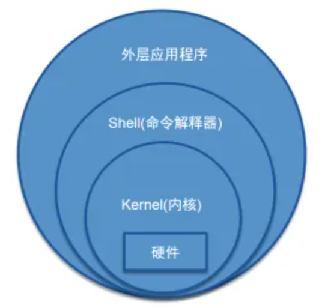

Shell脚本以`#!/bin/bash`开头，以指明使用的Shell。当直接执行脚本时，需要先给脚本赋予执行权限，当使用`sh`执行时则不用赋予执行权限。

## Shell变量

- Linux Shell中的变量分为系统变量和用户自定义变量，常见的系统变量如`#HOME`，`#SHELL`，`#USER`，`#PATH`等，使用`set`命令可以查看所有的系统变量。
- 自定义变量
定义变量：`变量名=值`（注意`=`前后不能有空格）
撤销变量：`unset 变量名`
声明静态变量：`readonly 变量名=值`（静态变量不能被`unset`）
- 变量名称可以由字母、数字和下划线组成，但不能以数字开头；变量名称一般习惯大写。
- 将命令的返回值赋给变量：使用反引号（例如``A=`date` ``）或使用`$()`（例如`A=$(date)`）。

## 设置环境变量

- `export VarName=Value`：将Shell变量输出为环境变量/全局变量\
- `source configFile`：使修改后的环境变量生效\
- `echo $Var`：查询某个环境变量的值
- Shell脚本中多行注释的写法：`:<<! your code !`

## 位置参数变量

当一个Shell脚本需要从外部获取参数时，需要用到位置参数变量，例如`./myshell.sh 100 200`，相关用法如下：
- `$n`：`n`为数字，`$0`为命令本身，`$1`~`$9`代表第一到第九个参数，第十个及以后的参数需要用大括号包含，比如`${10}`。
- `$*`：代表所有的参数，当直接使用`$*`时，每个参数独立；当被双引号包围，即`"$*"`时，全部参数作为一个整体。
- `$@`：代表全部参数，不论是否使用双引号每个参数始终独立。
- `$#`：代表参数的个数。

## 预定义变量

预定义变量是Shell语言预先定义好的变量，可以在Shell脚本中直接使用。常用的预定义变量如下：
- `$$`：获取当前进程的PID。
- `$!`：获取后台运行的最后一个进程的PID。
- `$?`：获取最后一次执行的命令的执行结果，若为0表示命令正确执行，若为非0值表示命令没有正确执行，可以结合C++中函数最后的`return 0`来理解。

## 运算符与表达式

Shell中进行算数运算有下面三种写法：
- `$((expr))` 注意必须要用两层括号把表达式包起来，例如`$(((2+3)*4))`。
- `$[expr]` 中括号里面可以使用小括号，但是最外层需要用中括号包起来，例如`$[(2+3)*4]`。
- `expr m + n` 采用这种方式运算符前后必须有空格；如果要将计算结果赋给一个变量需要将整个表达式用反引号` `` `包起来，包括`expr`本身；可用运算符有加`+`减`-`乘`\*`除`/`和取余`%`，注意乘号要用转义符。举例：``RES=`expr 2 + 3` ``。

## 条件判断

- 基本语法：
```Shell
if [ condition ]
then
some code...
elif [ condition ]
then
some code...
fi
```
注意中括号里面condition前后必须有空格。
- 字符串比较用`=`，例如：`if [ "ok" = "ok" ]`
- 两个整数比较：`-lt` 小于 &emsp; `-le` 小于等于 &emsp; `-eq` 等于 &emsp; `-gt` 大于 &emsp; `-ge` 大于等于 &emsp; `-ne` 不等于
例如：`if [ 20 -ge 23 ]`
- 判断文件权限：`-r` 有读权限 &emsp; `-w` 有写权限 &emsp; `-x` 有执行权限
例如：`if [ -w abc.txt ]`
- 判断文件是否存在：`-f` 文件存在且是一个普通文件 &emsp; `-e` 文件存在 &emsp; `-d` 文件存在且是一个目录
例如：`if [ -f abc.txt ]`

## case语句

```Shell
case $Var in
"Value1")
some code...
;;
"Value2")
some code...
;;
......
*)
some code...
;;
esac
```

## for循环

- 语法一
```Shell
for Var in Value1 Value2 Value3...
do
some code...
done
```
- 语法二(类似C++写法)
```Shell
for ((iniValue;condition;update))
do
some code...
done
```

## while循环
```Shell
while [ condition ]
do
some code...
done
```
注意condition前后必须有空格

## read获取输入

- 基本语法：`read OPTION PARAM`
- OPTION:
`-p`：指定读取输入时的提示信息
`-t`：指定读取输入时的等待时间，超过此时间则不再等待
- PARAM：指定一个变量名，将读取值赋给此变量。

## 系统函数

- `basename PATH SUFFIX` 获取文件名
举例：`basename /home/tom/test.txt` → `test.txt`
    `basename /home/tom/test.txt .txt` → `test`

- `dirname PATH` 返回文件路径最后一个/前面的部分
举例：`dirname /home/tom/test.txt` → `/home/tom`

## 自定义函数

```Shell
funcName(){
some code...
return int （这句也可以不写）
}
```
调用函数：`funcName Param1 Param2...`

# 日志管理

- 系统的日志文件主要放在`/var/log`目录。
- 日志管理服务：`rsyslog`。 
查询`rsyslog`是否启动：`systemctl status rsyslog`
查询`rsyslog`自启动设置：`systemctl list-unit-files | grep rsyslog`
- `rsyslog`服务的配置文件在`/etc/rsyslog.d/50-default.conf`，在该文件中可以设置需要记录的日志和该日志对应的日志文件，用户也可以仿照该形式自定义想要记录的日志。
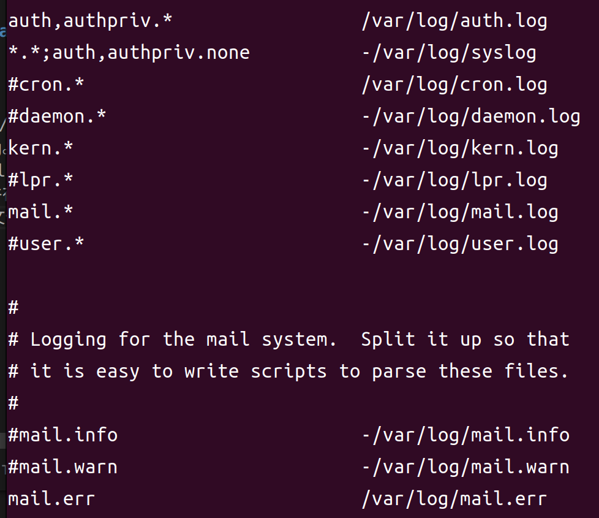
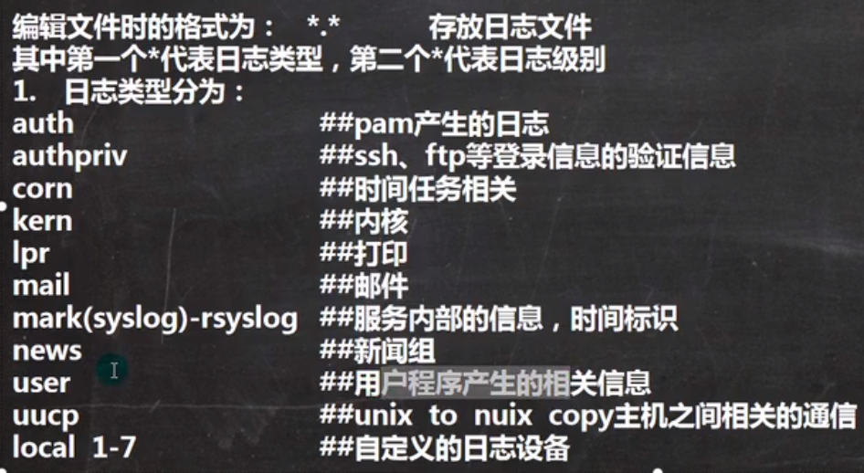
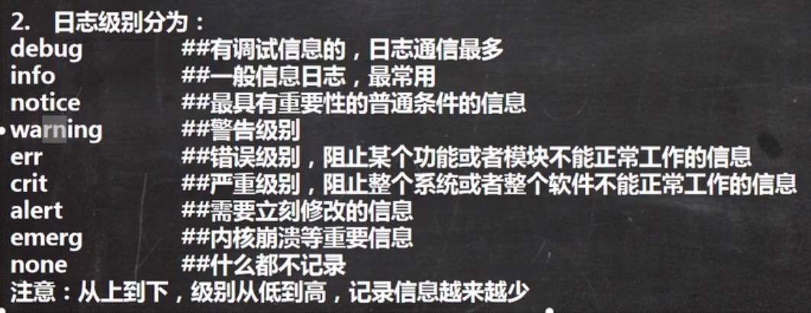

- 日志轮替：对于某一项日志，每隔一段时间或当日志文件达到指定大小时自动建立新的日志文件，便于管理和查看。Linux中使用`logrotate`服务来自动实现这一功能，其配置文件在`/etc/logrotate.conf`和`/etc/logrotate.d/*`。

# 备份与恢复

- 方式一：把需要备份的文件用`tar`命令打包，需要恢复的时候解压覆盖即可。
- 方式二：使用`dump`和`restore`命令。
`dump`命令语法：`dump [options]`，常用选项如下：

restore命令语法：`restore [mode] -f filename`，总共有4 种模式。
`-C`：对比模式，将备份文件与已存在的文件进行对比；
`-i`：交互模式，在还原备份文件时询问用户；
`-r`：还原模式；
`-t`：查看模式，查看备份文件中有哪些文件。

# Linux可视化管理工具

webmin和bt（宝塔）。
