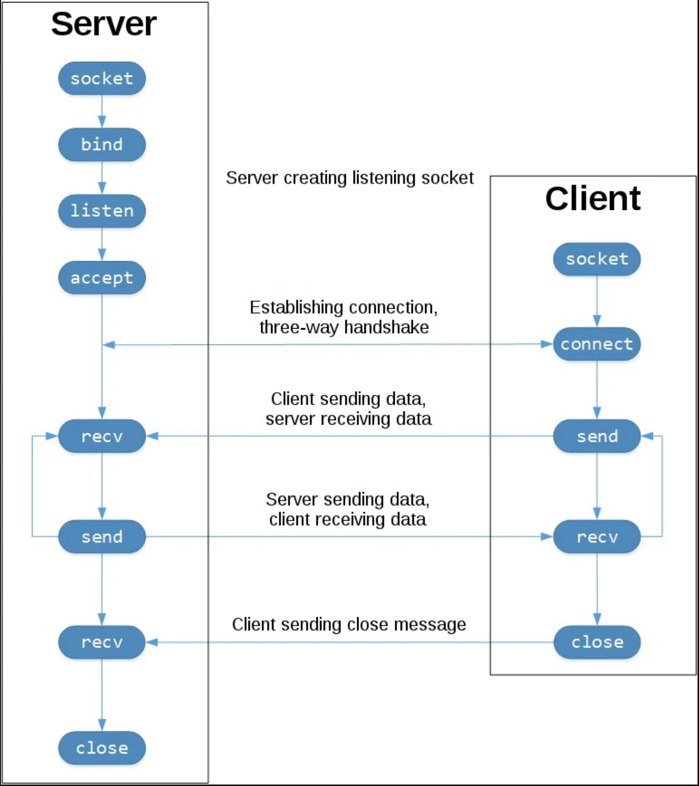
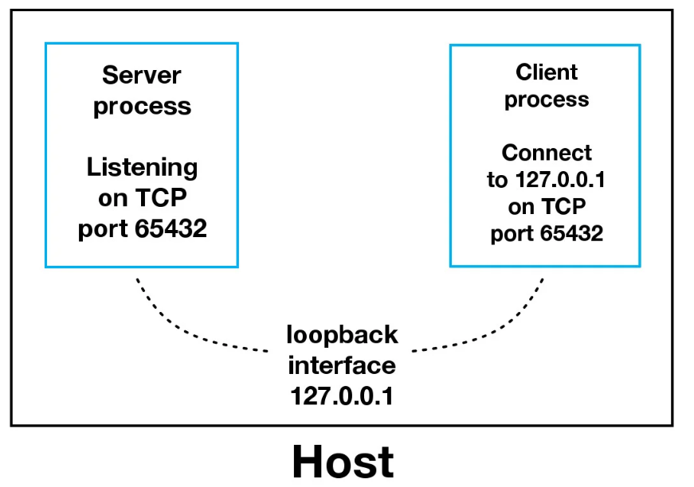
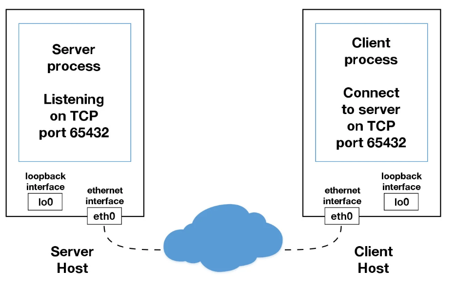
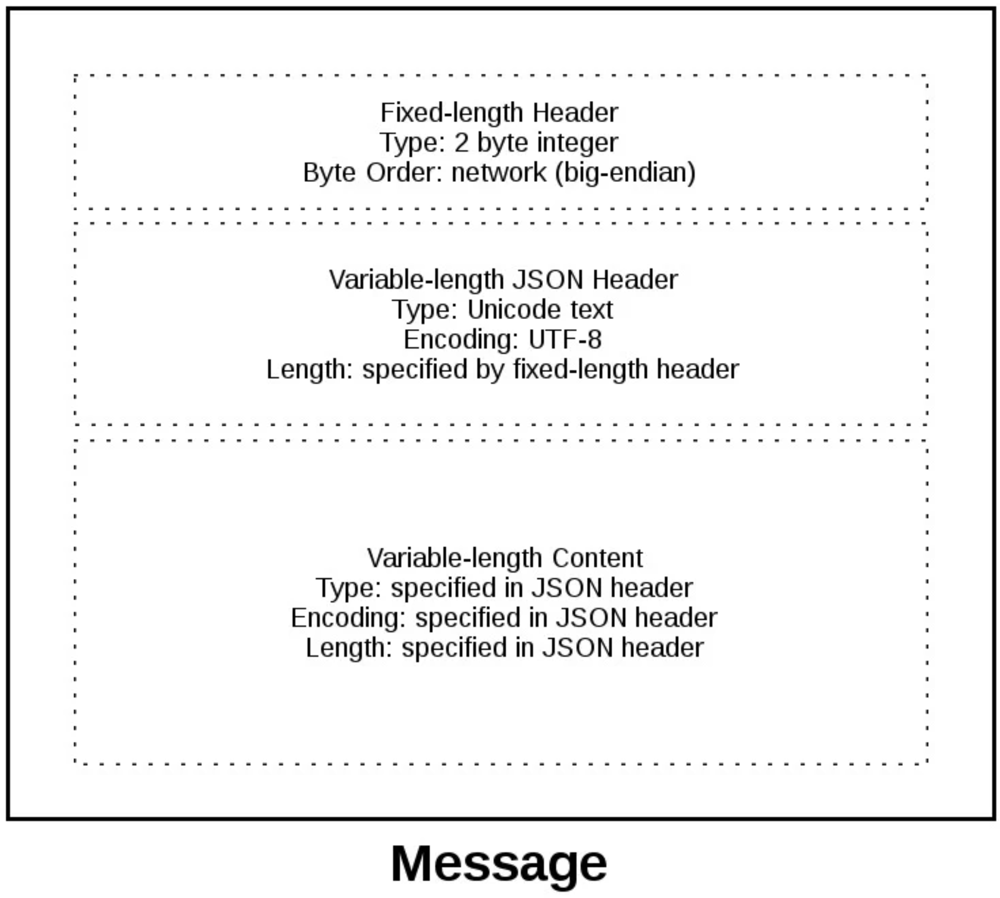

- [Socket Programming in Python](#socket-programming-in-python)
  - [Socket API Overview](#socket-api-overview)
  - [TCP Sockets](#tcp-sockets)
  - [Echo Client and Server](#echo-client-and-server)
    - [Echo Server](#echo-server)
    - [Echo Client](#echo-client)
    - [Viewing Socket State](#viewing-socket-state)
  - [Communication Breakdown](#communication-breakdown)
  - [Handling Multiple Connections](#handling-multiple-connections)
  - [Multi-Connection Client and Server](#multi-connection-client-and-server)
    - [Multi-Connection Server](#multi-connection-server)
    - [Multi-Connection Client](#multi-connection-client)
    - [Running the Multi-Connection Client and Server](#running-the-multi-connection-client-and-server)
  - [Application Client and Server](#application-client-and-server)
    - [Application Protocol Header](#application-protocol-header)
    - [Sending an Application Message](#sending-an-application-message)
    - [Application Message Class](#application-message-class)
      - [Message Entry Point](#message-entry-point)
      - [Server Main Script](#server-main-script)
      - [Server Message Class](#server-message-class)
      - [Client Main Script](#client-main-script)
      - [Client Message Class](#client-message-class)
      - [Message Class Wrapup](#message-class-wrapup)
    - [Running the Application Client and Server](#running-the-application-client-and-server)
  - [TroubleShooting](#troubleshooting)
    - [`ping`](#ping)
    - [`netstat`](#netstat)
    - [Wireshark](#wireshark)

# Socket Programming in Python

## Socket API Overview
在Python中进行socket编程需要用到的模块是`socket`，常用的方法有：
- `socket()` 创建socket
- `.bind()` 绑定IP和端口（服务端）
- `.listen()` 监听（服务端）
- `.accept()` 等待连接（服务端）
- `.connect()` 发起TCP连接（客户端）
- `.connect_ex()` connect()的扩展版，如有问题返回错误码而不是异常（客户端）
- `.send()` 发送TCP消息
- `.receive()` 接收TCP消息
- `.close()` 关闭socket

## TCP Sockets
socket类型：`socket.SOCK_STREAM` (TCP)，`socket.SOCK_DGRAM` (UDP)。



## Echo Client and Server

### Echo Server
完整代码见 [echo-server.py](scripts/echo-server.py)，下面仅对部分代码加以解释。

```Python
with socket.socket(socket.AF_INET, socket.SOCK_STREAM) as s:
```

`socket`对象支持`with`语句，从而可以不用在最后手动调用`s.close()`来关闭socket。`socket.socket()`中的两个参数分别表示地址族和socket类型，`socket.AF_INET`表示TCP/IP-IPv4，`socket.SOCK_STREAM`表示TCP连接。类似地，TCP/IP-IPv6是`socket.AF_INET6`，UDP是`socket.SOCK_DGRAM`。

```Python
s.bind((HOST, PORT))
```

因为之前指定了`socket.AF_INET`，因此此处`bind`函数的参数为`(HOST, PORT)`的形式，其中`HOST`既可以是域名字符串也可以是IPv4格式的IP地址。但需要注意的是，如果`HOST`使用域名字符串，会由于每次DNS解析结果的不同，导致每次实际连接的IP不同。

```Python
conn, addr = s.accept()
```

`.accept()`方法将会阻塞程序等待客户端连接，当有客户端连接时，此方法将返回一个新的socket对象`conn`和一个包含客户端地址信息的元组`addr`。注意，这里的`conn`是一个由`.accept`返回用来和客户端通信的新的socket对象，和`s.listen()`中的`s`不是一回事。至于`addr`，对于IPv4连接是`(host, port)`格式，对于IPv6连接是`(host, port, flowinfo, scopeid)`格式。

### Echo Client
结合上面对echo-server的解释，echo-client非常容易理解，此处不再赘述。

### Viewing Socket State
通过`netstat`命令可以看到socket的状态，比如在Linux系统运行echo-server后通过`netstat`可以得到如下图所示输出：

```Shell
$ netstat -an | grep 65432
Proto Recv-Q Send-Q Local Address      Foreign Address    State
tcp        0      0 127.0.0.1:65432    0.0.0.0:*          LISTEN
```

在运行echo-client时，常见的一个报错信息是：

```Shell
$ python echo-client.py 
Traceback (most recent call last):
  File "./echo-client.py", line 9, in <module>
    s.connect((HOST, PORT))
ConnectionRefusedError: [Errno 61] Connection refused
```

这可能是因为echo-client的端口设置错误，或者echo-server未启动，或者连接被防火墙阻止。

## Communication Breakdown



在上面的例子中，我们在server端将IP设为127.0.0.1，即本地环回地址，这意味着它只能接受来自本机内部的连接而与外部网络隔离。



上图显示的是我们的服务端和客户端不在同一台设备上，通过以太网进行通信的情况。

## Handling Multiple Connections

- 在之前的例子中，我们使用了`s.recv(1024)`来接收数据，其中的1024表示一次最多能接收1024个字节。类似地，`.send()`方法也不一定能一次性把数据全部发送完，因此它的返回值是发出的字节个数，开发者需要自己检查数据是否全部发送成功，如有必要可以多次调用`.send()`来发完数据（`.sendall()`本质上就是这样做的）。
- 同时，前面的例子中服务端和客户端也只能进行一对一的通信，而不能同时处理多个连接，因此我们需要引入异步IO。在Python中，异步IO常用的模块是`asyncio`。但为了使异步IO的过程在代码中体现得更加清晰明了，在本教程中我们将使用一种更传统的方法`.select()`，为此我们需要引入一个新的模块`selectors`。

## Multi-Connection Client and Server

### Multi-Connection Server

完整代码见 [multiconn-server.py](scripts/multiconn-server.py)，下面将按照先主要代码，再函数定义的顺序对部分代码进行解释。

```Python
lsock.setblocking(False)
sel.register(lsock, selectors.EVENT_READ, data=None)
```

与前面的echo server不同的是，在`.listen`之后调用了`.setblocking`来将`lsock`这个socket设为非阻塞模式。`sel.register()`将`lsock`注册为一个被`sel.select()`监控的socket。

```Python
while True:
    events = sel.select(timeout=None)
    for key, mask in events:
        if key.data is None:
            accept_wrapper(key.fileobj)
        else:
            service_connection(key, mask)
```

在这个event loop中，`sel.select()`阻塞等待，直到有socket准备好进行I/O操作，其返回值`events`是一个由tuple组成的列表，每一个tuple表示一个socket，包含`key`和`mask`。`key`是一个`SelectorKey namedtuple`，`key.fileobj`是一个socket对象。`mask`是一个event，即`selectors.EVENT_READ`或`selectors.EVENT_WRITE`。如果`key.data`为`None`，说明是一个监听到的新连接，通过`accept_wrapper()`函数接受该连接并注册到selector；如果`key.data`不为`None`，说明是一个已经接受的客户端socket，则通过`service_connection()`函数提供服务。

```Python
def accept_wrapper(sock):
    conn, addr = sock.accept()
    print(f"Accepted connection from {addr}")
    conn.setblocking(False)
    data = types.SimpleNamespace(addr=addr, inb=b"", outb=b"")
    events = selectors.EVENT_READ | selectors.EVENT_WRITE
    sel.register(conn, events, data=data)
```

在`accept_wrapper()`函数中，首先接受连接，然后同样将其设为非阻塞（*non-blocking*）模式，这一点非常重要，否则整个服务端都会被阻塞。然后同样使用`sel.register()`将其注册为一个受`sel.select()`监控的socket。这里我们把对方的IP地址作为了`data`，因此呼应了上文中“当`key.data`不为`None`时，说明是一个已经建立连接的socket”。

```Python
def service_connection(key, mask):
    sock = key.fileobj
    data = key.data
    if mask & selectors.EVENT_READ:
        recv_data = sock.recv(1024)
        if recv_data:
            data.outb += recv_data
        else:
            print(f"Closing connection to {data.addr}")
            sel.unregister(sock)
            sock.close()
    if mask & selectors.EVENT_WRITE:
        if data.outb:
            print(f"Echoing {data.outb!r} to {data.addr}")
            sent = sock.send(data.outb)
            data.outb = data.outb[sent:]
```

`service_connection`的功能比较明确，即读取或写入数据，socket对象和数据都在`key`中，需要进行的操作在`mask`中。读取数据时，将读取到的数据存到`data.outb`中。如果没有收到数据，说明客户端已经关闭了socket连接，服务端也只需要用`sel.unregister()`将这个socket从`sel.select()`注销（即不再监控），然后关闭socket即可。写入数据时，作为一个echo server，这里是将收到的数据原样返回。不要忘了，这里的`sock.send()`返回的其实是发出的字节数。

### Multi-Connection Client

完整代码见 [multiconn-client.py](scripts/multiconn-client.py)，下面仅对部分代码进行说明。

```Python
def start_connection(host, port, num_conns):
    server_addr = (host, port)
    for i in range(0, num_conns):
        connid = i + 1
        print(f"Start connection {connid} to {server_addr}")
        sock = socket.socket(socket.AF_INET, socket.SOCK_STREAM)
        sock.setblocking(False)
        sock.connect_ex(server_addr)
        events = selectors.EVENT_READ | selectors.EVENT_WRITE
        data = types.SimpleNamespace(connid=connid,
                                     msg_total=sum(len(m) for m in messages),
                                     recv_total=0,
                                     messages=messages.copy(),
                                     outb=b"")
        sel.register(sock, events, data=data)
```

在multiconn-client中，我们定义了一个函数`start_connection()`来发起socket连接，`num_conns`为发起的连接数，运行时在命令行输入。另外需要注意的是，这里使用了`connect_ex()`而不是`connect()`，这是因为`connect`用在多线程中会触发`BlockingIOError`，使用`connect_ex()`则可以避免这一问题。

```Python
def service_connection(key, mask):
    sock = key.fileobj
    data = key.data
    if mask & selectors.EVENT_READ:
        recv_data = sock.recv(1024)
        if recv_data:
            print(f"Received {recv_data!r} from connection {data.connid}")
            data.recv_total += len(recv_data)
        if not recv_data or data.recv_total == data.msg_total:
            print(f"Closing connection {data.connid}")
            sel.unregister(sock)
            sock.close()
    if mask & selectors.EVENT_WRITE:
        if not data.outb and data.messages:
            data.outb = data.messages.pop(0)
        if data.outb:
            print(f"Sending {data.outb!r} to connection {data.connid}")
            sent = sock.send(data.outb)
            data.outb = data.outb[sent:]
```

客户端的`service_connection()`函数与服务端类似，主要的不同是客户端会统计收到的数据字节数，当收到的数据量与发出的相等时关闭socket连接，从而服务端也会关闭连接。实际情况中，服务端不会像这样一直等待客户端关闭连接，而是会设置一个超时时间，只要超过这一时间没有收到客户端的请求就关闭与客户端的连接。

### Running the Multi-Connection Client and Server

运行multiconn-server：

```Shell
$ python3 multiconn-server.py 127.0.0.1 54321
Listening on ('127.0.0.1', 54321)
Accepted connection from ('127.0.0.1', 42852)
Accepted connection from ('127.0.0.1', 42856)
Echoing b'Message 1 from client.Message 2 from client.' to ('127.0.0.1', 42852)
Accepted connection from ('127.0.0.1', 42862)
Echoing b'Message 1 from client.Message 2 from client.' to ('127.0.0.1', 42856)
Closing connection to ('127.0.0.1', 42852)
Echoing b'Message 1 from client.Message 2 from client.' to ('127.0.0.1', 42862)
Closing connection to ('127.0.0.1', 42856)
Closing connection to ('127.0.0.1', 42862)
^C
Caught keyboard interrupt, exiting.
```

运行multiconn-client：

```Shell
$ python3 multiconn-client.py 127.0.0.1 54321 3
Start connection 1 to ('127.0.0.1', 54321)
Start connection 2 to ('127.0.0.1', 54321)
Start connection 3 to ('127.0.0.1', 54321)
Sending b'Message 1 from client.' to connection 1
Sending b'Message 1 from client.' to connection 2
Sending b'Message 1 from client.' to connection 3
Sending b'Message 2 from client.' to connection 1
Sending b'Message 2 from client.' to connection 2
Sending b'Message 2 from client.' to connection 3
Received b'Message 1 from client.Message 2 from client.' from connection 1
Closing connection 1
Received b'Message 1 from client.Message 2 from client.' from connection 2
Closing connection 2
Received b'Message 1 from client.Message 2 from client.' from connection 3
Closing connection 3
```

## Application Client and Server

在上述多连接的socket基础上，我们将进一步完善错误处理等内容，以实现完善的socket通信。从Python 3.3开始，socket相关的报错的异常类型均为`OSError`或其子类。除了报错以外，还有一类常见的问题是超时，也需要进行处理。

使用TCP socket发送和接收数据时，传递的都是原始字节，要将其转换为有效信息，就需要应用层协议来定义数据的格式。一种常见的方法是在要传递的有效信息前加上一段`header`，用来说明传递的信息的字节个数等，这样接收方就可以知道在header后再读取多少个字节并转换成有效信息。

对于多字节的数据，还存在Byte Endianess，即字节顺序的问题，不同类型的CPU的字节顺序可能不同。大端（Big Endian）存储高位优先，内存的最低位地址存储数据的最高位；小端（Little Endian）存储低位优先，内存的最低位地址存储数据的最低位。为了避免这个麻烦的问题，我们可以在header中使用`Unicode`并采用`UTF-8`编码。

### Application Protocol Header

现在来定义一个header，这个header是一个使用JSON序列化的Python字典，UTF-8编码。内容如下：

| 名称 | 描述 |
| :---: | :---: |
| `byteorder` | 本机的字节顺序（用`sys.byteorder`查看） |
| `content-length` | 数据内容的字节个数 |
| `content-type` | 数据内容的类型，比如`text/json`或`binary/my-binary-type` |
| `content-encoding` | 数据内容的编码方式，比如Unicode文本的`utf-8`和二进制数据的`binary` |

这样我们就定义了一个简单的header，数据接收方根据这个header就可以正确解码出收到的原始字节数据。由于header是一个字典，如果有必要，也完全可以在header中添加除了上述四条外更多的信息。

### Sending an Application Message

在上文中提到，header的长度是不定的，那么接收者在接收数据时如何知道接收多少个字节才是完整的header呢？为了解决这一问题，header前面会添加固定的两个字节来指明header的长度。因此一条完整的消息的格式是：两字节的header长度数据 + 长度不定的header + 在header中指明长度的消息内容，如图所示：



### Application Message Class

完整代码见 [app-client.py](scripts/app-client.py)，[app-server.py](scripts/app-server.py)，[libclient.py](scripts/libclient.py)，[libserver.py](scripts/libserver.py)。

在接下来的例子中，客户端将发起一个搜索请求，服务端执行查找并返回匹配结果。如果客户端发起的不是搜索请求，服务端则将其视为二进制请求并返回二进制响应。本例中客户端和服务端的大部分代码都与之前的多连接例子`multiconn-client`和`multiconn-server`类似，不同的是将会使用一个名叫`Message`的类来构建传输的消息，以实现对header和消息内容的读、写、处理等。

#### Message Entry Point

每一个实例化的`Message`对象，都与一个被selector监听的socket连接相关联：

```Python
#app-server.py

message = libserver.Message(sel, conn, addr)
sel.register(conn, selectors.EVENT_READ, data=message)
```

`sel.select()`监听到有socket连接收到数据时，调用`Message`类的`.process_events()`方法对message进行处理：

```Python
# app-server.py

events = sel.select(timeout=None)
for key, mask in events:
    if key.data is None:
        accept_wrapper(key.fileobj)
    else:
        message = key.data
        try:
            message.process_events(mask)
```

`.process.events()`方法的内容如下：

```Python
# libserver.py

def process_events(self, mask):
    if mask & selectors.EVENT_READ:
        self.read()
    if mask & selectors.EVENT_WRITE:
        self.write()
```

可以看到，`.process_events()`方法非常简单，只是选择执行读取还是写入操作。然后我们再来看一下`.read()`方法：

```Python
# libserver.py

def read(self):
    self._read()

    if self._jsonheader_len is None:
        self.process_protoheader()

    if self._jsonheader_len is not None:
        if self.jsonheader is None:
            self.process_jsonheader()

    if self.jsonheader:
        if self.request is None:
            self.process_request()
```

`.read()`方法首先调用`._read()`方法获取数据，然后按照上文所述的完整message的三个组成部分分别进行处理。
再来看看`.write()`方法：

```Python
# libserver.py

def write(self):
    if self.request:
        if not self.response_created:
            self.create_response()

    self._write()
```

`.write()`方法很简单，基本就是先调用`.create_response()`方法构造一个返回message，然后再调用`._write()`方法发送即可。
客户端版本的`.write()`方法与服务端类似，不同的是客户端在发送完数据后会将selector设置为只监听读取事件，因为客户端此时只关心从服务端返回的结果。

```Python
# libclient.py

def write(self):
    if not self._request_queued:
        self.queue_request()

    self._write()

    if self._request_queued:
        if not self._send_buffer:
            # Set selector to listen for read events, we're done writing.
            self._set_selector_events_mask("r")
```

#### Server Main Script

本节主要介绍 [app-server.py](scripts/app-server.py)的内容，与之前的`multiconn-server.py`重复的内容将不再赘述。首先的一个不同是多了一句`lsock.setsockopt(socket.SOL_SOCKET, socket.SO_REUSEADDR, 1)`，其作用注释已经说明，是为了避免`OSError: [Errno 48] Address already in use`。另外，在实例化`Message`对象并将socket注册到selector时：

```Python
# app-server.py

message = libserver.Message(sel, conn, addr)
sel.register(conn, selectors.EVENT_READ, data=message)
```

这里将selector设置为了只监听读取事件，在收到客户端的请求后，再将其变为只监听写入事件。这是因为在大多数情况下，一个正常的socket连接总是可写入的(writable)，如果监听写入事件将会频繁触发`sel.select()`，浪费资源。

#### Server Message Class

当服务端接收到至少两个字节时，便可以开始处理header中固定长度的部分（详见前文所述header的组成部分）：

```Python
# libserver.py

def process_protoheader(self):
    hdrlen = 2
    if len(self._recv_buffer) >= hdrlen:
        self._jsonheader_len = struct.unpack(
            ">H", self._recv_buffer[:hdrlen]
        )[0]
        self._recv_buffer = self._recv_buffer[hdrlen:]
```

header的前两个字节包含了后续的不定长JSON header的长度信息，我们将其解码出来存在`self._jsonheader_len`中，然后将这两个已经解码的字节从接收缓存中删掉。类似地，当接收到JSON header长度地字节数时，便可以开始处理JSON header:

```Python
# libserver.py

def process_jsonheader(self):
    hdrlen = self._jsonheader_len
    if len(self._recv_buffer) >= hdrlen:
        self.jsonheader = self._json_decode(
            self._recv_buffer[:hdrlen], "utf-8"
        )
        self._recv_buffer = self._recv_buffer[hdrlen:]
        for reqhdr in (
            "byteorder",
            "content-length",
            "content-type",
            "content-encoding",
        ):
            if reqhdr not in self.jsonheader:
                raise ValueError(f"Missing required header '{reqhdr}'.")
```

我们将JSON header解码转成一个字典存在`self.jsonheader`中，然后同样从接收缓存中去掉相应的字节数。最后便是真正的信息内容部分，其长度由JSON header中的`content-length`指定，当接收缓存接收到指定的字节数时，开始进行处理：

```Python
# libserver.py

def process_request(self):
    content_len = self.jsonheader["content-length"]
    if not len(self._recv_buffer) >= content_len:
        return
    data = self._recv_buffer[:content_len]
    self._recv_buffer = self._recv_buffer[content_len:]
    if self.jsonheader["content-type"] == "text/json":
        encoding = self.jsonheader["content-encoding"]
        self.request = self._json_decode(data, encoding)
        print(f"Received request {self.request!r} from {self.addr}")
    else:
        # Binary or unknown content-type
        self.request = data
        print(
            f"Received {self.jsonheader['content-type']} "
            f"request from {self.addr}"
        )
    # Set selector to listen for write events, we're done reading.
    self._set_selector_events_mask("w")
```

首先我们将相应的字节从接收缓存中取出来赋给变量`data`，然后根据内容的类型（这里只分了`text/json`和其他两种）分别进行处理。最后将selector从只监听读取事件改为只监听写入事件，因为此时我们已经完成了对请求的读取。当socket为可写入状态时，我们开始创建对客户端的响应消息：

```Python
# libserver.py

def create_response(self):
    if self.jsonheader["content-type"] == "text/json":
        response = self._create_response_json_content()
    else:
        # Binary or unknown content-type
        response = self._create_response_binary_content()
    message = self._create_message(**response)
    self.response_created = True
    self._send_buffer += message
```

这里我们根据收到的请求的消息类型调用不同的函数相应地创建了不同的相应信息，然后将flag变量`self.response_created`设为`True`并将创建好的响应信息加到发送缓存中，`._write`方法将负责发送响应消息并在发送完毕后关闭socket。至此，服务端的操作结束。

```Python
# libserver.py

def _write(self):
    if self._send_buffer:
        print(f"Sending {self._send_buffer!r} to {self.addr}")
        try:
            # Should be ready to write
            sent = self.sock.send(self._send_buffer)
        except BlockingIOError:
            # Resource temporarily unavailable (errno EWOULDBLOCK)
            pass
        else:
            self._send_buffer = self._send_buffer[sent:]
            # Close when the buffer is drained. The response has been sent.
            if sent and not self._send_buffer:
                self.close()
```

#### Client Main Script

首先，客户端运行时需要同时给予必要的参数：

```Shell
$ python app-client.py
Usage: app-client.py <host> <port> <action> <value>
```

然后`start_connection()`函数根据输入的参数发起socket连接：

```Python
# app-client.py

def start_connection(host, port, request):
    addr = (host, port)
    print(f"Starting connection to {addr}")
    sock = socket.socket(socket.AF_INET, socket.SOCK_STREAM)
    sock.setblocking(False)
    sock.connect_ex(addr)
    events = selectors.EVENT_READ | selectors.EVENT_WRITE
    message = libclient.Message(sel, sock, addr, request)
    sel.register(sock, events, data=message)
```

此时我们将selector设为同时监听读取和写入，因为我们的请求还未发送，发送完请求后基于同样的原因将会和服务端一样将selector设为只监听读取。

#### Client Message Class

首先，客户端需要将请求内容加上header构成完整的请求消息：

```Python
# libclient.py

def queue_request(self):
    content = self.request["content"]
    content_type = self.request["type"]
    content_encoding = self.request["encoding"]
    if content_type == "text/json":
        req = {
            "content_bytes": self._json_encode(content, content_encoding),
            "content_type": content_type,
            "content_encoding": content_encoding,
        }
    else:
        req = {
            "content_bytes": content,
            "content_type": content_type,
            "content_encoding": content_encoding,
        }
    message = self._create_message(**req)
    self._send_buffer += message
    self._request_queued = True
```

然后将flag变量`self._request_queued`设为`True`并将创建好的请求消息加到发送缓存中，`._write`方法将负责发送请求消息。接收和处理服务端返回的响应消息和上述服务端接收和处理客户端的请求消息非常类似，也是先处理两字节的固定长度header，然后处理JSON header，然后处理消息内容，不同的是在处理完响应消息后，不需要再发送任何东西，而是直接关闭socket，流程结束。

#### Message Class Wrapup

总结几个关于`Message`类需要注意的问题。首先，`Message`类如果出现报错都会被主程序中的`try except`语句捕获：

```Python
# app-client.py

try:
    while True:
        events = sel.select(timeout=1)
        for key, mask in events:
            message = key.data
            try:
                message.process_events(mask)
            except Exception:
                print(
                    f"Main: Error: Exception for {message.addr}:\n"
                    f"{traceback.format_exc()}"
                )
                message.close()
        # Check for a socket being monitored to continue.
        if not sel.get_map():
            break
except KeyboardInterrupt:
    print("Caught keyboard interrupt, exiting")
finally:
    sel.close()
```

尤其注意`message.close()`这一句，它保证了如果出现异常socket会被关闭并不再被selector监听。
`._read()`和`._write()`方法中也有需要注意的地方：

```Python
# libclient.py

def _read(self):
    try:
        # Should be ready to read
        data = self.sock.recv(4096)
    except BlockingIOError:
        # Resource temporarily unavailable (errno EWOULDBLOCK)
        pass
    else:
        if data:
            self._recv_buffer += data
        else:
            raise RuntimeError("Peer closed.")
```

注意这里的`except BlockingIOError:`和下一句`pass`，这是因为`BlockingIOError`是一个暂时性的异常，不需要进行任何处理，等待即可。

### Running the Application Client and Server

首先启动服务端：

```Shell
$ python app-server.py '' 65432
Listening on ('', 65432)
```

然后运行客户端：

```Shell
$ python app-client.py 10.0.1.1 65432 search morpheus
Starting connection to ('10.0.1.1', 65432)
Sending b'\x00d{"byteorder": "big", "content-type": "text/json", "content-encoding": "utf-8", "content-length": 41}{"action": "search", "value": "morpheus"}' to ('10.0.1.1', 65432)
Received response {'result': 'Follow the white rabbit. 🐰'} from ('10.0.1.1', 65432)
Got result: Follow the white rabbit. 🐰
Closing connection to ('10.0.1.1', 65432)
```

再来一次：

```Shell
$ python app-client.py 10.0.1.1 65432 search 🐶
Starting connection to ('10.0.1.1', 65432)
Sending b'\x00d{"byteorder": "big", "content-type": "text/json", "content-encoding": "utf-8", "content-length": 37}{"action": "search", "value": "\xf0\x9f\x90\xb6"}' to ('10.0.1.1', 65432)
Received response {'result': '🐾 Playing ball! 🏐'} from ('10.0.1.1', 65432)
Got result: 🐾 Playing ball! 🏐
Closing connection to ('10.0.1.1', 65432)
```

相应的服务端的输出为：

```Shell
Accepted connection from ('10.0.2.2', 55340)
Received request {'action': 'search', 'value': 'morpheus'} from ('10.0.2.2', 55340)
Sending b'\x00g{"byteorder": "little", "content-type": "text/json", "content-encoding": "utf-8", "content-length": 43}{"result": "Follow the white rabbit. \xf0\x9f\x90\xb0"}' to ('10.0.2.2', 55340)
Closing connection to ('10.0.2.2', 55340)

Accepted connection from ('10.0.2.2', 55338)
Received request {'action': 'search', 'value': '🐶'} from ('10.0.2.2', 55338)
Sending b'\x00g{"byteorder": "little", "content-type": "text/json", "content-encoding": "utf-8", "content-length": 37}{"result": "\xf0\x9f\x90\xbe Playing ball! \xf0\x9f\x8f\x90"}' to ('10.0.2.2', 55338)
Closing connection to ('10.0.2.2', 55338)
```

当`action`不为`search`时，根据`libserver.py`中的处理方式，只会打印出`content-type`并将收到的前10个字节返回给客户端。

客户端：

```Shell
$ python .\app-client.py 127.0.0.1 23333 test qwertyuiopa
Starting connection to ('127.0.0.1', 23333) ...
Sending b'\x00\x7f{"byteorder": "little", "content-type": "binary/custom-client-binary-type", "content-encoding": "binary", "content-length": 15}testqwertyuiopa' to ('127.0.0.1', 23333)

Received binary/custom-server-binary-type response from ('127.0.0.1', 23333)
Got response: b'First 10 bytes of request: testqwerty'
Closing connection to ('127.0.0.1', 23333)
```

服务端：

```Shell
$ python app-server.py 127.0.0.1 23333
Listening on ('127.0.0.1', 23333)
Accepted connection from ('127.0.0.1', 51043)
Received binary/custom-client-binary-type request from ('127.0.0.1', 51043)
Sending b'\x00\x7f{"byteorder": "little", "content-type": "binary/custom-server-binary-type", "content-encoding": "binary", "content-length": 37}First 10 bytes of request: testqwerty' to ('127.0.0.1', 51043)
Closing connection to ('127.0.0.1', 51043)
```

## TroubleShooting

### `ping`

`ping`命令通过发送ICMP请求检查一个终端是否连接到网络。

### `netstat`

前文中我们已经提到过用`netstat`来查看网络状态，值得注意的是，其输出中的`Recv-Q`和`Send-Q`表示的是缓存中待接收和发送的字节数。如果这个值非常大，说明存在异常。可能是遇到了CPU瓶颈，或者程序有bug导致没有调用`socket.recv()`和`socket.send()`来处理数据，或者网络拥堵等等。当这个值大到一定程度，将会触发报错。

### Wireshark

Wireshark是一个强大的网络分析和抓包工具，GUI版本叫Wireshark，终端版本叫TShark。