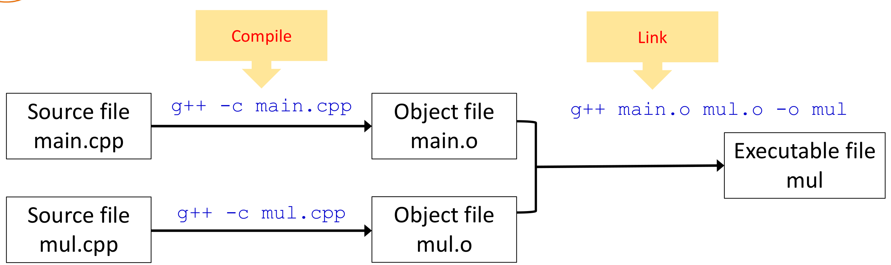
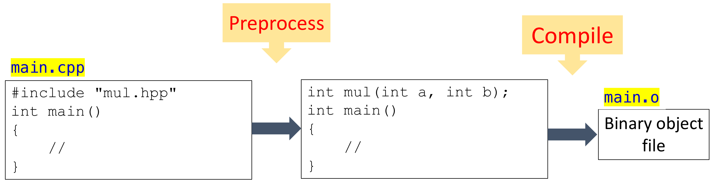
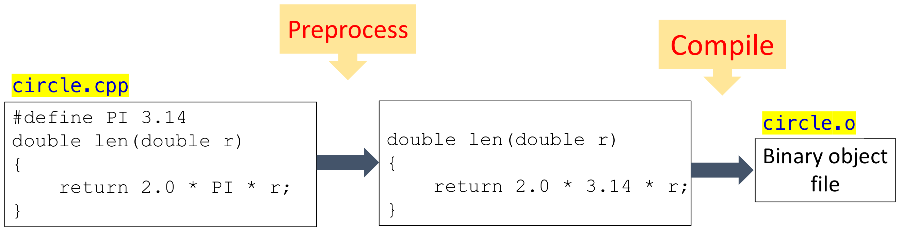
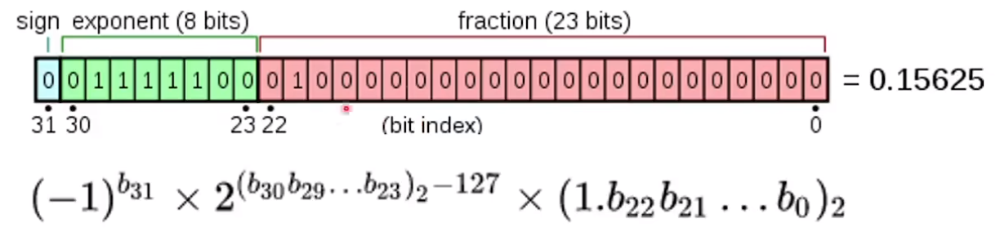
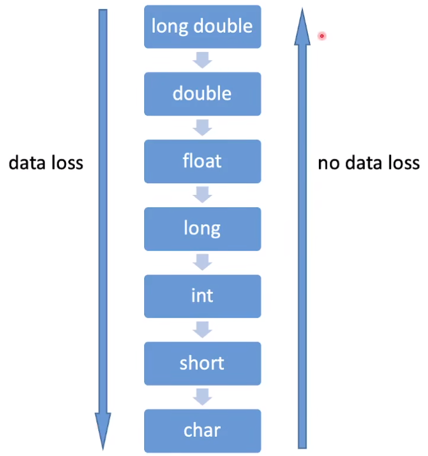

- [课程介绍](#课程介绍)
- [入门](#入门)
  - [一个简单的例子](#一个简单的例子)
  - [编译与链接](#编译与链接)
    - [函数原型与定义](#函数原型与定义)
  - [错误与调试](#错误与调试)
  - [预处理和宏](#预处理和宏)
    - [预处理 (Preprocessor)](#预处理-preprocessor)
    - [宏 (Macros)](#宏-macros)
  - [简单输入与输出](#简单输入与输出)
    - [C++风格的输出](#c风格的输出)
    - [C++风格的输入](#c风格的输入)
    - [C风格的输出](#c风格的输出-1)
    - [C风格的输入](#c风格的输入-1)
- [数据类型和算数运算符](#数据类型和算数运算符)
  - [整数](#整数)
    - [`int`](#int)
  - [其他整数类型](#其他整数类型)
    - [`char`](#char)
    - [`bool`](#bool)
    - [`size_t`](#size_t)
    - [固定位数整型](#固定位数整型)
  - [浮点数](#浮点数)
  - [算术运算符](#算术运算符)
    - [常量数值](#常量数值)
    - [`const`](#const)
    - [`auto`](#auto)
    - [算术操作符](#算术操作符)
    - [数据类型转换](#数据类型转换)
- [分支与循环语句](#分支与循环语句)
  - [`if`语句](#if语句)
  - [`? :`三目运算符](#-三目运算符)
  - [条件表达式](#条件表达式)
  - [`while`循环](#while循环)
  - [`for`循环](#for循环)
  - [`goto`语句](#goto语句)
  - [`switch`语句](#switch语句)
- [数据结构](#数据结构)
  - [Arrays](#arrays)
  - [Strings](#strings)
  - [Structures unions and enumerations](#structures-unions-and-enumerations)
  - [`typedef`](#typedef)
- [内存和指针](#内存和指针)
  - [Pointers](#pointers)
  - [Pointers and arrays](#pointers-and-arrays)
  - [Allocate memory in C style](#allocate-memory-in-c-style)
  - [Allocate memory in C++ style](#allocate-memory-in-c-style-1)
- [函数基础](#函数基础)
  - [Functions](#functions)
  - [Function parameters](#function-parameters)
  - [References](#references)
  - [`return` statement](#return-statement)
  - [`inline` function](#inline-function)
- [函数进阶](#函数进阶)
  - [Default arguments](#default-arguments)
  - [Function overloading](#function-overloading)
  - [Function templates](#function-templates)
  - [Function pointers and references](#function-pointers-and-references)
  - [Recursive functions](#recursive-functions)
- [程序加速](#程序加速)
  - [C and C++ with ARM](#c-and-c-with-arm)
  - [Speedup your program](#speedup-your-program)
  - [An example with SIMD and OpenMP](#an-example-with-simd-and-openmp)
  - [Avoid memory copy in OpenCV](#avoid-memory-copy-in-opencv)
- [类基础](#类基础)
  - [Classes and objects](#classes-and-objects)
  - [Constructors and destructors](#constructors-and-destructors)
  - [`this` pointer](#this-pointer)
  - [`const` and `static` members](#const-and-static-members)
- [类进阶](#类进阶)
  - [Operators in OpenCV](#operators-in-opencv)
  - [Operator overloading](#operator-overloading)
  - [Friend functions](#friend-functions)
  - [User defined type conversion](#user-defined-type-conversion)
  - [Increment and decrement operators](#increment-and-decrement-operators)
- [类的动态内存管理](#类的动态内存管理)
  - [Some default operations](#some-default-operations)
  - [An example with dynamic memory](#an-example-with-dynamic-memory)
  - [Solution1: Hard copy](#solution1-hard-copy)
  - [Solution2: Soft copy](#solution2-soft-copy)
  - [Smart pointers](#smart-pointers)
- [类的继承](#类的继承)
  - [Improve your source code](#improve-your-source-code)
  - [Derived class](#derived-class)
  - [Access control](#access-control)
  - [Virtual functions](#virtual-functions)
  - [Inheritance and dynamic memory allocation](#inheritance-and-dynamic-memory-allocation)
  - [Examples in opencv](#examples-in-opencv)
- [类模板和std库](#类模板和std库)
  - [Class template](#class-template)
  - [Template non-type parameters](#template-non-type-parameters)
  - [Class template specialization](#class-template-specialization)
  - [`std` classes](#std-classes)
- [错误处理](#错误处理)
  - [Standard output stream and standard error stream](#standard-output-stream-and-standard-error-stream)
  - [`assert`](#assert)
  - [Exceptions](#exceptions)
  - [More about exceptions](#more-about-exceptions)
  - [`nothrow`](#nothrow)
- [嵌套类和RTTI](#嵌套类和rtti)
  - [Friend classes](#friend-classes)
  - [Nested types](#nested-types)
  - [RTTI and type cast operators](#rtti-and-type-cast-operators)


# 课程介绍

GitHub Repo：[Programming in C/C++ Efficiently - GitHub](https://github.com/ShiqiYu/CPP)

# 入门

## 一个简单的例子

```C++
// the first example
#include <iostream>
#include <vector>
#include <string>

using namespace std;

int main()
{
    vector<string> msg {"Hello", "C++", "World", "!"};
    for (const string& word : msg)
    {
        cout << word << " ";
    }
    cout << endl;
}
```

- 编译hello.cpp  
  `g++ hello.cpp`
- 指定编译的标准  
  `g++ hello.cpp --std=c++11`
- 使用`-o`选项指定编译输出文件名  
  `g++ hello.cpp --std=c++11 -o hello`
- 执行  
  `./hello`

## 编译与链接

### 函数原型与定义

- 函数原型 (prototypes) 通常在头文件（*.h; *.hpp）  
  `int mul(int a, int b);`
- 函数定义 (definitions) 通常在源文件（*.c; *.cpp）  
  ```C++
  int mul(int a, int b)
  {
    return a * b;
  }
  ```

在[mainmul.cpp](./src/chapter1/mainmul.cpp)中，我们定义了两个函数，一个`mul`函数，一个`main`函数。可以预见，当程序非常庞大，函数非常多时，如果也像这样全部写在一个源文件里，编译将会非常耗时。因此我们可以将程序拆分成不同的部分存放在不同的文件里面，例如将`main`函数放在[main.cpp](./src/chapter1/main.cpp)，`mul`函数放在[mul.cpp](./src/chapter1/mul.cpp)，需要注意的是，我们还需要一个头文件[mul.hpp](./src/chapter1/mul.hpp)来存放`mul`函数的声明，并在main.cpp和mul.cpp中include这个头文件。对于这三个文件，编译和链接的过程如下：



首先，我们分别编译main.cpp和mul.cpp得到main.o和mul.o（`-c`选项表示只编译不链接），从Object文件（`*.o`）生成可执行文件的过程就叫链接，我们使用`-o`选项来从两个Object文件生成可执行文件。上述过程也可以只用一条命令来完成：`g++ main.cpp mul.cpp -o mul`。

## 错误与调试

- 编译错误 (Compilation errors)：编译环节出现错误，一般是因为源文件里存在语法错误；
- 链接错误 (Link errors)：每个源文件内部没有语法错误，编译成功，但是在链接时存在错误。例如上述main.cpp文件中我们调用了`mul`函数，如果我们在mul.cpp文件中不小心将函数名写成了`Mul`，就会出现链接错误，因为链接时找不到main.o需要的`mul`函数。链接错误的报错信息通常为"Undefined symbols..."或者"symbol(s) not found..."。
- 运行时错误 (Runtime errors)：编译和链接都成功，程序运行时出现了异常，比如除数为零。

## 预处理和宏

### 预处理 (Preprocessor)

- 预处理在编译之前运行，处理完以后编译器才开始编译，如下图所示；
  
- 预处理指令指的是程序中以`#`开头的语句，例如
  ```C++
  #include <iostream>

  #define PI 3.1415926535

  #if defined(_OPENMP)
  #include <omp.h>
  #endif
  ```
- 每条预处理指令只能占一行，超过一行用转义符连接；
- 预处理指令：`define`, `undef`, `include`, `if `, `ifdef`, `ifndef`, `else`, `elif`, `endif`, `line`, `error`, `pragma`.

### 宏 (Macros)

宏就是将一段代码替换为另一段代码，通过`#define`语句定义。例如我们程序中定义了`#define PI 3.1415926`，则在预处理时程序中所有的`PI`都会被替换成`3.1415926`，然后再交给编译器编译，如下图所示。

需要注意的是，这里的`PI`不能理解为变量，应该当作纯粹的文本替换。事实上，不仅可以将常量定义为宏，函数也可以定义为宏，例如`#define ADD(a, b) (a + b)`

## 简单输入与输出

### C++风格的输出

`cout`：`cout`是`std`命名空间`ostream`类型的对象，即`std::ostream cout；`。`<<`是一个运算符，表示将其后面的内容传递给前面的对象，例如`cout << "hello";`表示将`hello`传递给`cout`进行输出。`endl`表示一个换行符。

### C++风格的输入

`cin`：与`cout`类似，数据类型为`std::istream`，`>>`与`<<`也类似，例如`cin >> a;`表示将通过`cin`获取的数据传给变量`a`。

### C风格的输出

C使用`printf()`或者`fprintf()`进行输出，这两个都是函数，按照调用函数的方式使用即可，输出的内容可以使用`%d`、`%.2f`等进行格式化输出，例如`printf("Hello, value = %d\n", 100);`。

### C风格的输入

C风格的输入使用`scanf`，这也是一个函数，例如`scanf("%d", &a);`表示将输出的数据作为十进制整数赋给变量`a`。需要注意的是，这里的`a`前面必须加上`&`，表示取变量`a`的地址。

# 数据类型和算数运算符

## 整数

### `int`

- `int`：最常用的整数类型。  
  ```C++
  int i;  // 声明一个整数变量
  int j = 10;  // 声明并赋值
  ```
- 需要强调的是，务必要对变量进行初始化赋值，因为未初始化的变量在不同的平台不同的编译器编译出来的值是不同的，可能导致奇奇怪怪的问题，非常难以排查。初始化的方式有以下几种：
  ```C++
  int num;
  num = 10;    // 一定要赋值！

  int num = 10;

  int num (10);

  int num {10};
  ```
- 我们常用的`int`其实是`signed int`的缩写，通常是32位的（在个别比较老的设备上可能是16位的），所以能够表示的数的范围为$[-2^{31}, 2^{31}-1]$。如果只需要取正数，可以使用`unsigned int`，能够表示的范围为$[0, 2^{32}-1]$。除此之外，还有`short int`，`long int`，`long long`，但需要注意，C和C++的标准并没有对它们的位数做明确的规定，只规定了每种类型的最少位数，因此在不同的设备上可能有所不同。
- `sizeof`：通过`sizeof`我们可以获取一种数据类型或者一个变量所占的字节数。注意，`sizeof`不是一个函数，而是一个操作符 (operator)。  
  ```C++
    int i = 0;
    short s = 0;

    cout << "sizeof(i) = " << sizeof(i) << endl;
    cout << "sizeof(int) = " << sizeof(int) << endl;
    cout << "sizeof(s) = " << sizeof(s) << endl;
    cout << "sizeof(short) = " << sizeof(short) << endl;
    cout << "sizeof(long) = " << sizeof(long) << endl;
    cout << "sizeof(long long) = " << sizeof(long long) << endl;
  ```

## 其他整数类型

### `char`

本质上是个8位的整数，分为`signed char` $(-128\sim127)$和`unsigned char` $(0\sim255)$。至于`char`到底表示`signed char`还是`unsigned char`，标准并没有规定，在不同的平台上会有所不同。给`char`类型变量赋值时，我们既可以用字符，也可以直接用整数。同样的，对于`char`变量也可以以整数而非字符形式输出，只要在变量前加上加号`+`即可。另外，对于中文字符，我们需要采用Unicode编码，使用`char16_t`或`char32_t`。

```C++
char c1 = 'C';
char c2 = 80;  // 'P'
char c3 = 0x50;  // 'P'

cout << +c1;  // 67

char16_t c = u'码'；  // C++11
char32_t c = U'码';  // C++11
```

### `bool`

- `bool`是C++的数据类型，但不是C语言的数据类型。
- `bool`变量占1个字节，也就是8位，而不是1位。但取值范围只有`true`(1)和`false`(0)。
- 对于`bool`类型的变量来讲，其值只要不为0，都会被转成1。

```C++
bool b1 = true;  \\ 1
int i = b1;  \\ 1
bool b2 = -257;  \\ 1
```

- 在C语言中使用bool类型，主要有两种方式。一是使用`typedef`定义bool类型，二是使用C99标准引入的`stdbool.h`库。  
  ```C
  // use typedef to create a type
  typedef char bool;
  #define true 1
  #define false 0

  // use stdbool.h since C99
  #include <stdbool.h>
  ```

### `size_t`

- `size_t`也是一种整数类型，但一般用于表达内存大小或者元素的个数等场景。这是因为在进行申请内存等操作时，如果我们使用`int`来表示内存的大小，最大只能申请4Gb ($2^{32}$ bit)的内存，随着计算机的内存越来越大程序越来越复杂，`int`就不够用了。
- `size_t`是无符号整数，能够表示当前系统理论上能够支持的最大的任何类型对象的大小，`sizeof`的返回值就是`size_t`类型。

### 固定位数整型

从C++11开始，C++引入了`cstdint`库，定义了一些固定位数的整数类型，避免同样的类型在不同平台上位数不同导致的问题。例如`int8_t`，`int16_t`，`int32_t`，`int64_t`，`uint8_t`，`uint16_t`，`uint32_t`，`uint64_t`等。同时还定义了一些实用的宏，可以很方便地用来判断变量的范围，避免出现溢出。例如`INT8_MIN`，`INT16_MIN`，`INT32_MIN`，`INT64_MIN`，`INT8_MAX`，`INT16_MAX`，`INT32_MAX`，`INT64_MAX`。

## 浮点数

- 由于实数有无穷多个，而不管什么数据类型总是只能用有限的位数来表示，因此不可能准确地表示所有实数，只能在能表达的范围内取一个最接近的采样点来近似表示，这就是浮点数。因为浮点数并不是完全准确的，所以浮点数的计算总是存在微小的误差，这种误差是无法消除的，我们能做的只是管理好这些误差使它们尽量不明显影响计算的结果。
  ```C++
  float f1 = 1.2f;
  cout << fixed << setprecision(15) << f1;  // 1.200000047683716

  float f3 = 2.3E+9f;  // 2602300000000.000000000000000
  float f4 = f3 + 10;  // 2602300000000.000000000000000
  cout << "f3-f4= : " << (f3 - f4);  // 0.000000000000000
  ```
- `float`：单精度浮点数，32位，具体格式如下。
  
  `double`：双精度浮点数，64位。
  `long double`：扩展精度浮点数，如果平台支持128位则为128位，不支持则为64位。
  在深度学习中，由于涉及到海量的浮点运算，因此也采用一种用16位来表示的半精度浮点数，但不是C++标准。
- 对于两个浮点数相等与否的判断，由于浮点数都是近似的，所以不能用`==`来判断，而是计算两个数的差值，只要差值小于一个规定的阈值我们就认为两者相等。
  ```C++
  if (fabs(f1 - f2) < FLT_EPSILON)
  ```

- `inf`：无穷大。上图float格式中的exponent=11111111，fraction=0；
  `nan`：not a number。exponent=11111111，fraction!=0。

## 算术运算符

### 常量数值

- 正常写一个整数默认十进制，例如`95`；在前面加一个0表示八进制，例如`0137`表示八进制的95；前面加上0x表示十六进制，例如`0x5F`表示十六进制的95。
- 通过在数值后面加上特定的字符，我们可以指定数值为不同的数据类型。
  ```C++
  95  \\ int
  95u  \\ unsigned int
  95l  \\ long
  95ul  \\ unsigned long
  95lu  \\ unsigned long

  6.02e23L  \\ long double
  6.02e23f  \\ float
  6.02e23  \\ double
  ```

### `const`

`const`是一个类型限定符，使用`const`定义的变量必须在定义时就初始化，并且其值不能被修改，通常用来定义一些常量，可以替代宏定义。
```C++
const float PI = 3.1415926f;
```

### `auto`

`auto`是一个类型占位符（placeholder），可以让我们在定义变量时不直接指定变量的类型，而是根据变量初始化赋的值的数据类型来自动确定。
```C++
auto a = 2;  // int
auto b = 2.3;  // float
auto c;  // C允许这种写法，C++不允许
auto d = a * 1.2;  // double
```
注意，变量的类型一旦确定，后续就不会再改变，如果给变量赋的值和变量的数据类型不一致，可能会存在隐式的类型转换从而造成精度丢失。
```C++
auto a = 2;
a = 3.2;  // 3
```

### 算术操作符

| 操作符名称 | 语法 |
| :-: | :-: |
| 单目加 | `+a` |
| 单目减 | `-a` |
| 加 | `a + b` |
| 减 | `a - b` |
| 乘 | `a * b` |
| 除 | `a / b` |
| 取余 | `a % b` |
| 按位取反 | `~a` |
| 按位与 | `a & b` |
| 按位或 | `a \| b` |
| 按位异或 | `a ^ b` |
| 向左移位 | `a << b` |
| 向右移位 | `a >> b` |

使用除法时要注意，当除数和被除数都是整数时，执行的是整数除法，相当于Python里的地板除`//`，结果是整数（直接去掉小数部分而不是四舍五入）。当两者任意一个为浮点数时，结果为浮点数。
```C++
cout << 17/5 << endl;  // 3
cout << 5/3 << endl;  // 1
cout << 5/3.f << endl;  // 1.666666626930237
```

### 数据类型转换

```C++
int n1 = 9;  // 值与变量类型相同，无转换
int n2 = 'C'；  // 隐式转换，char to int
int n3 = (int)'C'；  // 显式转换，C风格
int n4 = int('C');  // 显式转换，函数风格
int n5 = 2.8;  // 隐式转换，double to int
float n6 = 2.3; // 隐式转换，double to float
short n7 = 650000;  // 溢出
```


所有的算术运算只会在`int`，`long`，`float`，`double`之间进行，如果有操作数不是这四种类型，会被自动转为这四种类型。
```C++
unsigned char a = 255;
unsigned char b = 1;
int c = a + b;  // 256
```

# 分支与循环语句

## `if`语句

```C++
if (num < 5)
  cout << "The number is less than 5." << endl;  // 只有一行时不需要用{}
else if (num > 10)
  cout << "The number is greater than 10." << endl;
else
  // 超过一行必须用{}
  {
    cout << "The number is greater than 5." << endl;
    cout << "The number is less than 10." << endl;
  }
```

## `? :`三目运算符

`var = condition ? value1 : value2`。如果条件为`true`，`var = value1`；如果条件为`false`，`var = value2`。

## 条件表达式

- 凡是可以被隐式地转换成`bool`类型的表达式都可以作为条件，包括`bool`, `char`, `int`, `float`等。
- 关系表达式：`a == b`, `a != b`, `a < b`, `a > b`, `a <= b`, `a >= b`。
- 逻辑表达式：`!a`, `a && b`, `a || b`。如果有操作数不是`bool`类型会被隐式转换为`bool`类型，例如`-2 && true`等价于`true && true`，结果为`true`。

## `while`循环

- `while`语法
  ```C++
  while (condition)
    {
      // do something...
    }
  ```

- `do-while`循环
  ```C++
  do
  {
    // do something
  }
  while (condition)
  ```

- `break`语句：跳出循环。
- `continue`语句：跳过本次循环，继续下一次循环。

## `for`循环

- 语法
  ```C++
  for (initialization; condition; iteration)
    {
      // do something...
    }
  ```
  初始化和迭代表达式也可以省略，例如：
  ```C++
  for (; num > 0; )
    {
      cout << "num = " << num << endl;
      num--;
    }
  ```
  甚至条件表达式也可以省略，这样就变成了死循环，相当于`while (true)`。
  ```C++
  for (;;)
    {
      // do something...
      cout << "Endless loop!" << endl;
    }
  ```

## `goto`语句

跳转到任意的位置，会降低程序的可读性，一般不建议使用，但在错误处理等场景可能会使用。

```C++
float mysquare(float value)
  {
    float result = 0.0f;

    if (value >= 1.0f || value <= 0)
      {
        cerr << "The input is out of range." << endl;
        goto EXIT_ERROR;
      }
      result = value * value;
      return result;

    EXIT_ERROR:
      // do something such as closing files here
      return 0.0f;
  }
```

## `switch`语句

- 语法
  ```C++
  switch (var)
  {
    case value1:
      // do something...
    case value2:
      // do something...
      break;
    case value3:
      // do something...
      break;
    default:
      // do something...
      break;
  }
  ```
  注意不要忘记写`break`，比如在上面的代码中，如果`var`的值为`value1`，会在执行完`value1`分支下的代码后继续执行`value2`分支的代码，直到遇到`break`退出。

# 数据结构

## Arrays

## Strings

## Structures unions and enumerations

## `typedef`

# 内存和指针

## Pointers

## Pointers and arrays

## Allocate memory in C style

## Allocate memory in C++ style

# 函数基础

## Functions

## Function parameters

## References

## `return` statement

## `inline` function

# 函数进阶

## Default arguments

## Function overloading

## Function templates

## Function pointers and references

## Recursive functions

# 程序加速

## C and C++ with ARM

## Speedup your program

## An example with SIMD and OpenMP

## Avoid memory copy in OpenCV

# 类基础

## Classes and objects

## Constructors and destructors

## `this` pointer

## `const` and `static` members

# 类进阶

## Operators in OpenCV

## Operator overloading

## Friend functions

## User defined type conversion

## Increment and decrement operators

# 类的动态内存管理

## Some default operations

## An example with dynamic memory

## Solution1: Hard copy

## Solution2: Soft copy

## Smart pointers

# 类的继承

## Improve your source code

## Derived class

## Access control

## Virtual functions

## Inheritance and dynamic memory allocation

## Examples in opencv

# 类模板和std库

## Class template

## Template non-type parameters

## Class template specialization

## `std` classes

# 错误处理

## Standard output stream and standard error stream

## `assert`

## Exceptions

## More about exceptions

## `nothrow`

# 嵌套类和RTTI

## Friend classes

## Nested types

## RTTI and type cast operators