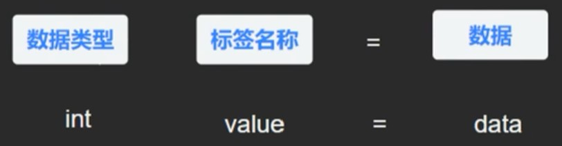
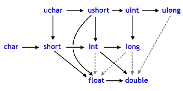

- [MQL5学习笔记](#mql5学习笔记)
  - [基础知识](#基础知识)
    - [学习路径](#学习路径)
    - [认识MT5软件](#认识mt5软件)
    - [外汇基础知识](#外汇基础知识)
      - [点差（Spread）](#点差spread)
      - [滑点（Slip Point）](#滑点slip-point)
      - [隔夜利息\\库存费（Swap）](#隔夜利息库存费swap)
    - [认识MetaEditor](#认识metaeditor)
    - [第一个MQL5程序](#第一个mql5程序)
    - [注释](#注释)
  - [数据类型](#数据类型)
    - [数据类型和内存](#数据类型和内存)
    - [变量命名规范](#变量命名规范)
    - [整型](#整型)
    - [布尔型](#布尔型)
    - [浮点型](#浮点型)
    - [字符型](#字符型)
    - [字符串型](#字符串型)
    - [日期时间类型](#日期时间类型)
    - [颜色类型](#颜色类型)
    - [枚举类型](#枚举类型)
    - [数据类型转换](#数据类型转换)
    - [类型转换函数](#类型转换函数)
    - [输出信息函数](#输出信息函数)
  - [运算符](#运算符)
    - [算数运算符](#算数运算符)
      - [加法`+`](#加法)
      - [减法`-`](#减法-)
      - [乘除法`*` `/`](#乘除法-)
      - [取模`%`](#取模)
      - [自增`++`自减`--`](#自增自减--)
      - [幂运算`MathPow`](#幂运算mathpow)
    - [赋值运算符](#赋值运算符)
    - [比较运算符](#比较运算符)
    - [逻辑运算符](#逻辑运算符)
    - [运算符优先级](#运算符优先级)
  - [流程控制语句](#流程控制语句)
    - [`if else`语句](#if-else语句)
    - [三目运算符](#三目运算符)
    - [`switch`语句](#switch语句)
    - [`while`语句](#while语句)
    - [`do while`语句](#do-while语句)
    - [`for`语句](#for语句)
    - [循环控制语句](#循环控制语句)
  - [数组](#数组)
    - [一维数组](#一维数组)
      - [创建一维数组](#创建一维数组)
      - [获取元素的值](#获取元素的值)
      - [修改元素的值](#修改元素的值)
      - [获取数组长度](#获取数组长度)
    - [二维数组](#二维数组)
      - [创建二维数组](#创建二维数组)
      - [获取数组维度](#获取数组维度)
  - [排序方法](#排序方法)
  - [函数](#函数)
  - [结构体](#结构体)
  - [账户信息函数](#账户信息函数)
  - [货币对信息函数](#货币对信息函数)
  - [交易操作函数](#交易操作函数)


# MQL5学习笔记

## 基础知识

### 学习路径
- 第一阶段：学习MQL5语言的基础语法，比如数据类型、变量、逻辑运算、条件表达式、循环表达式等
- 第二阶段：学习函数式编程，编写各种功能函数组件
- 第三阶段：将多个函数组成函数库，进行调用开发
- 第四阶段：学习结构体，面向对象编程（OOP）
- 第五阶段：开始真实的自动交易系统开发：指标开发、页面控件、智能EA等
- 第六阶段：进行业务的扩展，比如连接互联网、数据库、FTP上传、授权管理、多账户管理

### 认识MT5软件

### 外汇基础知识

#### 点差（Spread）
当前撮合交易的卖价和买价之间的差异。

#### 滑点（Slip Point）
进行买入或卖出操作时，由于发出交易请求并等待撮合交易完成时真实的交易价格会发生变动，因此订单实际完成的价格可能会和你指定的价格有所差异，这样产生的价格差就是滑点。

#### 隔夜利息\库存费（Swap）
持仓超过了规定的交割周期时会产生的费用，可能是盈利可能是亏损。

### 认识MetaEditor
编写的源码文件是`.mq5`格式，编译后会生成`.ex`格式文件。

### 第一个MQL5程序
- C++语法，不要忘记分号。
- 编译完之后，按`F5`即可跳转到MT5软件并输出脚本运行结果。

### 注释
多行注释使用`/*`作为开始到`*/`结束，在这之间不能够嵌套。单行注释使用`//`作为开始到新的一行结束，可以被嵌套到多行注释之中。

单行注释快捷键：`ctrl`+`'`；取消注释快捷键：`ctrl`+`;`；更多可见“编辑” -> “高级”。

## 数据类型

### 数据类型和内存
- 数据类型：定义不同的数据类型向内存申请的空间大小不同，能够表示的数值范围也就不同。不同的数据类型有不同的处理速度，整型数据是最快的。双精度的数据处理需要特殊的协同处理器，然而，因为处理浮点型数据比较复杂， 所以它比处理整型数据慢一些。字符串是处理速度最慢的，因为它要存取动态内存。

- 变量名：表示指向申请的内存地址ID的标签别名，比如：a -> 0x001122（内存地址ID）。
- 数据：存到申请的内存中的内容。



### 变量命名规范
- 变量的名称不能使用系统保留的关键字；
- 变量名称只能由字母、数字和下划线`_`组成；
- 变量名称不能以数字作为开头；
- 变量名称区分大小写；
- 以下划线`_`开头的变量约定俗成作为私有变量。

变量命名：小写，单词之间用下划线`_`连接。

函数命名：驼峰命名法，单词首字母大写。

### 整型
| 类型 | 字节大小 | 最小值 | 最大值 | C++类比 |
| :-:  | :-:     | :-:   | :-:    | :-:    |
| char | 1       | -128  | 127    | char   |
| uchar | 1 | 0 | 255 | unsigned char, BYTE |
| bool | 1 | 0 (false) | 1 (true) | bool |
| short | 2 | -32768 | 32767 | short, wchar_t |
| ushort | 2 | 0 | 65535 | unsigned short, WORD |
| int | 4 | -2147483648 | 2147483647 | int |
| uint | 4 | 0 | 4294967295 | unsigned int, DWORD |
| color | 4 | -1 | 16777215 | int, COLORREF |
| long | 8 | -9223372036854775808 | 9223372036854775807 | __int64|
| ulong | 8 | 0 | 18446744073709551615 | unsigned __int64 |
| datetime | 8 | 0 (1970.01.01 0:00:00) | 32 535 244 799 (3000.12.31 23:59:59) | __time64_t |

### 布尔型
bool，占1个字节，只有0(false)和1(true)两个值。

### 浮点型
浮点型包括两种数据类型：`float`和`double`。`float`占4个字节，可表示7位有效数字；`double`占8个字节，可表示16位有效数字。

### 字符型
字符型包括两种数据类型：`char`和`uchar`，均占1个字节，用于表示单个字符。字符型应当使用单引号`''`括起来。

### 字符串型
字符串型指`string`数据类型，用于表示多个字符连接组成的字符串，MQL5中规定字符串的长度范围为0~2000个字符。字符串所占字节数为写出的字符总数+1，1是末尾自动添加的`\0`，长度为从第一个字符到第一个`\0`为止（不计`\0`）的字符数。字符串应当使用双引号`""`括起来，转义字符使用`\`。

### 日期时间类型
日期时间类型指`datetime`数据类型，占8个字节，用于表示日期时间，可表示的时间范围为1970.01.01 0:00:00 ~ 3000.12.31 23:59:59。可以按完整的日期+时间格式（`D'2023.1.2 21:15:50`）赋值，也可以只写一部分，例如：
- 只写日期：`D'2023.1.2'`，此时时间默认为`0:00:00`；
- 只写时间：`D'21:15:50'`，此时日期默认为当天日期；
- 写日期和小时：`D'2023.1.2 21'`，此时分钟和秒默认为`00`；
- 写日期、小时和分钟：`D'2023.1.2 21:15`，此时秒默认为`00`。

注意格式是`D` `+`**单引号**`''`括起来的日期时间。

### 颜色类型
颜色类型指`color`数据类型，占4个字节，用于表示颜色值（第一个字节忽略不计，其余三个字节表示红绿蓝），表示范围为（0~255, 0~255, 0~255）。颜色类型有多种赋值方式，例如：
- 十进制RGB：`C'128,128,128'`　　　　　　　　// 灰色
- 十六进制RGB：`C'0x00,0x00,0xFF'`　　　　　　　　// 蓝色
- 十进制整数：`16777215`　　　　　　　　// 白色
- 十六进制整数：`0xFFFFFF`　　　　　　　　// 白色
- 颜色名称：`clrRed`　　　　　　　　// 红色

### 枚举类型
枚举类型即`enum`数据类型，相当于常量列表，其格式为：
```
enum name of enumerable type
  {
   list of values
  };
```
例如：
```
enum intervals
   {
    month=1,
    quarter=3,
    halfyear=6,
    year=12,
   };
```

### 数据类型转换
各种数据类型之间可以转换，但需要注意，有的转换可能会导致数据丢失，比如`double`转`int`，因此这样的转换是不建议的。允许的转换如下：



其中实线箭头表示不会丢失精度，虚线箭头表示会丢失精度。当然，各种数据类型都可以转换成`string`类型。

### 类型转换函数
MQL5提供了一些用来进行数据类型转换的函数，我们可以直接使用。某些函数除了进行数据类型转换外，还具有指定输出值小数点后的位数、指定输出时间格式等功能。
| 函数 | 功能 |
| :-: | :-:  |
| [`CharToString`](#CharToString) | 将`uchar`转换为字符串 |
| [`CharArrayToString`](#CharArrayToString) | 将`uchar`数组转换为字符串 |
| [`CharArrayToStruct`](#CharArrayToStruct) | 将`uchar`数组转换为POD结构 |
| [`StructToCharArray`](#StructToCharArray) | 将POD结构转换为`uchar`数组 |
| [`ColorToARGB`](#ColorToARGB) | 将`color`类型转换为`uint`类型，获取RGB值 |
| [`ColorToString`](#ColorToString) | 将`color`类型转换为RGB字符串或直接显示颜色名称 |
| [`DoubleToString`](#DoubleToString) | 将`double`值转换为字符串 |
| [`EnumToString`](#EnumToString) | 将枚举值转换为文本格式 |
| [`IntegerToString`](#IntegerToString) | 将整型值转换为特定长度的字符串 |
| [`ShortToString`](#ShortToString) | 将交易品种代码(unicode)转换为字符串代码 |
| [`ShortArrayToString`](#ShortArrayToString) | 将数组的一部分转换为字符串 |
| [`TimeToString`](#TimeToString) | 将timestamp转换为时间格式的字符串 |
| [`NormalizeDouble`](#NormalizeDouble) | 将浮点数按指定精确度四舍五入 |
| [`StringToCharArray`](#StringToCharArray) | 逐个字母将字符串从Unicode转换为ANSI，存入一个`uchar`数组，返回数组元素个数 |
| [`StringToColor`](#StringToColor) | 将RGB字符串或颜色名称字符串转换为`color`类型 |
| [`StringToDouble`](#StringToDouble) | 将字符串转换为`double`值 |
| [`StringToInteger`](#StringToInteger) | 将字符串转换为整型 |
| [`StringToShortArray`](#StringToShortArray) | 逐个字母将字符串复制到一个`ushort`数组中，返回数组元素个数 |
| [`StringToTime`](#StringToTime) | 将指定时间格式的字符串转换为`datetime`类型 |
| [`StringFormat`](#StringFormat) | 字符串格式化输出 |

<h4 id='CharToString'> CharToString </h4>

```
string CharToString(
  uchar char_code;　　　　// 交易品种的数值代码
);
```

<h4 id='CharArrayToString'> CharArrayToString </h4>

```
string CharArrayToString(
  uchar  array[],            // 数组
  int    start=0,            // 数组启动位置
  int    count=-1,           // 交易品种数
  uint   codepage=CP_ACP     // 代码页
);
```

<h4 id='CharArrayToStruct'> CharArrayToStruct </h4>

```
bool CharArrayToStruct(
  void&         struct_object,        // 结构
  const uchar&  char_array[],         // 数组
  uint          start_pos=0           // 数组中的起始位置
);
```

<h4 id='StructToCharArray'> StructToCharArray </h4>

```
bool  StructToCharArray(
   const void&  struct_object,     //结构
   uchar&       char_array[],      // 数组
   uint         start_pos=0        // 数组中的起始位置
   );
```

<h4 id='ColorToARGB'> ColorToARGB </h4>

```
uint  ColorToARGB(
   color  clr,          // 以color格式转换颜色
   uchar  alpha=255     // alpha通道管理彩色透明度
   );
```

<h4 id='ColorToString'> ColorToString </h4>

```
string  ColorToString(
   color  color_value,     // 颜色值
   bool   color_name       // 是否显示颜色名称
   );
```

<h4 id='DoubleToString'> DoubleToString </h4>

```
string  DoubleToString(
   double  value,      // 数字
   int     digits=8    // 小数点后的位数
   );
```

<h4 id='EnumToString'> EnumToString </h4>

```
string  EnumToString(
   any_enum  value      // 任何类型的枚举值
   );
```

<h4 id='IntegerToString'> IntegerToString </h4>

```
string  IntegerToString(
   long    number,              // 数字
   int     str_len=0,           // 字符串结果长度
   ushort  fill_symbol=' '      // 填充物
   );
```

<h4 id='ShortToString'> ShortToString </h4>

```
string  ShortToString(
   ushort  symbol_code      // 交易品种
   );
```

<h4 id='ShortArrayToString'> ShortArrayToString </h4>

```
string  ShortArrayToString(
   ushort  array[],      // 数组
   int     start=0,      // 数组中的启动位置
   int     count=-1      // 交易品种数
   );
```

<h4 id='TimeToString'> TimeToString </h4>

```
string  TimeToString(
   datetime  value,                           // 数字
   int       mode=TIME_DATE|TIME_MINUTES      // 输出形式
   );
```

<h4 id='NormalizeDouble'> NormalizeDouble </h4>

```
double  NormalizeDouble(
   double  value,      // 浮点值
   int     digits      // 小数点后的数字数
   );
```

<h4 id='StringToCharArray'> StringToCharArray </h4>

```
int  StringToCharArray(
   string  text_string,         // 源字符串
   uchar&  array[],             // 数组
   int     start=0,             // 数组中的启动位置
   int     count=-1             // 交易品种数
   uint    codepage=CP_ACP      // 代码页
   );
```

<h4 id='StringToColor'> StringToColor </h4>

```
color  StringToColor(
   string  color_string      // 字符串颜色表示
   );
```

<h4 id='StringToDouble'> StringToDouble </h4>

```
double  StringToDouble(
   string  value      // 字符串
   );
```

<h4 id='StringToInteger'> StringToInteger </h4>

```
long  StringToInteger(
   string  value      // 字符串
   );
```

<h4 id='StringToShortArray'> StringToShortArray </h4>

```
int  StringToShortArray(
   string  text_string,     // 源字符串
   ushort& array[],         // 数组
   int     start=0,         // 数组启动位置
   int     count=-1         // 交易品种数
   );
```

<h4 id='StringToTime'> StringToTime </h4>

```
datetime  StringToTime(
   const string  time_string      // 日期字符串
   );
```

<h4 id='StringFormat'> StringFormat </h4>

```
string  StringFormat(
   string  format,     // 带有格式描述的字符串
   ...     ...         // 参量
   );
```

### 输出信息函数
输出信息函数指的是将字符串类型的数据输出到控制台的函数，在MQL5中主要有`Print`和`PrintFormat`（可简写为`printf`）两个函数。
| 函数 | 功能 |
| :-: | :-: |
| `Print` | 拼接字符串，输出到控制台 |
| `PrintFormat` | 格式化输出字符串，根据指定的类型强制转换输出的值 |

常用的格式化输出符号：
| 符号 | 类型 | 输出格式 |
| :-: | :-: | :-: |
| c | int | Unicode编码 |
| C | int | ANSI编码 |
| d | int | 有符号十进制整数 |
| i | int | 有符号十进制整数 |
| u | int | 无符号十进制整数 |
| o | int | 无符号八进制整数 |
| x | int | 无符号十六进制整数，使用abcdef |
| X | int | 无符号十六进制整数，使用ABCDEF |
| e | double | 使用科学计数法表示 |
| f | double | 有符号浮点数，f前面可以加.和数字来指定输出小数位数，如.2f |
| s | string | 字符串 |

## 运算符

### 算数运算符

#### 加法`+`
- 数字相加：数值运算
- bool值相加：true为1，false为0，结果等于0则为false，否则为true
- 字符串相加：字符串拼接

#### 减法`-`
- 数字相减：数值运算
- bool值相减：true为1，false为0，结果等于0则为false，否则为true
- 字符串相减：不支持

#### 乘除法`*` `/`
- 乘除法一般只用于数值计算，不支持对字符串进行操作
- 使用除法时需要注意，若返回值为浮点型，但被除数和除数均为整型，返回值将是整数，例如10/3返回3.0。解决办法是将被除数或者除数写成浮点型，例如10.0/3或10/3.0，返回值将为3.333333。

#### 取模`%`
只用于两个整数取余数的运算。

#### 自增`++`自减`--`
单独使用时`a++`和`++a`没有区别，都是使`a`自增1。但在运算中使用自增时需要注意，前置自增（`++a`）先自增再运算，后置自增（`a++`）先运算再自增，具体区别见下面的例子。

```
uint a = 10;
uint b = a++ * 2;
uint c = ++a * 2;
Print(b);  // 20
Print(c);  // 24
```

自减与自增相同，前置自减和后置自减单独使用时没有区别，用在运算中时需要注意。

#### 幂运算`MathPow`
MQL里没有`2**3`这种写法，如果需要进行幂运算，可以使用`MathPow`函数，比如2的3次方可以写成`MathPow(2,3)`。

### 赋值运算符

常用的赋值运算符包括`=`、`+=`、`-=`、`*=`、`/=`、`%=`，基本规则都是先运算再赋值，例如：

```
a = 1;
a += 2;    // a = 3
a -= 1;    // a = 2
a *= 3;    // a = 6
a /= 2;    // a = 3
a %= 2;    // a = 1
```

### 比较运算符

`==`、`!=`、`>`、`<`、`>=`、`<=`。

### 逻辑运算符

且`&&`或`||`非`!`。

### 运算符优先级

| 运算符 | 级别 |
| :-: | :-: |
| `()`, `[]`, `{}` | 0 |
| `*`, `/`, `%` | 1 |
| `+`, `-` | 2 |
| `==`, `!=`, `>`, `<`, `>=`, `<=` | 3 |
| `&&`, `\|\|`, `!` | 4 |

## 流程控制语句

### `if else`语句

```
if(condition1)
{
   do task1...
}
else if(condition2)
{
   do task2...
}
else
{
   do task3...
}
```

### 三目运算符

`expr1?expr2:expr3`

当表达式1为`true`时，返回表达式2的值；为`false`时，返回表达式3的值。

### `switch`语句

```
switch(expr)
{
   case value1:
      do task1;
      break;
   case value2:
      do task2;
      break;
   ......
   default:
      do default task;
}
```

### `while`语句

```
while(condition)
{
   do task...
}
```

### `do while`语句

`do while`语句是`while`语句的变体，主要区别在于进入`while`条件判断之前，会先执行一次循环体的内容。

```
do
{
   do task...
}
while(condition);
```

### `for`语句

```
for(init_value; condition; init_value++)
{
   do task...
}
```

### 循环控制语句

`break`：结束整个循环；

`continue`：结束本次循环，继续下一次循环。

## 数组

### 一维数组

#### 创建一维数组

- 创建固定长度数组：数组名后用中括号`[]`，中括号内指明数组长度，数组内容用大括号`{}`包围；

```
int arr[5] = {35, 75, 87, 43, 65};
```

当赋值的初始化数组长度小于指定的数组长度时，会自动用`0`补齐；反之，当初始化数组长度大于指定长度时，程序报错。

- 创建动态数组：中括号内不写数组长度。

```
int arr[] = {45, 75, 82};
```

#### 获取元素的值

数组名+中括号`[]`+下标，例如`arr[3]`。最后一个元素下标应为数组长度-1，不支持`arr[-1]`这种方式获取最后一个元素的值。

#### 修改元素的值

直接赋值，例如`arr[2] = 12`；

#### 获取数组长度

使用`ArraySize()`函数，例如`arrLen = ArraySize(arr)`。

### 二维数组

#### 创建二维数组

- 创建固定长宽二维数组：与创建一维数组类似

```
int arr2d[3][2] = {
   {54, 75},
   {72, 83},
   {71, 94}
};
```

与一维数组类似，当初始化数组的元素个数小于指定的数组大小时，会自动用`0`补齐。

- 创建动态二维数组：

```
int arr2d[][2] = {
   {54, 75},
   {72, 83},
   {71, 94}，
   {42，65}
};
```

需要注意的是，只能不写行数，列数必须指明，否则会报错。

#### 获取数组维度

- `ArraySize()`：返回数组总元素个数，即行数乘以列数；
- `ArrayRange()`：返回数组某一维的元素数量。


## 排序方法

## 函数

## 结构体

## 账户信息函数

## 货币对信息函数

## 交易操作函数