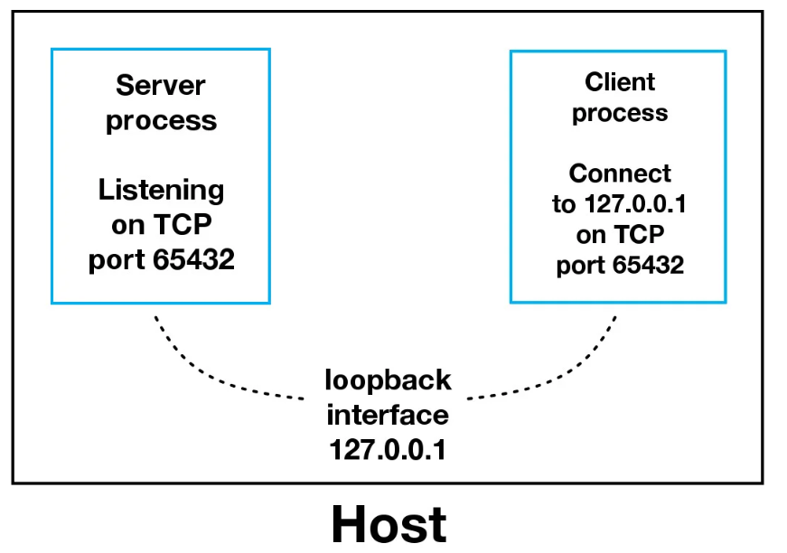
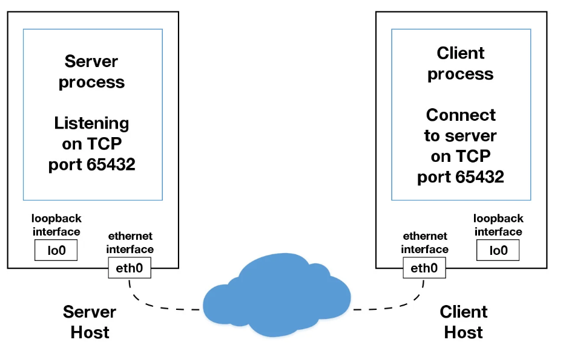

# Socket Programming in Python

## Socket API Overview
在Python中进行socket编程需要用到的模块是`socket`，常用的方法有：
- `socket()` 创建socket
- `.bind()` 绑定IP和端口（服务端）
- `.listen()` 监听（服务端）
- `.accept()` 等待连接（服务端）
- `.connect()` 发起TCP连接（客户端）
- `.connect_ex()` connect()的扩展版，如有问题返回错误码而不是异常（客户端）
- `.send()` 发送TCP消息
- `.receive()` 接收TCP消息
- `.close()` 关闭socket

## TCP Sockets
socket类型：`socket.SOCK_STREAM` (TCP)，`socket.SOCK_DGRAM` (UDP)。


## Echo Client and Server

### Echo Server
完整代码见 [echo-server.py](scripts/echo-server.py)，下面仅对部分代码加以解释。
```Python
with socket.socket(socket.AF_INET, socket.SOCK_STREAM) as s:
```
`socket`对象支持`with`语句，从而可以不用在最后手动调用`s.close()`来关闭socket。`socket.socket()`中的两个参数分别表示地址族和socket类型，`socket.AF_INET`表示TCP/IP-IPv4，`socket.SOCK_STREAM`表示TCP连接。类似地，TCP/IP-IPv6是`socket.AF_INET6`，UDP是`socket.SOCK_DGRAM`。

```Python
s.bind((HOST, PORT))
```
因为之前指定了`socket.AF_INET`，因此此处`bind`函数的参数为`(HOST, PORT)`的形式，其中`HOST`既可以是域名字符串也可以是IPv4格式的IP地址。但需要注意的是，如果`HOST`使用域名字符串，会由于每次DNS解析结果的不同，导致每次实际连接的IP不同。

```Python
conn, addr = s.accept()
```
`.accept()`方法将会阻塞程序等待客户端连接，当有客户端连接时，此方法将返回一个新的socket对象`conn`和一个包含客户端地址信息的元组`addr`。注意，这里的`conn`是一个由`.accept`返回用来和客户端通信的新的socket对象，和`s.listen()`中的`s`不是一回事。至于`addr`，对于IPv4连接是`(host, port)`格式，对于IPv6连接是`(host, port, flowinfo, scopeid)`格式。

### Echo Client
结合上面对echo-server的解释，echo-client非常容易理解，此处不再赘述。

### Viewing Socket State
通过`netstat`命令可以看到socket的状态，比如在Linux系统运行echo-server后通过`netstat`可以得到如下图所示输出：
```Shell
$ netstat -an | grep 65432
Proto Recv-Q Send-Q Local Address      Foreign Address    State
tcp        0      0 127.0.0.1:65432    0.0.0.0:*          LISTEN
```

在运行echo-client时，常见的一个报错信息是：
```Shell
$ python echo-client.py 
Traceback (most recent call last):
  File "./echo-client.py", line 9, in <module>
    s.connect((HOST, PORT))
ConnectionRefusedError: [Errno 61] Connection refused
```
这可能是因为echo-client的端口设置错误，或者echo-server未启动，或者连接被防火墙阻止。

## Communication Breakdown



在上面的例子中，我们在server端将IP设为127.0.0.1，即本地环回地址，这意味着它只能接受来自本机内部的连接而与外部网络隔离。



上图显示的是我们的服务端和客户端不在同一台设备上，通过以太网进行通信的情况。

## Handling Multiple Connections

- 在之前的例子中，我们使用了`s.recv(1024)`来接收数据，其中的1024表示一次最多能接收1024个字节。类似地，`.send()`方法也不一定能一次性把数据全部发送完，因此它的返回值是发出的字节个数，开发者需要自己检查数据是否全部发送成功，如有必要可以多次调用`.send()`来发完数据（`.sendall()`本质上就是这样做的）。
- 同时，前面的例子中服务端和客户端也只能进行一对一的通信，而不能同时处理多个连接，因此我们需要引入异步IO。在Python中，异步IO常用的模块是`asyncio`。但为了使异步IO的过程在代码中体现得更加清晰明了，在本教程中我们将使用一种更传统的方法`.select()`，为此我们需要引入一个新的模块`selectors`。

## Multi-Connection Client and Server

### Multi-Connection Server

