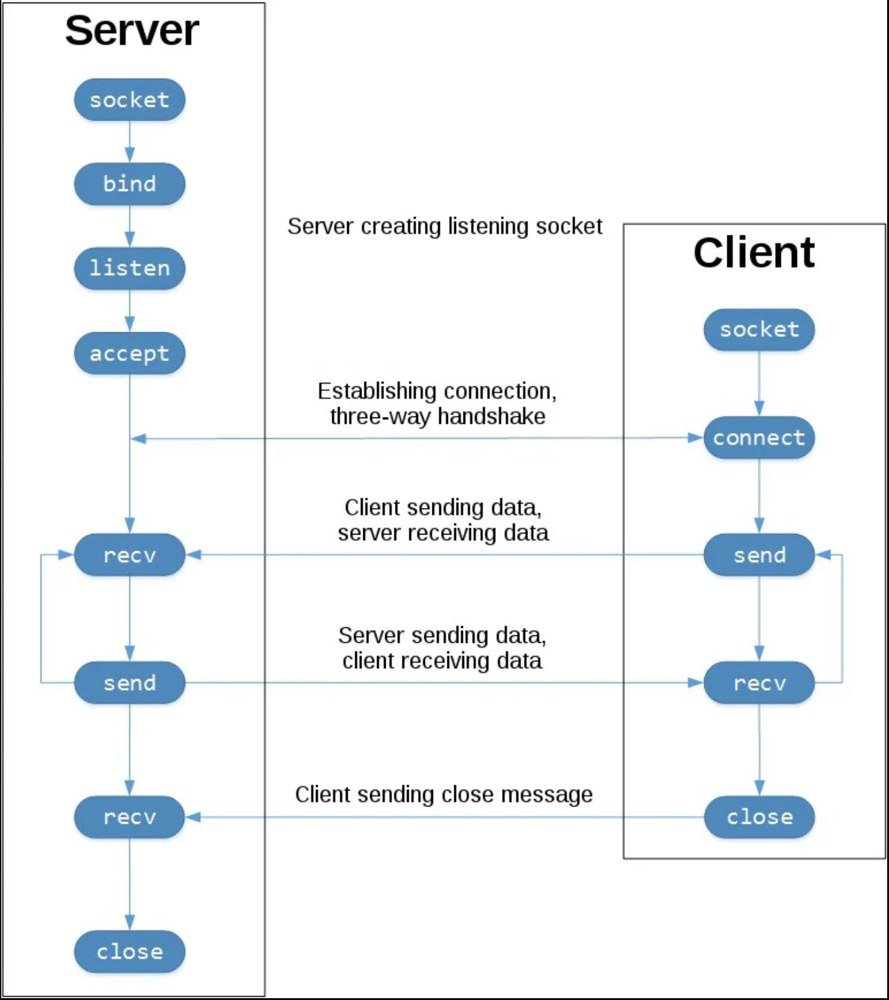

# Socket Programming in Python

## Socket API Overview
在Python中进行socket编程需要用到的模块是`socket`，常用的方法有：
- `socket()` 创建socket
- `.bind()` 绑定IP和端口（服务端）
- `.listen()` 监听（服务端）
- `.accept()` 等待连接（服务端）
- `.connect()` 发起TCP连接（客户端）
- `.connect_ex()` connect()的扩展版，如有问题返回错误码而不是异常（客户端）
- `.send()` 发送TCP消息
- `.receive()` 接收TCP消息
- `.close()` 关闭socket

## TCP Sockets
socket类型：`socket.SOCK_STREAM` (TCP)，`socket.SOCK_DGRAM` (UDP)。

## Echo Client and Server

### Echo Server
完整代码见 [echo-server.py](scripts/echo-server.py)
