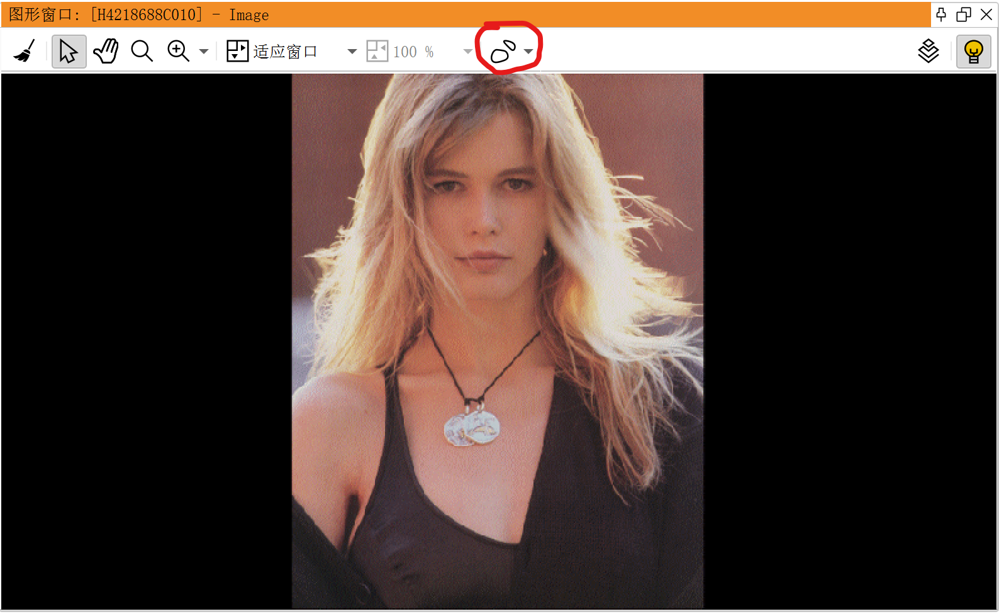
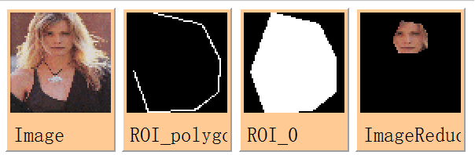
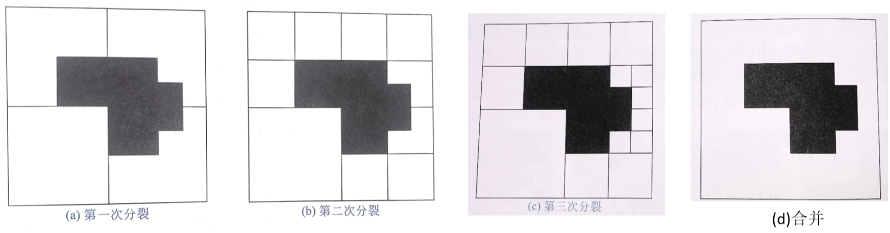

- [认识HALCON](#认识halcon)
  - [HALCON基础架构](#halcon基础架构)
  - [HDevelop界面](#hdevelop界面)
    - [算子窗口](#算子窗口)
  - [图像采集](#图像采集)
    - [获取非实时图像](#获取非实时图像)
      - [`read_image()`语句](#read_image语句)
      - [`Ctrl+R`快捷键](#ctrlr快捷键)
      - [Image Acquisition](#image-acquisition)
    - [获取实时图像](#获取实时图像)
  - [数据类型](#数据类型)
    - [通道（channel）](#通道channel)
    - [区域（Region）](#区域region)
    - [XLD](#xld)
- [基础语法](#基础语法)
  - [变量](#变量)
    - [变量赋值](#变量赋值)
    - [tuple操作](#tuple操作)
  - [流程控制](#流程控制)
    - [if-else语句](#if-else语句)
    - [while语句](#while语句)
    - [repeat语句](#repeat语句)
    - [for语句](#for语句)
    - [switch语句](#switch语句)
    - [continue语句和break语句](#continue语句和break语句)
  - [操作符](#操作符)
- [图像处理](#图像处理)
  - [创建ROI](#创建roi)
    - [图像窗口ROI工具](#图像窗口roi工具)
    - [代码设定ROI](#代码设定roi)
    - [交互式绘制ROI](#交互式绘制roi)
  - [图像变换](#图像变换)
    - [仿射变换](#仿射变换)
    - [投影变换](#投影变换)
  - [图像增强](#图像增强)
    - [灰度变换](#灰度变换)
    - [直方图均衡化](#直方图均衡化)
    - [图像平滑](#图像平滑)
    - [图像锐化](#图像锐化)
    - [频域滤波](#频域滤波)
  - [图像分割](#图像分割)
    - [阈值分割](#阈值分割)
    - [边缘检测](#边缘检测)
    - [Hough变换](#hough变换)
      - [直线检测](#直线检测)
      - [圆检测](#圆检测)
    - [区域分割](#区域分割)
      - [区域生长](#区域生长)
      - [区域分裂合并](#区域分裂合并)
      - [分水岭算法](#分水岭算法)
  - [特征提取](#特征提取)
    - [区域形状特征](#区域形状特征)
    - [基于灰度值的特征](#基于灰度值的特征)
    - [图像纹理特征](#图像纹理特征)
  - [图像形态学处理](#图像形态学处理)
    - [腐蚀](#腐蚀)
    - [膨胀](#膨胀)
    - [开运算与闭运算](#开运算与闭运算)
    - [击中击不中变换 (HMT)](#击中击不中变换-hmt)
    - [灰度腐蚀与膨胀](#灰度腐蚀与膨胀)
    - [顶帽底帽变换](#顶帽底帽变换)
    - [形态学应用](#形态学应用)
  - [模板匹配](#模板匹配)


***本文专注于介绍HALCON常用算子的使用，关于机器视觉的理论知识可以参考[机器视觉自动检测技术](../机器视觉自动检测技术/MachineVision.md)***

# 认识HALCON

## HALCON基础架构


HDevelop可以做什么：
- 直接连接采集卡或者相机；
- 查看图像的各种数据；
- 视觉方案可行性研究；
- 开发一个视觉检测项目；
- 测试不同算子的处理效果；
- 将HALCON程序导出为Python、C、C++、C#或者VB程序；
- 更多...

HDevelop不能做什么：
- 不能直接生成一个完整的带用户界面和其他辅助功能，可以直接运行在实际项目工控机上的应用程序。

一个完整的视觉程序开发过程通常如下图所示：


## HDevelop界面


### 算子窗口


从算子窗口中我们可以看到，HALCON算子的参数分为图像变量（iconic）和控制变量（control）两类，各自分别又可以分为输入变量和输出变量，一般顺序为`operator(input iconic : output iconic : input control : output control)`，当然并不是每个算子都需要完整的四组参数。另外需要注意的是，算子对输入图像的操作并不是直接在原图上进行的，输入图像并不会被改变，处理结果会保存在图像输出变量。

## 图像采集

### 获取非实时图像

获取非实时图像即读取现成的图片，有以下三种方式。

#### `read_image()`语句

常规方式，不再赘述。举例：`read_image(Image, './images/lena.jpeg')`。

#### `Ctrl+R`快捷键

使用`Ctrl+R`快捷键，会弹出读取图像窗口，我们可以浏览文件夹选择要读取的图片，然后点击确定即可，软件会自动在程序光标处插入一行`read_image()`语句。

#### Image Acquisition

使用Image Acquisition不仅可以读取单张图片，还可以批量读取指定文件夹内的图片。使用时只需点击工具栏相机样式的图标或者菜单栏“助手” → “打开新的Image Acquisition”，然后在弹出窗口中选择“图像文件” → “选择路径”选定图片文件夹路径，然后选择“代码生成” → “插入代码”，软件会自动在程序中光标处插入如下一段代码：

```
* Image Acquisition 07: Code generated by Image Acquisition 07
list_files ('C:/Users/muyi/AppData/Roaming/MVTec/HALCON-23.11-Progress/examples/images/bead', ['files','follow_links'], ImageFiles)
tuple_regexp_select (ImageFiles, ['\\.(tif|tiff|gif|bmp|jpg|jpeg|jp2|png|pcx|pgm|ppm|pbm|xwd|ima|hobj)$','ignore_case'], ImageFiles)
for Index := 0 to |ImageFiles| - 1 by 1
    read_image (Image, ImageFiles[Index])
    * Image Acquisition 07: Do something
endfor
```

从代码中我们可以看到，使用Image Acquisition读取图片文件夹时软件会自动生成一个for循环来逐一读取每一张图片，我们可以在此基础上根据需要修改自动生成的代码。

### 获取实时图像

获取实时图像即从相机获取图像，一般有两种方式：通过Image Acquisition获取和通过相机SDK获取。后者取决于具体的相机，在此我们仅介绍前者。

首先点击工具栏相机样式的图标或者菜单栏“助手” → “打开新的Image Acquisition”，选择“图像获取接口”，点击“自动检测接口”。检测到相机后，在“连接”选项卡点击“连接”，最后在“代码生成”选项卡点击“插入代码”即可。

注意事项：
- 在“参数”选项卡可以调整相机的各项参数，然后在“连接”选项卡点击“采集”（获取单帧图像）或者“实时”（获取视频流）即可看到调整参数后的效果。
- 在“代码生成”选项卡中有一个“采集模式”选项，可以选择“同步采集”或“异步采集”，其区别是：
   - 同步采集：程序发出指令，相机采集图像，程序获取图像，串行执行，可以保证获取的是相机最新一帧图像。
   - 异步采集：相机采集图像和程序获取图像并行执行，程序直接从相机存储中获取图像，获取的不一定是最新一帧图像。

## 数据类型

HALCON主要有以下数据类型：
- Iconic（图像变量）：Image（图像）、Region（区域）、E***x***tended ***L***ine ***D***escription（XLD）
- Control（控制变量）：String、Integer、Real、Handle...
- Tuple（类似于数组）

### 通道（channel）

一张图片可能是由多个通道的数据合成而来的，例如灰度图只有一个通道，彩色图有RGB三个通道，遥感图片可能有多个通道等。常用的通道相关的算子有：
- `count_channels`：获取图像的通道数
- `access_channel`：获取指定通道的图像
- `decompose3`：分解三通道图像
- `compose2`：合并两个通道
- `append_channel`：在图像上再附加一个通道

### 区域（Region）

Region指图像上的一块区域，一般对图像进行分割时会获得多个区域，例如使用`threshold`算子对灰度图进行阈值分割。

### XLD

XLD也叫亚像素精度轮廓，类似超分辨率的效果，可以得到比原始图像像素更精细的边缘。

# 基础语法

## 变量

### 变量赋值

HALCON不允许声明变量类型，直接对变量赋值，赋值符号为`:=`。例如：

```
a := 1
```

变量类型可以被改变。对tuple中指定索引赋值时，未指定的索引会自动填充0。并且tuple中可以包含多种数据类型。例如：

```
a := 1    \\ a = 1
a[1] := 2    \\ a = [1, 2]
a[4] := 3    \\ a = [1, 2, 0, 0, 3]
a[5] := 'HALCON'    \\ a = [1, 2, 0, 0, 3, 'HALCON']
```

### tuple操作

- 获取tuple长度：`len := |TupleName|`或`tuple_length(TupleName, len)`
- tuple添加元素：`TupleName := [TupleName, elementToAppend]`，例如：
  ```
  Tuple_1 := [1, 2, 3]
  Tuple_1 := [Tuple_1, 4]    \\ Tuple_1 = [1, 2, 3, 4]
  ```

## 流程控制

### if-else语句

```
if(condition)
    * Do someting...
elseif(condition)
    * Do something...
else
    * Do something...
endif
```

### while语句

```
while(condition)
    * Do something...
endwhile
```

### repeat语句

类似于do-while语句，不同的是当条件满足时程序退出循环而非继续循环。

```
repeat
    * Do something...
until(condition)
```

### for语句

```
for <index> := <start> to <end> by <step>
    * Do something...
endfor
```

### switch语句

```
switch (<var>)
    case 1:
        * Do something...
        break
    case 2:
    case 3:
        * Do something...
        break
    default:
        * Do something...
endswitch
```

### continue语句和break语句

HALCON也支持continue和break语句，且用法和C++等语言相同，不再赘述。

## 操作符

- `:=`：赋值
- `=`或`==`：相等
- `#`或`!=`：不等于
- `>`、`<`、`>=`、`<=`：大于、小于、大于等于、小于等于
- `and`、`or`、`not`、`xor`：与、或、非、异或
- `+`、`-`、`*`、`/`、`%`：加、减、乘、除、取余

# 图像处理

## 创建ROI

下面介绍三种在HALCON中创建ROI的方式。

### 图像窗口ROI工具



如上图所示，点击图形窗口中的ROI工具，在弹出的窗口中选择一种形状（矩形、圆、椭圆等等），然后通过鼠标左键绘制右键确认，即可得到一个ROI区域，最后点击插入代码即可。而且还可以绘制多个ROI区域并进行求合集、交集等集合操作。

### 代码设定ROI

当然，如果已知ROI在图像中的位置形状，我们也可以直接在代码中指定ROI范围。例如，创建一个圆心在(250,200)半径为100的区域作为ROI：

```
gen_circle (ROI_0, 250, 200, 100)
```

### 交互式绘制ROI

有时我们需要在程序运行过程中让用户来绘制ROI，这就需要我们在恰当的位置弹出交互式的窗口，下面的例子即可实现这一功能，源文件见`./scripts/interactiveROI.hdev`。

```
read_image(Image, 'claudia')    * 读取图片
dev_open_window_fit_image(Image, 0, 100, -1, -1, ROIWindow)    * 打开一个新窗口
dev_display(Image)    * 在新窗口显示图片
disp_message(ROIWindow,'Please draw a circle.', 'image', 0, 0, 'red', 'true')    * 显示提示信息
draw_circle(ROIWindow, CenterY, CenterX, CenterR)    * 用户在图像上绘制ROI
gen_circle (ROI_0, CenterY, CenterX, CenterR)    * 生成ROI
reduce_domain (Image, ROI_0,ImageReduced)    * 从原图中抠出ROI部分
dev_clear_window()    * 清除显示的图片
dev_display(ImageReduced)    * 显示抠图结果
```

在上面的程序中，我们使用了`draw_circle`来获取用户绘制的ROI，这也限定了用户只能绘制圆形的ROI。实际上HALCON还提供了多种类似的算子，例如`draw_rectangle1`、`draw_ellipse`，`draw_polygon`等。其中`draw_polygon`比较特殊，因为用户在绘制多边形时其实绘制的是一条折线，我们需要先将首尾连接起来形成一个闭合图形，再进行抠图，也就是不能用`gen_polygon`（实际上也没有这个算子）来生成多边形而需要用`shape_trans`，如下所示：

```
draw_polygon (ROI_polygon, ROIWindow)
shape_trans(ROI_polygon, ROI_0, 'convex')
reduce_domain (Image, ROI_0,ImageReduced)
```

注意结合上面的代码和下面的图片观察每个图像变量的区别：



## 图像变换

关于图像变换的理论知识可以参考[机器视觉自动检测技术](../机器视觉自动检测技术/MachineVision.md)中的“图像变换”章节，本节只介绍HALCON中进行图像变换操作需要用到的算子。

### 仿射变换

- `hom_mat2d_translate`：2维平移变换
- `hom_mat2d_rotate`：2维旋转变换
- `hom_mat2d_scale`：2维缩放变换
- `hom_mat2d_identity`：生成一个2维齐次变换单位矩阵，即3×3单位阵
- `affine_trans_image`：对图像进行2维仿射变换

### 投影变换

- `hom_vector_to_proj_hom_mat2d`：根据四对输入的匹配点计算单应性变换矩阵
- `projective_trans_image`：对图片进行投影变换

## 图像增强

图像增强分类：

- 空间域
  - 点运算
    - 灰度变换
    - 直方图均衡化
  - 邻域运算
    - 图像平滑
    - 图像锐化
- 频率域
  - 低通滤波
  - 同态滤波
  - 高通滤波

### 灰度变换

灰度变换即对图像上每一个点的灰度值进行操作从而得到新的图像，大致又可分为线性变换、分段线性变换和非线性变换（对数变换、伽马变换等）。

- `invert_image`：灰度图像反转变换，`g' = 255 - g`
- `emphasize`：增大图像对比度
- `scale_image`：标准线性变换，可以设置斜率和截距

### 直方图均衡化

- `equ_histo_image`：直方图均衡化

### 图像平滑

- `gauss_distribution`：生成高斯噪声
- `add_noise_distribution`：向图像添加噪声
- `sp_distribution`：生成椒盐噪声
- `mean_image`：均值滤波
- `median_image`：中值滤波

### 图像锐化

- `roberts`：使用Roberts算子进行边缘检测
- `prewitt_amp`：使用Prewitt算子进行边缘检测（仅幅值）
- `prewitt_dir`：使用Prewitt算子进行边缘检测（幅值和方向）
- `sobel_amp`：使用Sobel算子进行边缘检测（仅幅值）
- `sobel_dir`：使用Sobel算子进行边缘检测（幅值和方向）
- `skeleton`：提取骨架
- `laplace`：使用Laplace算子进行边缘检测
- `laplace_of_gauss`：LoG算子，即先对图像进行高斯平滑去除一些噪声，再用Laplace算子检测边缘

### 频域滤波

- `fft_image`：计算图像的傅里叶变换
- `fft_image_inv`：计算图像的反向傅里叶变换
- `fft_generic`：计算图像的傅里叶变换或者反向傅里叶变换（通过输入参数选择），并且相比于`fft_image`和`fft_image_inv`可以设置更多参数，适用于较复杂的场景
- `gen_lowpass`：生成低通滤波器
- `gen_highpass`：生成高通滤波器
- `convol_fft`：使用滤波器对图像在频域做卷积

## 图像分割

### 阈值分割

- `gray_histo`：计算灰度的直方图分布
- `histo_to_thresh`：根据直方图进行阈值分割，返回每个分割区间的上下阈值
- `threshold`：根据给定灰度阈值对图像进行分割
- `auto_threshold`：综合上述三个算子的功能，一步输出根据灰度直方图进行阈值分割的结果
- `mean_image`：均值滤波
- `dyn_threshold`：根据原图像和处理后的图像（比如均值滤波后的图像）每个像素灰度的偏差值来确定局部阈值，从而对图像进行分割
- `select_shape`：根据面积、长、宽等多种特征来从众多区域中选择符合条件的区域

### 边缘检测

- `edges_image`：提取图像的边缘，可以通过输入参数选择Canny等多种边缘检测算子
- `edges_sub_pix`：提取图像的亚像素边缘，同样可以选择Canny等多种算子

### Hough变换

#### 直线检测

- `hough_lines_dir`：在边缘检测结果图像中使用Hough变换检测直线，输入为边缘检测的方向图像（ImaDir），输出包括两个数组Angle（检测到的线法向量的角度）和Dist（检测到的线距原点的距离），还有检测出的直线的图像
- `hough_lines`：与`hough_lines_dir`类似，但只输出Angle和Dist不直接输出图像，如果要显示图像可以使用`gen_region_hline`生成。另外不像`hough_lines_dir`算子自带图像平滑选项，所以检测的结果可能含有较多噪声
- `hough_line_trans`：输出Hough变换的中间图像，即极坐标下多条曲线的交点
- `gen_region_hline`：根据Hough变换输出的Angle和Dist在图像上画出对应的直线

#### 圆检测

- `hough_circles`：给定一个半径，在边缘检测结果中寻找指定半径的圆的圆心
- `hough_circle_trans`：Hough变换的中间图像，投票结果

### 区域分割

#### 区域生长

- `regiongrowing`：使用区域生长方法对图像进行分割，返回分割后的多个区域
- `regiongrowing_mean`：指定一个起始点作为种子进行区域生长，返回生长出的一个区域
- `shape_trans`：对输入区域进行变换，实际上就是根据输入区域计算其最小外接圆、最大内切圆、最小外接矩形等等，在区域生长中我们常常用此算子获取区域的“inner center”（输入区域骨架上与输入区域重心距离最小的点）并以该点作为种子进行生长

#### 区域分裂合并

定义一个相似性准则Q，如果待分割的区域满足Q，则说明区域内的像素属于同一个整体，不必再分裂。否则将此区域分裂为若干个小的区域，再次检验每个小区域是否满足Q，不满足的继续分裂直到无法继续分裂。分裂完毕后，检查分裂出的区域两两之间是否满足Q，将满足的区域全部合并到一起就完成了对图像的分割。



区域间的相似性准则如何设定，可以从以下几个方面考虑：
- 两区域灰度平均值之差小于规定的阈值
- 两区域的灰度最大最小值极差接近
- 两区域的纹理特征相似
- 两区域的灰度分布统计函数相似
- ......

#### 分水岭算法

- `watersheds`：从输入图像中提取分水岭和盆地
- `watersheds_threshold`：带阈值的分水岭算法，第一步和`watersheds`算子一样，然后根据阈值将比较接近的盆地合并
- `watersheds_marker`：从指定的区域（marker）开始淹没

## 特征提取

### 区域形状特征

包括区域面积、中心点坐标、区域宽度和高度等。

- `area_center`：获取区域的面积和中心点坐标，可以一次性输入多个区域
- `area_holes`：获取区域中孔洞的面积，如果有多个孔洞则返回总面积
- `select_shape`：通过给定面积、坐标、长宽比、圆度、矩形度等多个特征的取值范围从多个区域中选择符合条件的区域
- `inner_circle`：获取一个区域最小内切圆的圆心坐标和半径
- `inner_rectangle1`：获取一个区域最大内接矩形的坐标
- `smallest_circle`：获取一个区域最小外接圆的圆心坐标和半径
- `smallest_rectangle1`：获取一个区域长宽平行于坐标轴方向的最小外接矩形的坐标
- `smallest_rectangle2`：获取一个区域任意方向上的最小外接矩形的坐标（真正的最小外接矩形）

### 基于灰度值的特征

- `gray_features`：计算一个或多个区域的灰度特征（灰度值总和、重心坐标、平均灰度值、最大最小灰度值等等）
- `intensity`：计算区域内灰度的平均值和偏差（类似标准差，只是分母略有不同）
- `min_max_gray`：获取区域内的最小灰度值和最大灰度值。值得注意的是，可以通过`Percent`参数从最小和最大两侧各排除一定比例的灰度值，然后给出剩余范围的最小最大值
- `area_center_gray`：获取区域内的灰度值之和和重心坐标
- `select_gray`：根据灰度特征从多个区域中选择符合条件的区域，类似于`select_shape`，只不过筛选条件不同

### 图像纹理特征

- `gen_cooc_matrix`：计算区域的灰度共生矩阵
- `cooc_feature_matrix`：根据灰度共生矩阵计算灰度特征（能量、相关性、局部均匀性、对比度）
- `cooc_feature_image`：将上述两个算子合二为一，先计算灰度共生矩阵再计算灰度特征

## 图像形态学处理

### 腐蚀

- `erosion_circle`：使用圆形结构元进行腐蚀（以中心作为参考点）
- `erosion_rectangle1`：使用矩形结构元进行腐蚀（以中心作为参考点）
- `erosion1`：使用自定义的结构元进行腐蚀（以中心作为参考点）
- `erosion2`：使用自定义的结构元进行腐蚀（可以指定参考点）

### 膨胀

- `dilation_circle`：使用圆形结构元进行膨胀（以中心作为参考点）
- `dilation_rectangle1`：使用矩形结构元进行膨胀（以中心作为参考点）
- `dilation1`：使用自定义的结构元进行膨胀（以中心作为参考点）
- `dilation2`：使用自定义的结构元进行膨胀（可以指定参考点）

### 开运算与闭运算

- `opening_circle`：使用圆形结构元进行开运算
- `opening_rectangle1`：使用矩形结构元进行开运算
- `opening`：使用自定义的结构元进行开运算
- `closing_circle`：使用圆形结构元进行闭运算
- `closing_rectangle1`：使用矩形结构元进行闭运算
- `closing`：使用自定义的结构元进行闭运算

### 击中击不中变换 (HMT)

- `hit_or_miss`：使用HMT算法在区域中检测目标的位置

### 灰度腐蚀与膨胀

- `gray_erosion`：使用自定义的结构元进行灰度腐蚀
- `gray_erosion_rect`：使用矩形结构元进行灰度腐蚀
- `gray_erosion_shape`：使用矩形、菱形或八边形进行灰度腐蚀
- `gray_dilation`：使用自定义的结构元进行灰度膨胀
- `gray_dilation_rect`：使用矩形结构元进行灰度膨胀
- `gray_dilation_shape`：使用矩形、菱形或八边形进行灰度膨胀
- `gray_opening`：使用自定义的结构元进行灰度开运算
- `gray_opening_rect`：使用矩形结构元进行灰度开运算
- `gray_opening_shape`：使用矩形、菱形或八边形进行灰度开运算
- `gray_closing`：使用自定义的结构元进行灰度闭运算
- `gray_closing_rect`：使用矩形结构元进行灰度闭运算
- `gray_closing_shape`：使用矩形、菱形或八边形进行灰度闭运算

### 顶帽底帽变换

- 顶帽变换(`gray_tophat`)：原图像减去图像做灰度开运算的结果。由于灰度开运算的效果是消除了暗背景中较亮的区域，因此顶帽变换得到的就是原图像中较亮的区域。
- 底帽变换(`gray_bothat`)：图像做灰度闭运算的结果减去原图像。由于灰度闭运算的效果是消除了亮背景中较暗的区域，因此底帽变换得到的就是原图像中较暗的区域。

### 形态学应用

- `boundary`：提取区域的边界
- `fill_up`：填充区域内的孔洞
- `fill_up_shape`：根据给定的条件填充区域内符合条件的孔洞
- `skeleton`：提取区域的骨架

## 模板匹配

- `create_ncc_model`：创建一个ncc模型用于模板匹配
- `find_ncc_model`：使用ncc模型在图像中进行匹配，返回匹配结果
- `clear_ncc_model`：释放ncc模型占用的内存
- `create_shape_model`：创建一个基于形状特征的模板匹配模型
- `find_shape_model`：使用基于形状特征的模板匹配模型进行匹配
- `clear_shape_model`：释放模型占用的内存
- `create_scaled_shape_model`：创建一个基于形状特征且包含各向同性尺寸缩放的模板匹配模型
- `create_aniso_shape_model`：创建一个基于形状特征且包含各向异性尺寸缩放的模板匹配模型