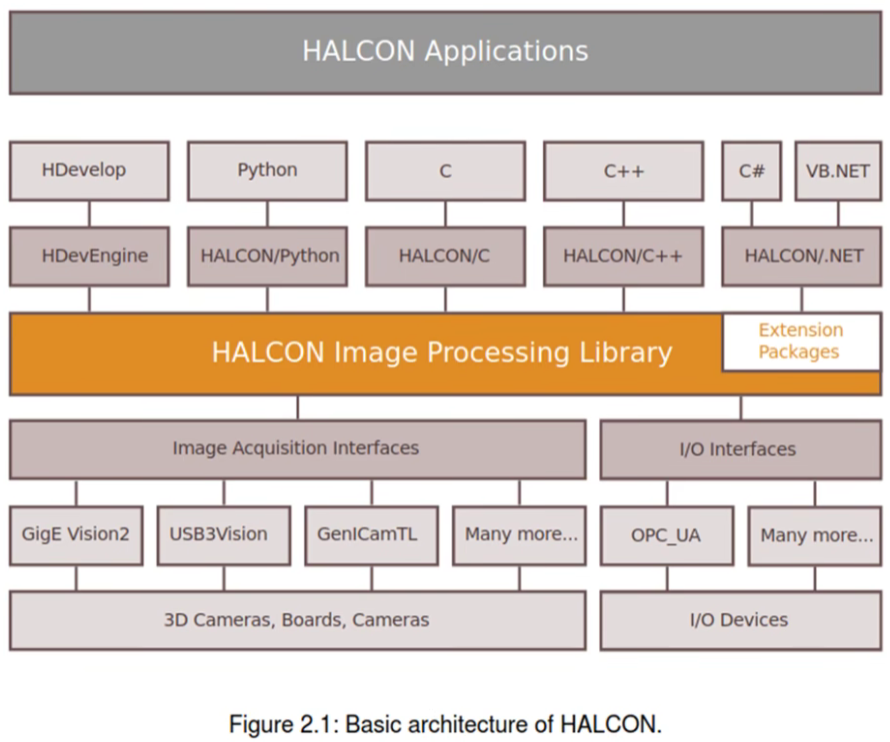
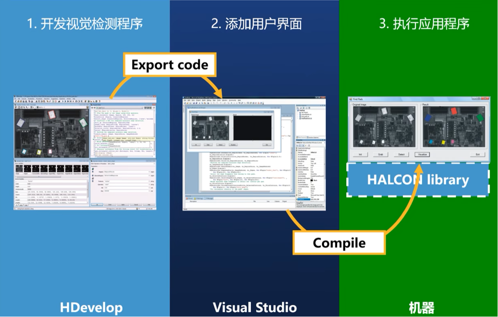
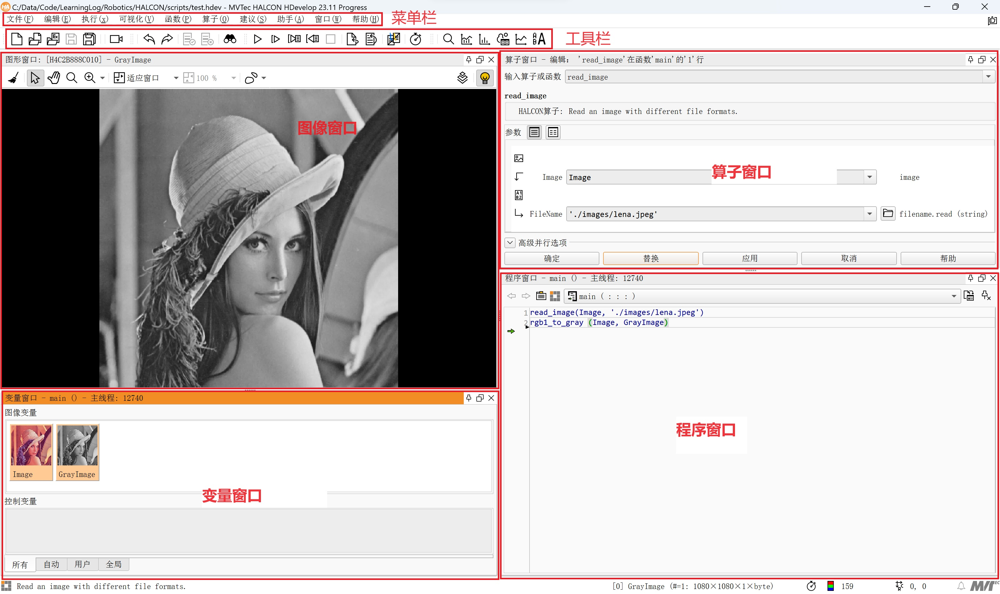
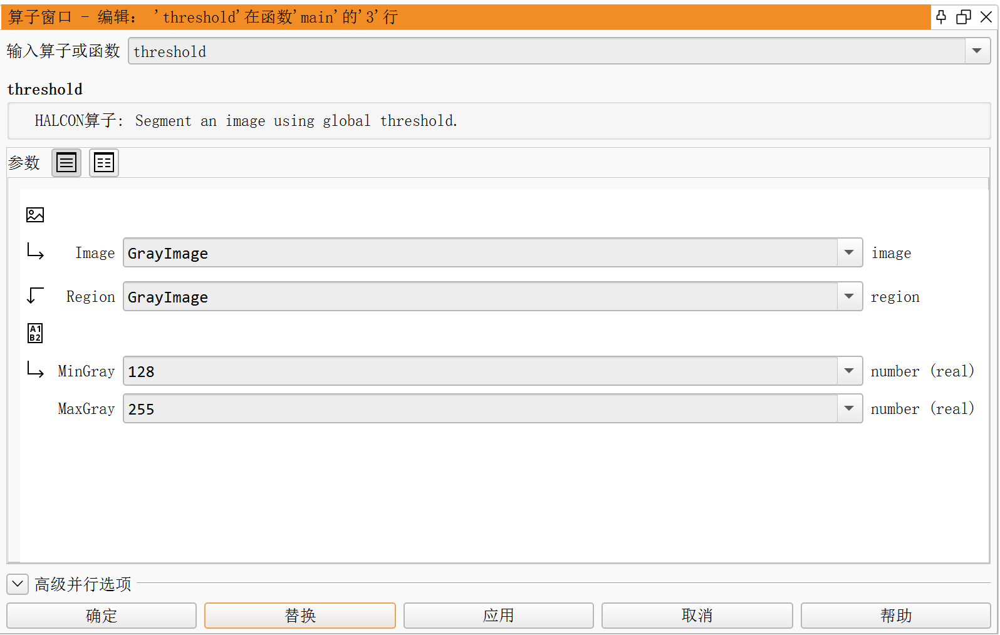

- [Hello, Halcon.](#hello-halcon)

# 认识HALCON

## HALCON基础架构

HDevelop可以做什么：
- 直接连接采集卡或者相机；
- 查看图像的各种数据；
- 视觉方案可行性研究；
- 开发一个视觉检测项目；
- 测试不同算子的处理效果；
- 将HALCON程序导出为Python、C、C++、C#或者VB程序；
- 更多...

HDevelop不能做什么：
- 不能直接生成一个完整的带用户界面和其他辅助功能，可以直接运行在实际项目工控机上的应用程序。

一个完整的视觉程序开发过程通常如下图所示：

## HDevelop界面

### 算子窗口

从算子窗口中我们可以看到，HALCON算子的参数分为图像变量（iconic）和控制变量（control）两类，各自分别又可以分为输入变量和输出变量，一般顺序为`operator(input iconic : output iconic : input control : output control)`，当然并不是每个算子都需要完整的四组参数。另外需要注意的是，算子对输入图像的操作并不是直接在原图上进行的，输入图像并不会被改变，处理结果会保存在图像输出变量。