- [基础指南](#基础指南)
  - [参考坐标系](#参考坐标系)
  - [常用快捷键](#常用快捷键)
- [开始](#开始)
  - [添加参考坐标系](#添加参考坐标系)
  - [导入3D目标](#导入3d目标)
  - [添加TCP](#添加tcp)
  - [添加目标位姿](#添加目标位姿)
  - [添加机器人运动程序](#添加机器人运动程序)
  - [添加主程序](#添加主程序)
- [界面](#界面)
  - [机器人面板](#机器人面板)
  - [机器人位姿](#机器人位姿)
  - [物体设置](#物体设置)
- [机器人程序](#机器人程序)
  - [新建程序](#新建程序)
  - [程序指令](#程序指令)
    - [显示信息指令](#显示信息指令)
    - [暂停指令](#暂停指令)
    - [设置轨迹精度](#设置轨迹精度)
    - [仿真指令](#仿真指令)
- [机器人制造](#机器人制造)
- [提示和技巧](#提示和技巧)
- [一般提示](#一般提示)
  - [标定工具（TCP）](#标定工具tcp)
  - [定义参考坐标系](#定义参考坐标系)
  - [标定转台](#标定转台)
    - [标定一轴转台](#标定一轴转台)
    - [标定二轴转台](#标定二轴转台)
  - [创建机构或机器人](#创建机构或机器人)
    - [如何创建一轴转台](#如何创建一轴转台)
    - [如何创建六轴机器人](#如何创建六轴机器人)
    - [如何创建三轴笛卡尔机器人](#如何创建三轴笛卡尔机器人)
  - [同步外部轴](#同步外部轴)
- [碰撞检测](#碰撞检测)
  - [碰撞检测](#碰撞检测-1)
    - [碰撞图](#碰撞图)
    - [更快的碰撞检测](#更快的碰撞检测)
  - [无碰撞运动规划器](#无碰撞运动规划器)
    - [使用PRM运动规划器](#使用prm运动规划器)
    - [运动设置](#运动设置)
    - [限制关节极限](#限制关节极限)
    - [设置PRM参数](#设置prm参数)
    - [生成路线图](#生成路线图)
    - [链接目标位置](#链接目标位置)
    - [链接程序](#链接程序)
    - [将新目标添加到路线图](#将新目标添加到路线图)
    - [提示和技巧](#提示和技巧-1)
- [Robot Tips](#robot-tips)
- [后处理程序](#后处理程序)
  - [选择后处理程序](#选择后处理程序)
  - [修改后处理程序](#修改后处理程序)
- [RoboDK API](#robodk-api)
  - [Python API](#python-api)
    - [Python仿真](#python仿真)
    - [Python离线编程](#python离线编程)
    - [Python在线编程](#python在线编程)
- [机器人驱动](#机器人驱动)
- [Accuracy](#accuracy)

# 基础指南

## 参考坐标系

- 在默认设置下，RoboDK显示参考坐标系之间的关系为XYZ坐标及X➔Y➔Z顺序的欧拉角格式。这意味着几何旋转将按照下面的顺序：
    1.首先：围绕X轴旋转一个角度
    2.接着：围绕静态Y轴旋转一个角度
    3.最后：围绕静态Z轴旋转一个角度
发那科（Fanuc）与安川（Motoman）机器人的控制器接受以上所描述的旋转格式。但是，其他机器人生产商使用的是不同的旋转顺序。例如，史陶比尔（Stäubli）机器人使用X➔Y’➔Z’’顺序，库卡（KUKA）机器人与那智（Nachi）机器人使用Z➔Y’➔X’’顺序，ABB机器人使用四元数旋转格式。在坐标系的设置界面，RoboDK提供了多种不同的旋转格式以供选择。

## 常用快捷键

- 左键单击选中物体；按住滚轮平移；按住右键旋转；滚动滚轮缩放。
- 按住Alt键，然后鼠标左键拖动坐标轴可以移动坐标系；或者先点击工具栏的移动坐标系工具（如下图），然后拖动坐标轴。
- 按住Alt+Shift键，然后鼠标左键拖动TCP的坐标轴可以移动TCP；或者先点击工具栏的移动TCP工具（如下图），然后拖动TCP的坐标轴。
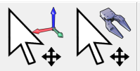
- `+`和`-`键可以放大和缩小坐标系。
- `*`键可以查看机器人的工作空间。

# 开始

## 添加参考坐标系

- 当需要添加一个相对于机器人底座的坐标系时，选中机器人底座坐标系，点击右键，然后选择“添加参考系”。从树状图可以看到，这样添加的坐标系在机器人底座坐标系下，意味着与机器人底座坐标系绑定，当机器人底座移动时该坐标系会跟着一起移动。
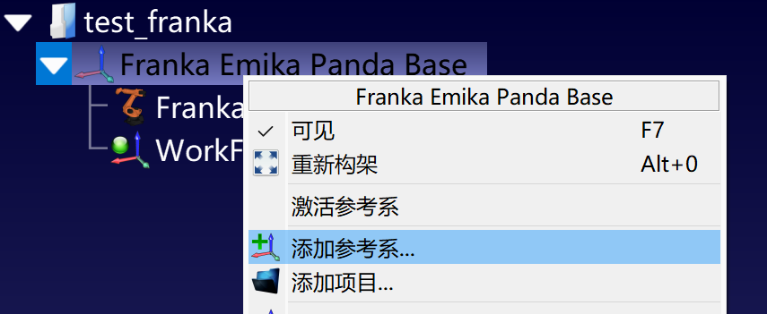

## 导入3D目标

- 拖拽树状图中的各个项目，可以改变他们的从属关系。例如将导入的工件拖拽到工件坐标系下。

## 添加TCP

- 从外部导入末端工具的3D模型文件后，将其拖拽到树状图中机器人下使其从属于机器人即可，然后可以双击工具设定TCP相对法兰的位置（RoboDK默认为[0, 0, 200, 0, 0, 0]）。
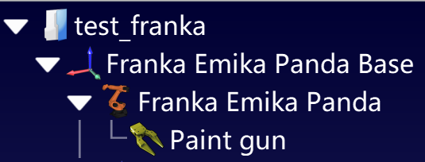

- 如果末端工具的3D模型有问题，使得工具安装在机器人上的实际状态与仿真中的状态不一致，可以通过双击工具然后在工具详情界面“更多选项”中的“移动几何”对工具的位姿进行调整。“应用缩放”选项可以按照一定比例改变工具的大小，方便碰撞检测等场景（确保真实工具不会发生碰撞）的应用。

## 添加目标位姿

使用工具栏中的“添加新的目标点”快捷方式（如下图）来添加目标位姿。

## 添加机器人运动程序

首先点击工具栏中的添加程序快捷方式，然后选中一个目标位姿作为机器人移动的目标，再点击工具栏的添加关节运动或者添加直线运动的快捷方式，一个使机器人移动到指定位置的程序就设置好了。如果需要移动到多个点，就按上述方式继续添加后续目标点。
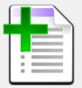 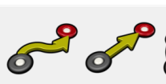 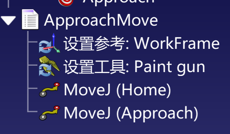

## 添加主程序

- 首先还是和上述添加机器人运动程序一样点击添加程序快捷方式，然后点击工具栏的“程序调用或插入代码指令”快捷方式，点击“选择程序”选中要调用的子程序。如果要依次调用多段子程序，重复上述步骤。

 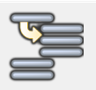 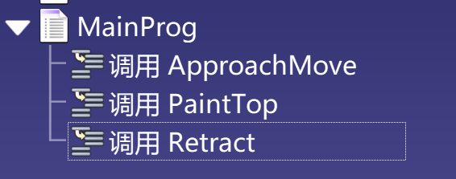

- 右键点击主程序下任意一个调用，选择“添加指令”，即可在该调用下方添加调用Python宏程序、设置速度、设置IO、设置等待时间等操作。
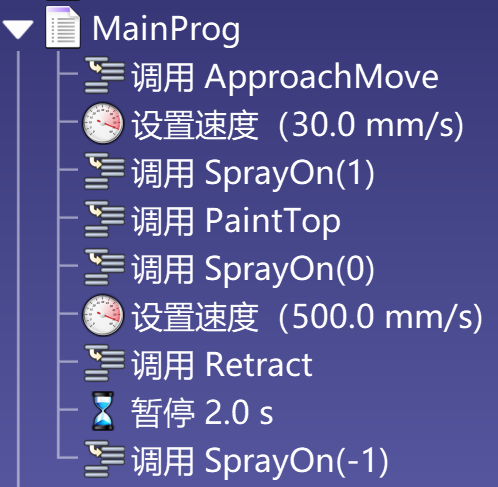

# 界面

## 机器人面板

双击树状图中的机器人或者直接双击机器人3D模型，可以打开机器人面板，在这里可以点动控制机器人，双击关节轴上下限的数字可以调整上下限。
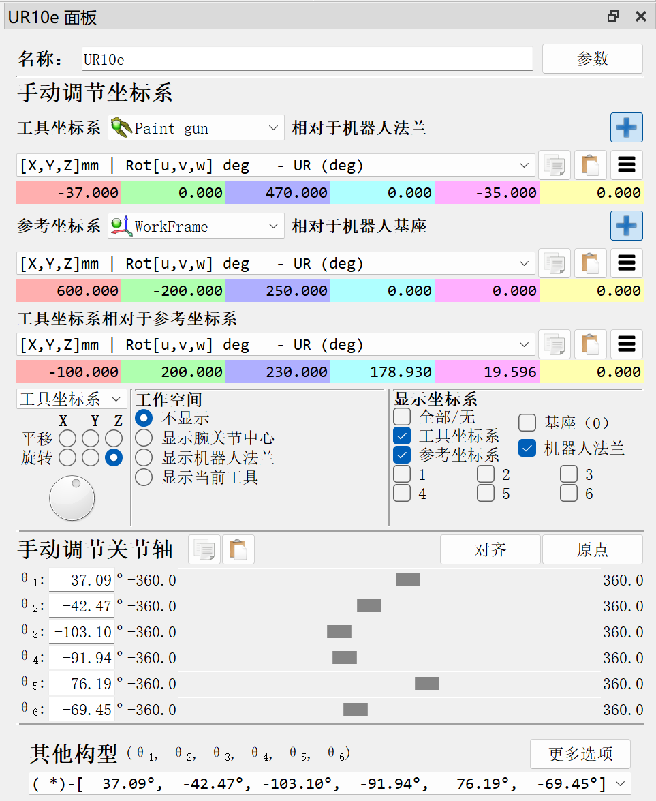

## 机器人位姿

在上述机器人面板中，点击“更多选项”可以看到在末端位姿不变的情况下其他的机器人关节参数组合。经典的6轴机器人在达到某一目标位置时通常可以有8种不同的位姿（假设每个关节轴都可旋转一整圈）。例如，机器人可以是肘部向上或者肘部向下（Up vs. Down，或者U/D），同时，它可以面向目标或者底座需要旋转180度达到目标（Front vs. Rear，或者F/R）。最后，机器人第5轴可能上下反转，同时第4轴与第6轴补偿第5轴的运动（Flip vs. Non-Flip，或者F/N）。以上共可提供2\*2\*2=8种不同的位姿。
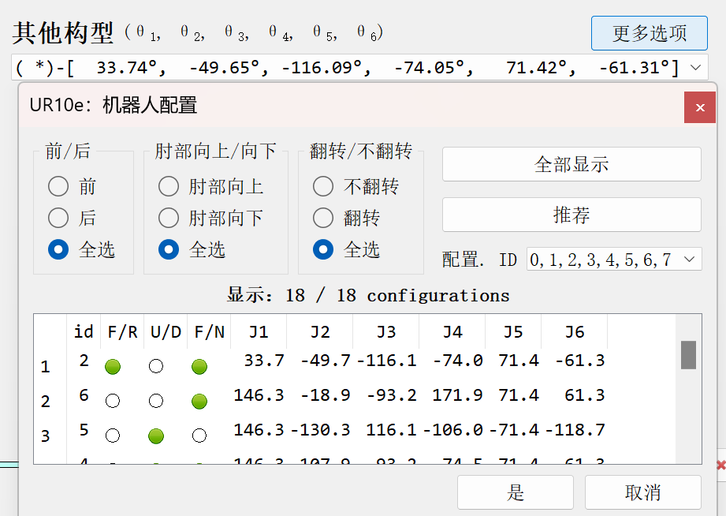

## 物体设置

双击物体可以设置物体的位置、大小、颜色等。按住Ctrl选择多个物体，然后右键单击并选择“合并”，可以将多个物体合并为一个。

# 机器人程序

本节将介绍如何仅使用图形操作界面（GUI）创建机器人程序，后续的[RoboDK API](#robodk-api)章节将介绍使用RoboDK提供的API来编写更复杂的机器人程序。

## 新建程序

新建机器人程序的方法在前文[添加机器人运动程序](#添加机器人运动程序)已有说明，不再赘述。值得注意的是，当我们没有选中一个已有的机器人程序而直接添加指令（例如添加一个直线运动指令）时，会自动生成一个程序并将我们选择的指令添加到程序中。

## 程序指令

右键单击一个机器人程序，选择“添加指令”，即可添加各种各样的指令。这里只对个别指令进行详细介绍，常用指令不再赘述。
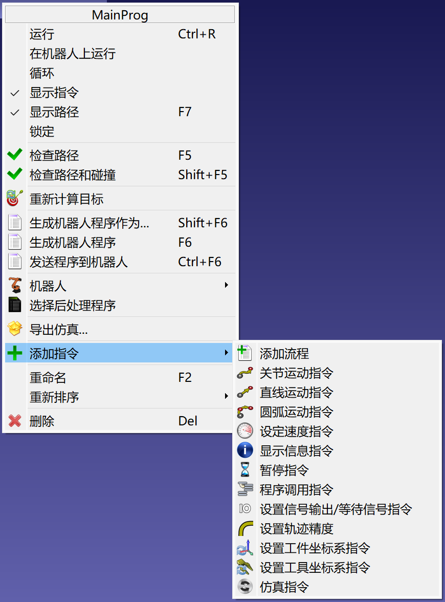

### 显示信息指令

这个指令可以在程序执行到此处时在示教器上显示特定的提示信息，但并不是所有机器人控制器都支持在示教器上显示信息。所以对于那些不支持的设备，这条屏幕显示信息指令将不会起作用。

### 暂停指令

这个指令可以使程序暂停指定的时间，当时间设置为`-1`时将会一直暂停。

### 设置轨迹精度

这里的轨迹精度即运动时的转弯半径，在UR机器人叫Blending radius，ABB机器人叫ZoneData，FANUC机器人叫CNT/FINE。设置为`-1`表示精确按照设定轨迹移动。

### 仿真指令

这条指令主要是为了实现一些仿真中的视觉效果，可以实现将物体和末端工具绑定或解绑、显示或隐藏指定的物体或工具、以及改变物体的位置等。例如，在机器人抓放物体的场景中，当机器人移动到抓取位时，我们利用这条指令添加一个“Attach Object”的动作，就可以实现机器人把物体“抓”起来的效果，使物体跟着末端工具一起移动，同理在放置位我们利用“Detach Object”即可将抓取的物体“放”下。

# 机器人制造

本章主要介绍RoboDK和机器人在机械加工中的应用，比如CNC程序和机器人程序的转换以及相关的设置等。由于目前没有接触到这些应用场景，本章暂时跳过。

# 提示和技巧

本章介绍了一些有用的技巧和窍门以更有效地使用RoboDK软件。

- 使用`+`和`-`键可以放大和缩小参考坐标系。
- 选中树状图中的任意对象，然后按`F2`键可以快捷地进行重命名。
- 按`*`键可以显示机器人的工作空间，方便进行可达性的验证。双击机械臂可以在弹出的选项卡中切换末端法兰的工作空间和工具的工作空间。
- 在树状图中选中一个或多个对象，然后按`F7`键可以使其隐藏/显示。
- 按`/`键可以隐藏/显示屏幕上的文本。
- 按住鼠标右键拖放树状图中的项目可以调整其顺序。

# 一般提示

## 标定工具（TCP）

1. 选择“实用程序” → “定义工具坐标系(TCP)”；
2. 在“选择工具”下拉菜单中选择正确的工具；
3. 选择方法：通过点校准XYZ：变换不同的机器人位姿使TCP接触一个固定点。通过平面校准XYZ：变换不同的位姿使TCP接触一个固定平面，TCP可以是点或球形。
4. 默认校准使用“关节”，可以修改为“姿态”。
5. 如果有多个机器人，选择正确的机器人；
6. 设置用于标定TCP的点的数量，建议至少使用4个。
7. 移动机器人以获取几个点的位姿数据。
8. 点击“显示误差”可以看到每个点的误差大小，选择“更新”以应用标定好的工具。

## 定义参考坐标系

1. 选择“实用程序” → “定义参考系（用户框架）”；
2. 在“选择参考坐标系”下拉菜单中选择要标定的坐标系；
3. 在“选择方法”下拉菜单选择标定的方式，下面的图片会对应地显示该方式所需的点的位置。
4. 默认校准使用“关节”，可以修改为“姿态”。
5. 如果有多个机器人，选择正确的机器人；。
6. 移动机器人以获取几个点的位姿数据。
7. 选择“更新”以应用标定好的坐标系。

## 标定转台

注意，转台可以通过RoboDK在线资源库Robot Library添加现成的转台（Type选择Ext.axis即可看到），也可以按照[创建机构或机器人](#创建机构或机器人)的方式自定义转台模型。在标定转台前，应按照[同步外部轴](#同步外部轴)中的方法将机器人和转台进行同步，然后再进行标定。

### 标定一轴转台

1. 选择“实用程序” → “定义参考系（用户框架）”；
2. 在“选择参考坐标系”下拉菜单中选择要标定的转台坐标系；
3. 在“选择方法”下拉菜单选择“转台校准（1轴）。
4. 默认校准使用“关节”，可以修改为“姿态”。
5. 如果有多个机器人，选择正确的机器人；。
6. 移动机器人以获取几个点的位姿数据。
   1. 如下图所示，每一个点包含7个数据，前6个数表示机器人的位姿，最后蓝色的一列表示转台旋转的角度。如果没有出现蓝色的一列，请检查是否按照[同步外部轴](#同步外部轴)中的方法将机器人和转台进行同步。请注意，第一点将决定X轴的正方向。取点的规则是在通过末端工具触碰决定X轴正方向的第一点后，转台沿正方向旋转一定角度（可以适当大一点），然后用末端工具去触碰转台上同一个点，此时机器人的姿态就是p2。以此类推，获取至少6个点，在此过程中每次机器人末端工具触碰的都是转台上的同一个点。
   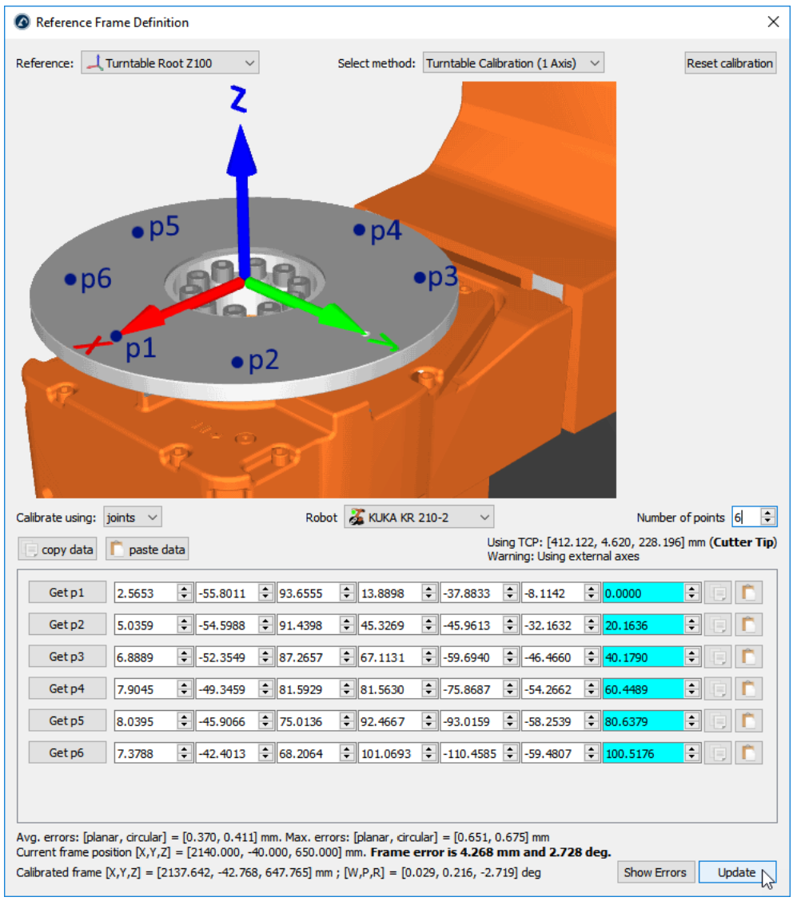
7. 选择“更新”以应用标定好的坐标系。

### 标定二轴转台

主要步骤与标定一轴转台相同，只是在“选择方法”下拉菜单选择“转台校准（2轴）。如下图所示，此时每个点将包含8个数据，即机器人位姿的6个数据和两列蓝色的数据分别表示转台两轴的角度。取点时，先使转台沿轴1正方向每次旋转一定角度取一系列点，再使转台沿轴2正方向每次旋转一定角度取一系列点，建议对于每个轴至少取6个点。请注意，整个取点过程中机器人末端工具始终触碰的是转台上的同一个点，且默认第一次绕着转台参考坐标系的X轴旋转，第二次绕着Z轴旋转，即轴1为X轴，轴2为Z轴。
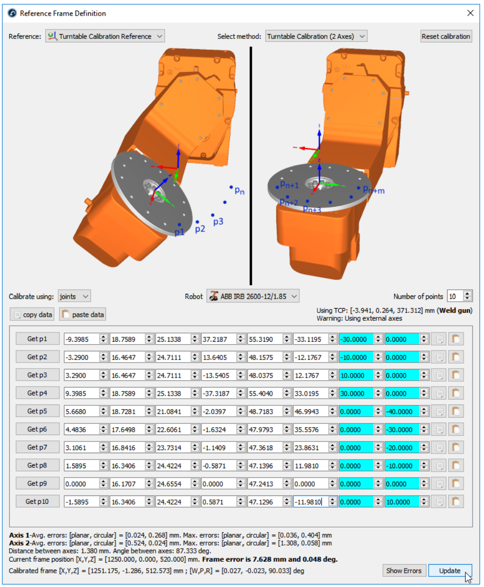

## 创建机构或机器人

- 在RoboDK中可以按照下列步骤自定义创建新的机器人或机构：
  1. 选择“实用程序” → “模型机构或机器人”；
  2. 选择要创建的机构或机器人的类型；
  3. 设置坐标系；
  4. 为每个关节选择一个对象；
  5. 根据不同的机构或机器人类型按照界面上的提示和说明设置其他的参数；
  6. 点击“更新”以查看创建的机构或机器人。

- RoboDK支持创建以下类型的机构或机器人：一个旋转轴（转盘或抓手）、两个旋转轴（二轴定位器）、一个直线轴（直线导轨）、两个直线轴（T型机器人）、三个直线轴（H型机器人）、一个直线轴+一个旋转轴、两指夹爪、SCARA机器人（4轴）、六轴机械臂、七轴机械臂。

### 如何创建一轴转台

1. 选择“程序” → “添加参考坐标系”；
2. 选择参考坐标系，然后将其重命名为Turntable Base Ref；
3. 加载转盘的3D模型：将3D模型拖放到RoboDK窗口中（例如STL，STEP或IGES文件）；
4. 选择“实用程序” → “模型机构或机器人”；
5. 选择“一个旋转轴”；
6. 参考坐标系和对象项会自动填充，如果自动选择不正确，可以手动修改；
7. 设置旋转极限，例如我们想要±20转，可以输入±7200度；
8. 选择“更新”以生成创建的一轴转台，如下图所示。

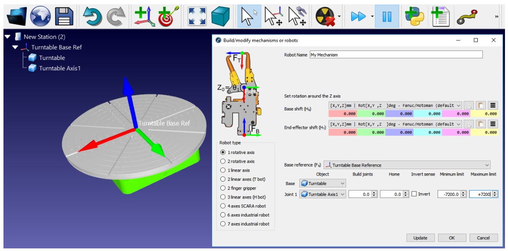

### 如何创建六轴机器人

参考文档 [如何创建六轴机器人](https://robodk.com.cn/doc/cn/General.html#Model6axis)。

### 如何创建三轴笛卡尔机器人

参考文档 [如何创建三轴笛卡尔机器人](https://robodk.com.cn/doc/cn/General.html#Model3axis)。

## 同步外部轴

要将机器人和外部轴同步，请按照以下步骤操作：
1. 导入机器人和外部轴到工作站中；
2. 将机器人和外部轴放置在合适的位置；
3. 选择“实用程序” → “同步外部轴”；
4. 选择要同步的机器人和外部轴；
5. 点击“确定”后，会打开机器人的设置页面，可以看到在“手动调节关节轴”一栏中除了机器人的关节轴一外，还会新增几行蓝色的轴参数，具体取决于同步的外部轴的轴数。同时，在左侧设计树中机器人和对应的外部轴图标上会增加一个链接🔗标识。

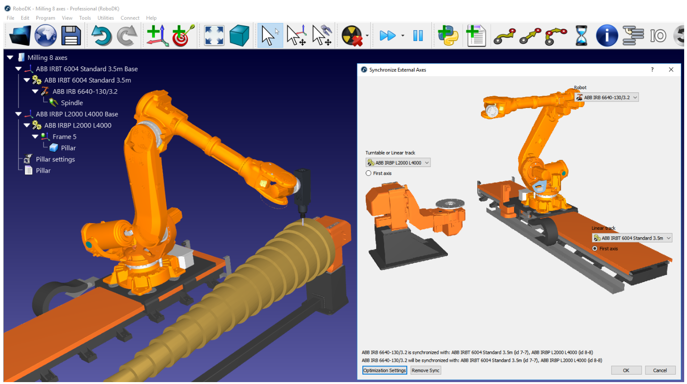

# 碰撞检测

## 碰撞检测

- 通过“工具” → “检查碰撞”或者工具栏的检查碰撞图标来开启和关闭碰撞检测。如果激活了碰撞检测功能，则当检测到碰撞时，所有程序和机器人运动都将停止，处于碰撞状态的物体将以红色突出显示。
- 只需要检测某一段程序中是否存在碰撞时，可以右键单击该程序，然后选择“检查路径和碰撞”。
- 碰撞检测的步长在“工具” → “选项” → “运动”中定义，如果需要在检测到碰撞时也继续执行机器人程序而不是停止，可以在本页面取消勾选“当检测到碰撞时停止机器人”。

### 碰撞图

在碰撞图中我们可以指定要检查哪些物体之间的碰撞。选择“工具” → “碰撞地图”可以看到当前工作站中所有对象间的碰撞检查状态，如下图所示。

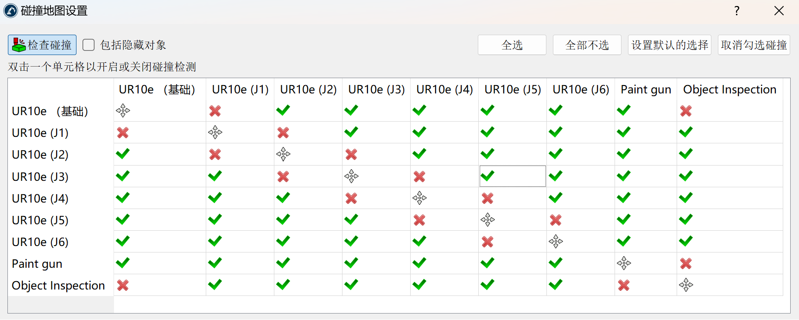

默认情况下RoboDK检查当前工作站所有运动对象之间的碰撞，除了连续的两个机器人关节，因为它们可能本来就处于接触状态。

### 更快的碰撞检测

碰撞检测的速度主要取决于以下因素：

- 碰撞图中定义的碰撞检查对的数目；
- 碰撞检查时的运动步长；
- 3D模型的精细复杂程度；简化3D模型可以加快碰撞检测速度。
- 计算机的性能。

## 无碰撞运动规划器

RoboDK使用PRM算法来进行无碰撞运动规划。

### 使用PRM运动规划器

PRM算法包括两个环节，较慢的“构造环节”仅需要执行一次，而较快的“搜索阶段”可以重复多次。

- 构造环节：PRM算法将点随机放置在机器人的自由工作空间内，然后它尝试将这些点连接在一起，以形成工作空间内无碰撞路径的路线图。
- 搜索环节：规划器尝试使用在构造环节创建的路线图来找到两个目标点之间的最短无碰撞路径。

### 运动设置

按照[快速入门](#开始)依次添加机器人、工具、障碍物、目标点等。

### 限制关节极限

通常来说我们不会允许机器人在整个关节空间中自由移动，对于6轴机器人，最经常受到限制的两个关节是：

- 第1关节（基础关节）：限制此关节可以大致限制机器人在俯视平面上的工作范围；
- 第3关节（肘关节）：限制此关节是为了使机器人固定肘朝上或者肘朝下，避免肘关节翻转。

可以通过双击机器人面板中“手动调节关节轴”部分关节上下限的数字来修改关节极限，并点击“工作空间”部分的“显示当前工具”来直观看到当前机器人的工作空间，如下图所示。

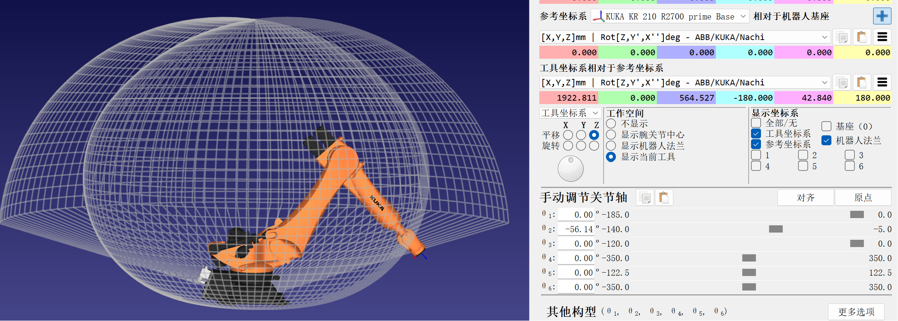

### 设置PRM参数

核心参数有三个：

- 随机点数量（Number of samples）：在[使用PRM运动规划器](#使用prm运动规划器)一节中我们提到PRM算法在构造环节会随机在机器人的工作空间内放置若干点，此参数表示随机点的数量，默认值100。
- “边”的数量（Min edges per sample）：两个随机点间的连线称为“边”，表示这两个点间的无碰撞路径，此参数表示对于每个随机点创建“边”的数量，默认值25。
- 机器人步长（Robot step (Deg)）：碰撞检查时的最小运动间隔，默认值4°。

### 生成路线图

本过程相当于PRM算法中的“构造环节”，将生成机器人工作空间的路线图。

1. 选择“实用程序” → “Collision-free motion planner” → “Create collision-free map"。
2. 输入上一节中介绍的三个参数或保留默认值。
3. 点击"Update Map"以生成新的路线图。

生成完毕后，点击“Display map”可以看到生成的路线图，如下图所示。

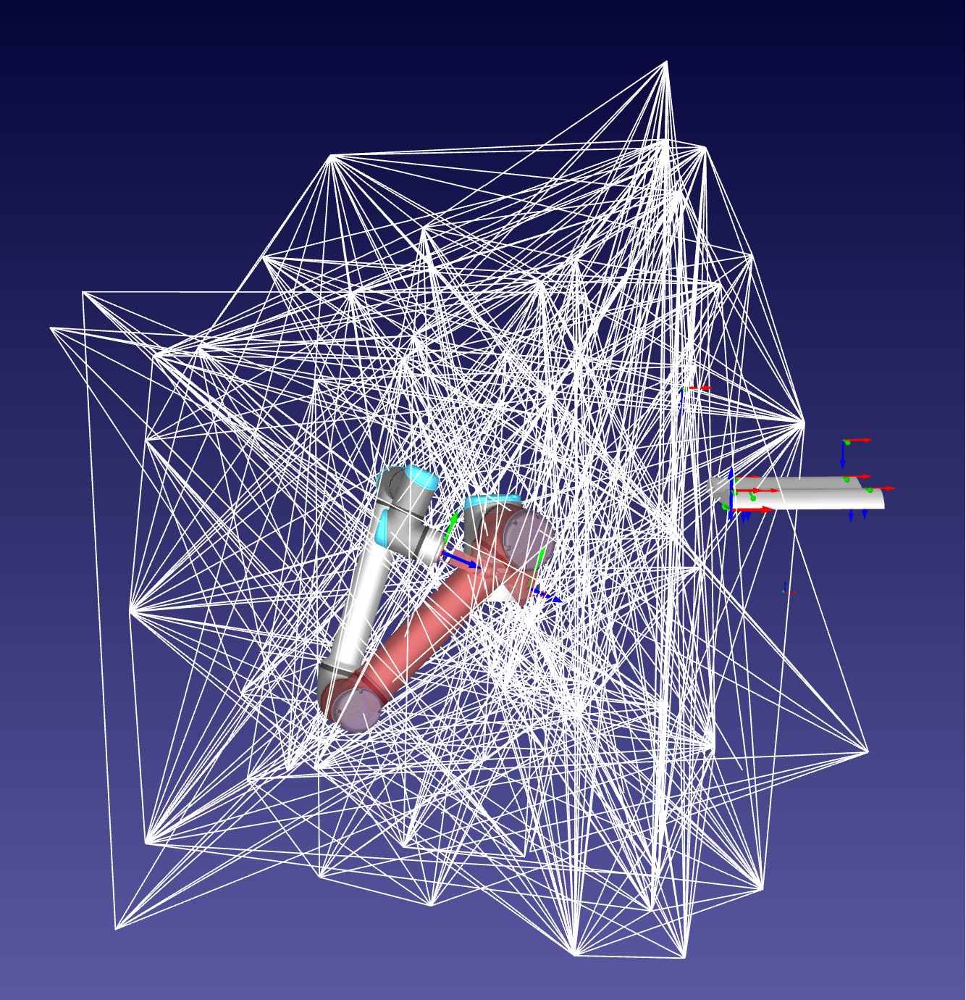

### 链接目标位置

此过程相当于PRM算法中的“搜索环节”，即利用生成的路线图在两个或多个目标位置之间创建一条无碰撞的路径。我们只需在设计树中选中所需的目标位置，然后右键选择“Link selected targets”，RoboDK便会自动在设计树创建一个新的机器人程序实现我们选定的目标位置间的无碰撞运动。

### 链接程序

同样地，我们也可以将两个或多个程序链接在一起，实现两个程序间的无碰撞运动。

### 将新目标添加到路线图

在[生成路线图](#生成路线图)中，路线图中点的位置是随机生成的，为了达到更好的运动规划效果，我们也可以手动添加一些点到路线图中。RoboDK支持在现有的路线图中直接添加新的点，而不用重新生成整个路线图（只要你试过一次就知道这有多耗时间）。首先我们还是打开“Collision-free motion planner”面板，然后在设计树中选中我们要添加到路线图中的位置，再点击面板上的“Add selected targets”即可。实际上，在我们链接目标位置或链接程序时，其中的目标位置也会被自动添加到路线图中。

### 提示和技巧

- 生成路线图时可以先从较粗糙的参数设置开始，以便快速生成结果，在实际应用前再以较大的参数重新生成更复杂的路线图以达到更好的运动效果。
- 不要忘记限制关节的极限，这既可以加快路线图的生成，也可以避免随机点落在我们不关心的区域。
- 正确定义碰撞图，适当去掉不必要的碰撞检测。
- 障碍物的三维模型应该进行适当的膨胀或者偏移，以避免因为仿真和现实的细微差别造成碰撞。
- 尽量在机器人可操作性最高的区域进行工作，避免靠近工作空间边缘。

# Robot Tips

本章主要介绍了RoboDK软件和主流品牌机器人之间进行程序传输、运行程序、设置TCP以及设置RoboDK驱动等操作的详细步骤，用到时查阅即可。

- [ABB机器人](https://robodk.com.cn/doc/cn/Robots-ABB.html#ABB)
- [Denso机器人](https://robodk.com.cn/doc/cn/Robots-Denso.html#Denso)
- [Fanuc机器人](https://robodk.com.cn/doc/cn/Robots-Fanuc.html#Fanuc)
- [KUKA机器人](https://robodk.com.cn/doc/cn/Robots-KUKA.html#KUKA)
- [Motoman机器人](https://robodk.com.cn/doc/cn/Robots-Motoman.html#Motoman)
- [UR机器人](https://robodk.com.cn/doc/cn/Robots-Universal-Robots.html#UR)

# 后处理程序

后处理程序主要负责将RoboDK程序转换为和不同的机器人控制器适配的程序。RoboDK已经提供了许多后处理程序，可以支持多种品牌的机器人控制器。除此之外，用户也可以自己编写新的后处理程序或者修改现有的后处理程序，所有的后处理程序文件都在`C:\RoboDK\Posts\`文件夹内。

## 选择后处理程序

1. 右键单击机器人或者某一段机器人程序；
2. 点击“选择后处理程序”；
3. 根据机器人控制器型号在弹出的列表中选择正确的后处理程序，然后点击OK。

注意：后处理程序的选择是和机器人绑定的，改变一段机器人程序的后处理程序时，所有此机器人的机器人程序的后处理程序都会改变。

## 修改后处理程序

选择“程序” → “添加/编辑后处理程序”，然后选择“添加新的后处理程序”以自定义新的后处理程序，或者选择一个现成的后处理程序进行修改。也可以直接在`C:\RoboDK\Posts\`文件夹新建Python文件或者修改已有的Python文件。

# RoboDK API

RoboDK API支持Python、C#和MATLAB。

## Python API

RoboDK Python API的详细文档见[RoboDK API for Python](https://robodk.com/doc/en/PythonAPI/index.html)。本节只是简单介绍。

RoboDK的Python API主要涉及两个模块：
- [robolink模块](https://robodk.com/doc/en/PythonAPI/robodk.html#robolink-py)：robolink模块建立了一个RoboDK与Python之间的接口，RoboDK项目设计树中的任何对象都可以通过robolink模块提供的方法进行检索和各种操作。
- [robodk模块](https://robodk.com/doc/en/PythonAPI/robodk.html)：robodk模块类似于Python的一个机器人工具箱，提供了一些进行数学运算和机器人位姿变换相关的方法，尤其是适配了主流品牌机器人不同的位姿变换方法，便于实际使用。所有的后处理程序都依赖于这个模块。

Python API相关的文件位于`C:\RoboDK\Python`路径。

### Python仿真

在前文关于机器人程序的章节已经提到过，我们可以在仿真中调用Python宏程序来实现更丰富的仿真效果，例如模拟喷涂应用中喷涂的范围。要创建Python宏程序，只需点击“程序” → “添加Python程序”或者直接点击工具栏的Python图标，然后右键单击设计树中新出现的Python程序，选择“编辑Python脚本”即可。这里我们并不会详细介绍Python宏程序的编写，相关内容请参阅[RoboDK API for Python](https://robodk.com/doc/en/PythonAPI/index.html)完整文档。值得一提的是，在`C:\RoboDK\Library\Macros`文件夹中，RoboDK已经提供了很多Python宏程序，可以用于学习参考或者直接使用。

### Python离线编程

Python脚本也可以通过后处理程序转换为适配多个品牌机器人控制器的离线运行机器人程序，只需在设计树中选中Python脚本，单击右键，然后选择“生成机器人程序”即可。

### Python在线编程

# 机器人驱动

# Accuracy