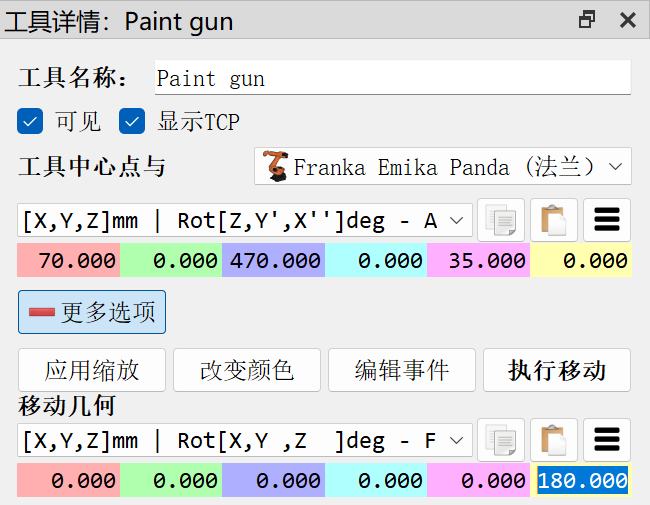

- [基础指南](#基础指南)
  - [参考坐标系](#参考坐标系)
  - [常用快捷键](#常用快捷键)
- [开始](#开始)
  - [添加参考坐标系](#添加参考坐标系)
  - [导入3D目标](#导入3d目标)
  - [添加TCP](#添加tcp)
- [界面](#界面)
- [选项菜单](#选项菜单)
- [机器人程序](#机器人程序)
- [机器人制造](#机器人制造)
- [提示和技巧](#提示和技巧)
- [一般提示](#一般提示)
- [Add-ins](#add-ins)
- [Plugins](#plugins)
- [碰撞检测](#碰撞检测)
- [Robot Tips](#robot-tips)
- [后置处理器](#后置处理器)
- [RoboDK API](#robodk-api)
- [机器人驱动](#机器人驱动)
- [Accuracy](#accuracy)

# 基础指南

## 参考坐标系

- 在默认设置下，RoboDK显示参考坐标系之间的关系为XYZ坐标及X➔Y➔Z顺序的欧拉角格式。这意味着几何旋转将按照下面的顺序：
    1.首先：围绕X轴旋转一个角度
    2.接着：围绕静态Y轴旋转一个角度
    3.最后：围绕静态Z轴旋转一个角度
发那科（Fanuc）与安川（Motoman）机器人的控制器接受以上所描述的旋转格式。但是，其他机器人生产商使用的是不同的旋转顺序。例如，史陶比尔（Stäubli）机器人使用X➔Y’➔Z’’顺序，库卡（KUKA）机器人与那智（Nachi）机器人使用Z➔Y’➔X’’顺序，ABB机器人使用四元数旋转格式。在坐标系的设置界面，RoboDK提供了多种不同的旋转格式以供选择。

## 常用快捷键

- 左键单击选中物体；按住滚轮平移；按住右键旋转；滚动滚轮缩放。
- 按住Alt键，然后鼠标左键拖动坐标轴可以移动坐标系；或者先点击工具栏的移动坐标系工具（如下图），然后拖动坐标轴。
- 按住Alt+Shift键，然后鼠标左键拖动TCP的坐标轴可以移动TCP；或者先点击工具栏的移动TCP工具（如下图），然后拖动TCP的坐标轴。

- `+`和`-`键可以放大和缩小坐标系。

# 开始

## 添加参考坐标系

- 当需要添加一个相对于机器人底座的坐标系时，选中机器人底座坐标系，点击右键，然后选择“添加参考系”。从树状图可以看到，这样添加的坐标系在机器人底座坐标系下，意味着与机器人底座坐标系绑定，当机器人底座移动时该坐标系会跟着一起移动。

## 导入3D目标

- 拖拽树形图中的各个项目，可以改变他们的从属关系。例如将导入的工件拖拽到工件坐标系下。

## 添加TCP

- 从外部导入末端工具的3D模型文件后，将其拖拽到树状图中机器人下使其从属于机器人即可，然后可以双击工具设定TCP相对法兰的位置（RoboDK默认为[0, 0, 200, 0, 0, 0]）。

- 如果末端工具的3D模型有问题，使得工具安装在机器人上的实际状态与仿真中的状态不一致，可以通过双击工具然后在工具详情界面“更多选项”中的“移动几何”对工具的位姿进行调整。

# 界面

# 选项菜单

# 机器人程序

# 机器人制造

# 提示和技巧

# 一般提示

# Add-ins

# Plugins

# 碰撞检测

# Robot Tips

# 后置处理器

# RoboDK API

# 机器人驱动

# Accuracy