- [相机和镜头](#相机和镜头)
  - [机器视觉的基本功能](#机器视觉的基本功能)
  - [传感器](#传感器)
  - [快门](#快门)
  - [镜头](#镜头)
  - [光圈、焦距、景深](#光圈焦距景深)
- [光源](#光源)
  - [灰度照明技术](#灰度照明技术)
    - [二值化处理](#二值化处理)
    - [照明方式](#照明方式)
  - [彩色照明技术](#彩色照明技术)
  - [照明方式](#照明方式-1)
- [图像预处理](#图像预处理)
  - [邻域和连通性](#邻域和连通性)
  - [空域滤波](#空域滤波)
  - [频域滤波](#频域滤波)
- [数学形态学](#数学形态学)
  - [膨胀](#膨胀)
  - [腐蚀](#腐蚀)
  - [开运算](#开运算)
  - [闭运算](#闭运算)
  - [形态学的应用](#形态学的应用)
    - [边界提取](#边界提取)
    - [骨架](#骨架)
  - [灰度形态学](#灰度形态学)
    - [灰度膨胀](#灰度膨胀)
    - [灰度腐蚀](#灰度腐蚀)
    - [灰度开运算和灰度闭运算](#灰度开运算和灰度闭运算)
- [边缘检测](#边缘检测)
  - [边缘](#边缘)
  - [边缘检测算子](#边缘检测算子)
    - [梯度算子](#梯度算子)
    - [拉普拉斯算子](#拉普拉斯算子)
    - [Canny算子](#canny算子)
- [图像分割](#图像分割)
  - [直方图](#直方图)
  - [多阈值分割](#多阈值分割)
  - [灰度均衡](#灰度均衡)
  - [局部阈值](#局部阈值)
- [尺寸测量](#尺寸测量)
  - [点检测](#点检测)
  - [线检测](#线检测)
  - [间距测量](#间距测量)
  - [角度检测](#角度检测)
- [图像变换](#图像变换)
  - [反转变换](#反转变换)
  - [对数变换](#对数变换)
  - [幂律（伽马）变换](#幂律伽马变换)
  - [分段线性变换](#分段线性变换)
  - [直方图均衡化](#直方图均衡化)
  - [仿射变换](#仿射变换)
  - [投影变换](#投影变换)
    - [投影方式](#投影方式)
    - [单应性变换](#单应性变换)
    - [单应性变换矩阵](#单应性变换矩阵)
- [3D视觉](#3d视觉)
  - [激光测距原理](#激光测距原理)
  - [结构光](#结构光)
    - [散斑结构光](#散斑结构光)
    - [条纹结构光](#条纹结构光)
  - [双目立体视觉](#双目立体视觉)
  - [TOF](#tof)
    - [测量原理](#测量原理)
    - [两种方式](#两种方式)
  - [小结](#小结)
- [相机标定](#相机标定)
  - [基本概念](#基本概念)
  - [手眼标定](#手眼标定)
- [附录一 相机内参和畸变](#附录一-相机内参和畸变)
  - [简介](#简介)
  - [内参矩阵](#内参矩阵)
  - [畸变](#畸变)

# 相机和镜头

## 机器视觉的基本功能

机器视觉的应用场景不计其数，但基本都可以归结到四种基本功能：识别、测量、定位、检测。
| 基本功能 | 功能描述 | 主要指标 | 举例 |
| :-: | :-: | :-: | :-: |
| 识别 | 基于目标物的外形、颜色、字符、条码等特征进行甄别 | 识别的准确性和精度 | OCR |
| 测量 | 把获取的图像像素信息标定成常用的度量衡单位，然后在图像中精确地计算出目标物的几何尺寸 | 测量精度以及复杂形态 | 工件尺寸测量 |
| 定位 | 获得目标物体的二维或三维位置信息 | 定位的精度和速度 | 视觉引导机器人抓取 |
| 检测 | 外观和缺陷检测等 | 检测的精度和速度 | 工件缺陷检测 |

## 传感器

CCD：成像质量好、速度慢、成本高、功耗高\
CMOS：反之

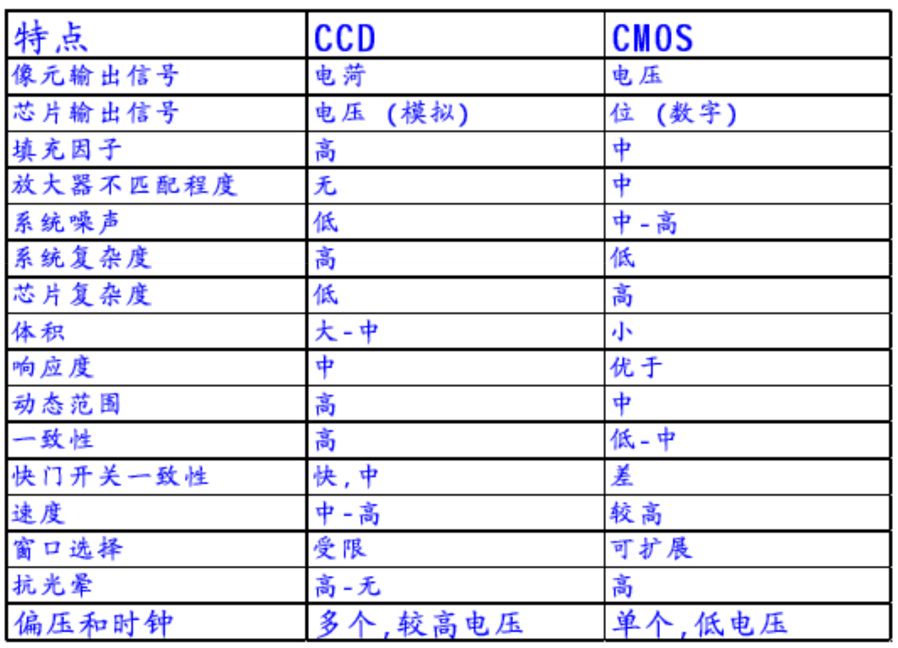

## 快门

Rolling Shutter 卷帘快门：逐行曝光，不适合拍摄运动物体，容易有拖影
Global Shutter 全快门：一次曝光，适合拍摄运动物体

## 镜头

镜头按照视场可以大致分为标准镜头、广角镜头、长焦镜头和微距镜头。
标准镜头：视角约50°，和人眼类似。
广角镜头：视角90°以上，适用于拍摄距离近且范围大的景物。
长焦镜头：适用于拍摄距离远的景物。
微距镜头：极近距离的微距摄影。

除此之外，还有一类特殊的远心镜头。一般镜头和人眼一样，都存在近大远小的现象，而远心镜头可以保证在景深范围内的物体其图像放大倍率不随物距变化而变化，适用于被测物不在同一物面上的情况。下图为普通镜头和远心镜头拍摄的图片对比。

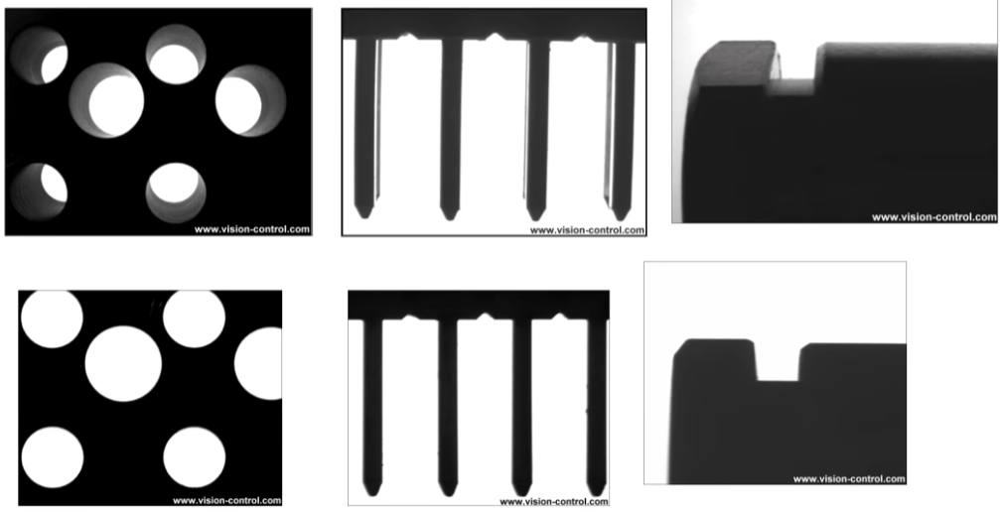

## 光圈、焦距、景深

光圈：$F=f/D$ &emsp;&emsp; $f:$ 焦距 $D:$ 通光孔径\
$F$值越小，光圈越大\
光圈越小，景深越大；光圈越大，景深越小
焦距越小，景深越大；焦距越大，景深越小
焦距越小，视场越大；焦距越大，视场越小

“景深”的形成：理论上来说只有镜头前一定距离的一个平面（下图中的对准平面）上的点（点A）会准确地落在传感器上，距离近一点（点B2）或者远一点（点B1）时落在传感器上的都不是一个点而是一个“弥散圆”，成像会变得模糊。但当弥散圆小于单个像素的大小时，实际上还是相当于一个点（一个像素），因此对准平面前后一段距离内的物体都可以认为是清晰成像的，这个距离就是景深。

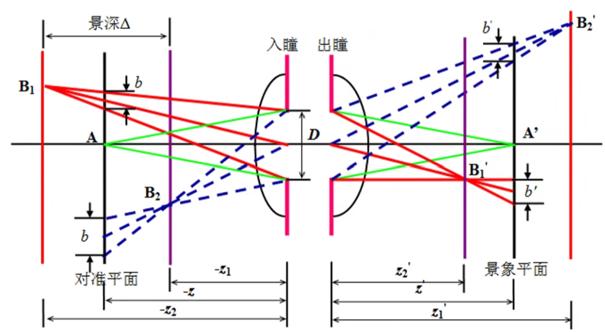
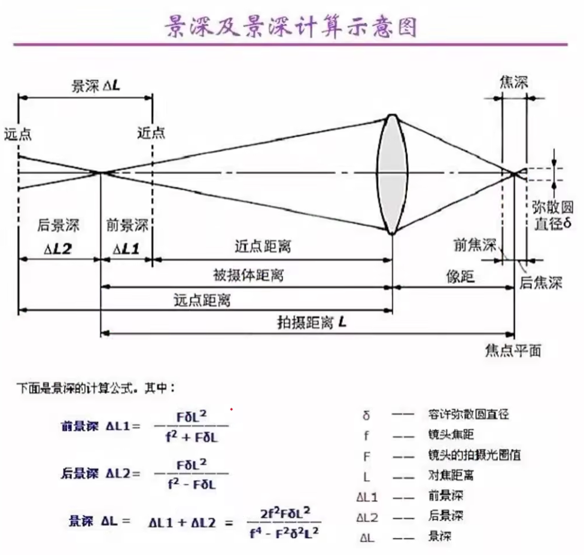

# 光源

## 灰度照明技术

### 二值化处理

灰度图像不是只有黑白两色，而是256级灰度，处理时我们常常会将灰度图按照一定的阈值转换为只有黑白两色。

### 照明方式

直射照明、漫射照明、透射照明、偏光照明
偏光镜可以消除强反射光线和散射光，使光线变得柔和

## 彩色照明技术

光照颜色与物体颜色相同，则在二值图像中光将被明亮反射，显示为白色
光照颜色与物体颜色互补，则在二值图像中光将被吸收，显示为黑色
互补色：红+绿=黄，互补于蓝；红+蓝=紫，互补于绿；绿+蓝=青，互补于红

## 照明方式

直射方式、低角度方式、条形方式、聚光方式、平面环形方式、圆拱形方式、同轴方式、平行光、透射方式

# 图像预处理

## 邻域和连通性

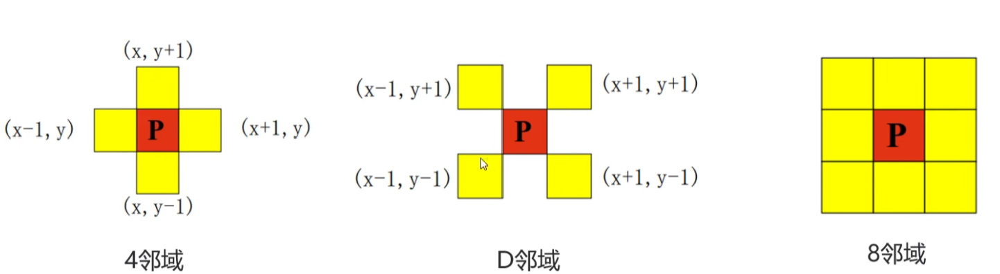
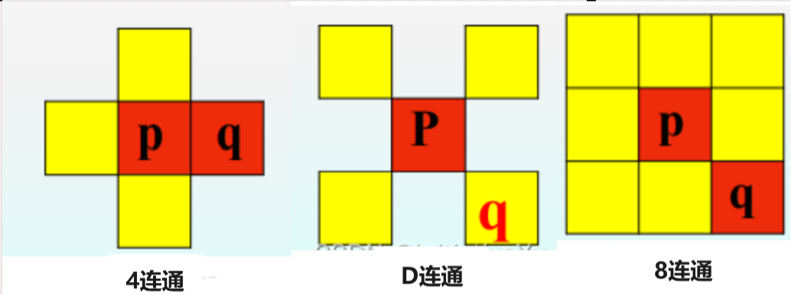
除此之外，还有一种连通性称为m连通。假设p、q两点是m连通的，则需要满足下面两个条件之一：
1. q在p的4邻域中；
2. q在p的D邻域中，并且q的4邻域与p的4领域交集为空。
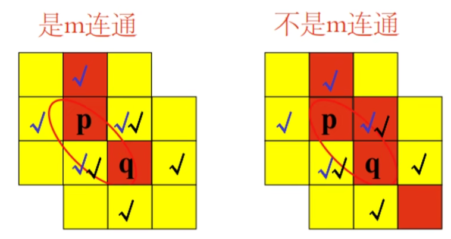
引入m连通是为了消除8连通的二义性（这在边缘检测中是很不希望出现的）。如下图所示，采用8连通的话中间的那个1可以有两条路径到达右上角的那个1，而改成m连通的话中间的1和右上角的1不是m连通的，路径唯一。m连通的实质其实就是当两个像素间同时存在4连通和8连通时优先采用4连通，屏蔽和同一个像素存在4连通的两个像素间的8连通。
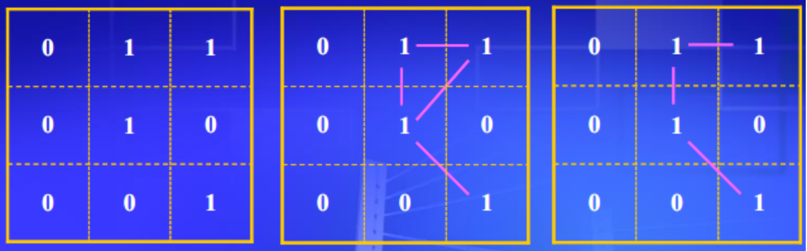

## 空域滤波

均值滤波：会使图像模糊，尤其是边缘轮廓
中值滤波：可有效抑制随机脉冲噪声（椒盐噪声）

## 频域滤波

图像中灰度变化缓慢的部分对应低频，图像的细节和边缘轮廓等灰度突变区域对应高频。
通过低通滤波器可以滤除高频部分，实现降噪。常用的低通滤波器有高斯低通滤波器、巴特沃思低通滤波器、指数形低通滤波器等

# 数学形态学

## 膨胀

将核的原点移至原图中的某一点
对原图和核求并集
对原图中的所有点重复上述操作

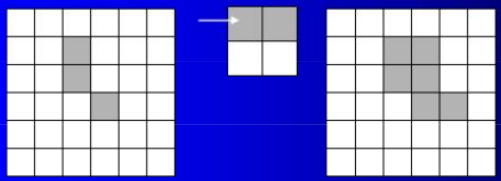

## 腐蚀

用$B$腐蚀$A$得到的是$B$完全包括在$A$中时$B$的原点位置的集合。
腐蚀可以把小于核的细节（如毛刺）去除，也可以将两个有细小连通的部分分开。

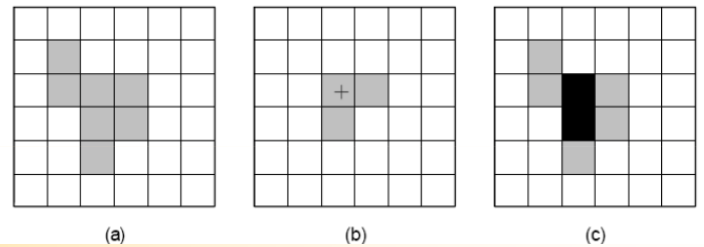

## 开运算

先腐蚀再膨胀。使图像的轮廓变得光滑，断开狭窄的间断，消除细的突出物。

## 闭运算

先膨胀再腐蚀。同样使轮廓变得光滑，但主要是消除长而细的鸿沟、小的孔洞，并填补轮廓线中的裂痕。

## 形态学的应用

### 边界提取

先腐蚀，然后用原图减去腐蚀后的图像

### 骨架

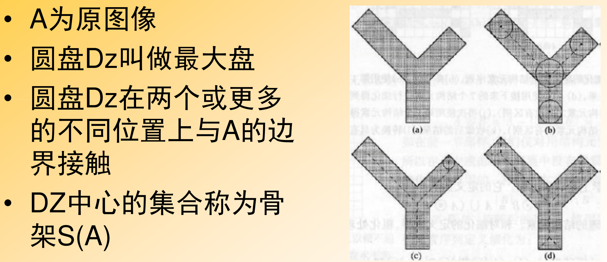

## 灰度形态学

### 灰度膨胀

将核的原点移至原图中某点$a$，在核的范围内将原图各点的灰度值与核各点的灰度值相加，取最大值作为$a$新的灰度值。

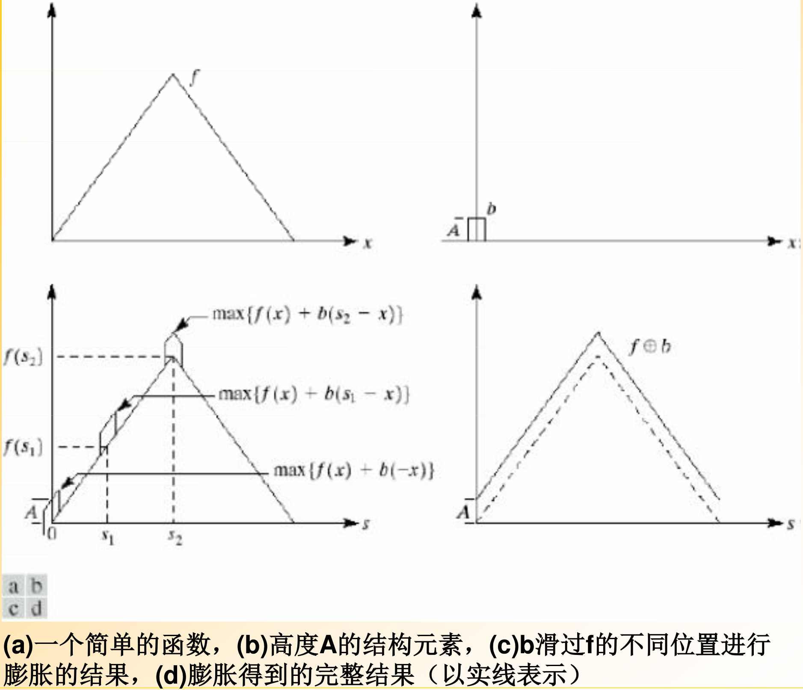

### 灰度腐蚀

类似于灰度膨胀，只不过是取原图灰度减核灰度的最小值。

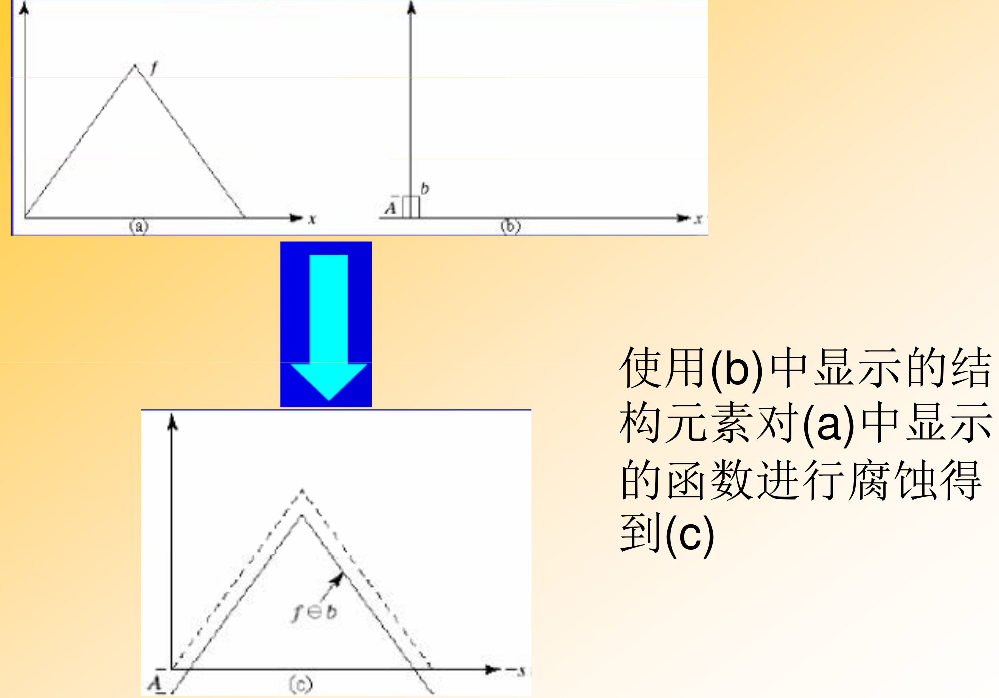

### 灰度开运算和灰度闭运算

示例：电路板去除文字保留线路、机场跑道检测等

# 边缘检测

## 边缘

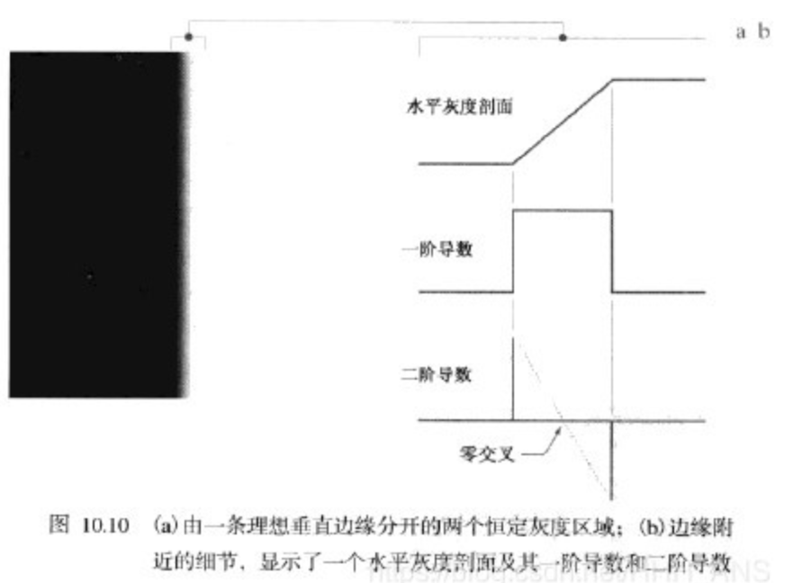

一阶导数可以用于检测图像中的一个点是否是边缘的点。边缘在一阶导数绝对值最大处。
二阶导数的符号可以用于判断一个边缘像素在边缘亮的一边还是暗的一边（正$\to$暗，负$\to$亮）。边缘在二阶导数过零点处。

## 边缘检测算子

### 梯度算子

使用模板计算一阶梯度，对图像做卷积，从而检测边缘。

- Roberts算子
$$
M_x = 
\begin{pmatrix}
0 & 1 \\
-1 & 0
\end{pmatrix}
\qquad
M_y = 
\begin{pmatrix}
1 & 0 \\
0 & -1
\end{pmatrix}
\qquad
g(x,y)=\sqrt{G_x^2+G_y^2}
$$
- Prewitt算子
$$
M_x = 
\begin{pmatrix}
-1 & 0 & 1 \\
-1 & 0 & 1 \\
-1 & 0 & 1
\end{pmatrix}
\qquad
M_y = 
\begin{pmatrix}
1 & 1 & 1 \\
0 & 0 & 0 \\
-1 & -1 & -1
\end{pmatrix}
\qquad
g(x,y)=\sqrt{G_x^2+G_y^2}
$$
- Sobel算子
$$
M_x = 
\begin{pmatrix}
-1 & 0 & 1 \\
-2 & 0 & 2 \\
-1 & 0 & 1
\end{pmatrix}
\qquad
M_y = 
\begin{pmatrix}
1 & 2 & 1 \\
0 & 0 & 0 \\
-1 & -2 & -1
\end{pmatrix}
\qquad
g(x,y)=\sqrt{G_x^2+G_y^2}
$$

### 拉普拉斯算子

使用模板计算二阶梯度，对图像做卷积，从而检测边缘。对噪声敏感，容易产生双像素边缘。拉普拉斯算子的模板可以有多种形式，以下是两种常用的形式。

$$
\begin{pmatrix}
0 & 1 & 0 \\
1 & -4 & 1 \\
0 & 1 & 0
\end{pmatrix}
\qquad 或 \qquad
\begin{pmatrix}
1 & 1 & 1 \\
1 & -8 & 1 \\
1 & 1 & 1
\end{pmatrix}
$$

### Canny算子

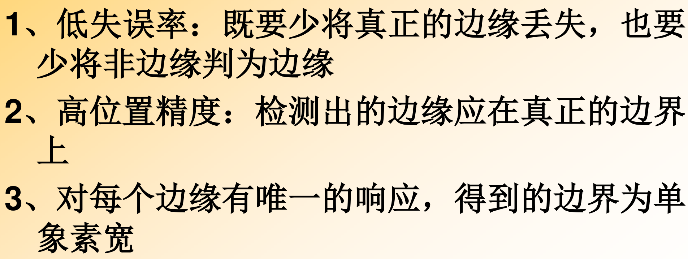

# 图像分割

## 直方图

图像中不同灰度值的像素所占的比例。
若直方图呈现双峰分布，可取一个介于两峰之间的阈值分离前景和背景。

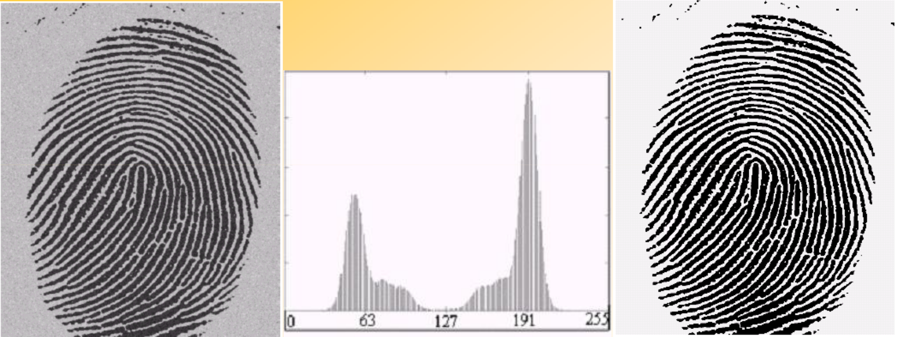

## 多阈值分割

## 灰度均衡

将原图的灰度范围映射到新的范围，增大对比度。具体方法包括线性均衡、对数均衡、指数均衡等

## 局部阈值

先进行单阈值分割，然后将分割后的结果作为种子，在原图中生长（灰度相近的视为同一物体）

# 尺寸测量

## 点检测

用空域的高通滤波来检测孤立点。

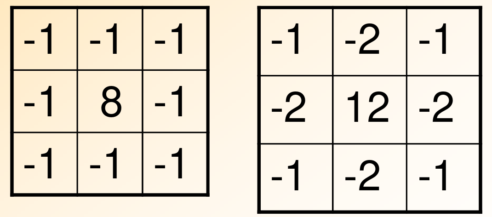

## 线检测

Hough变换

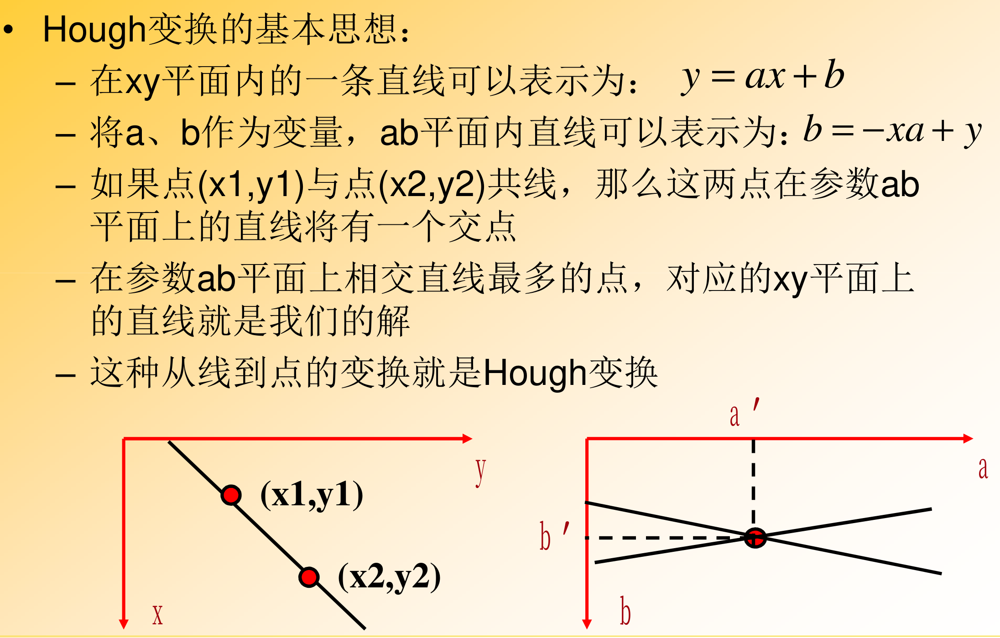

由于垂直直线的斜率$a$无穷大，一般用极坐标形式
$\rho = xcos\theta + ysin\theta$\
除了检测直线外，Hough变换也可用于检测曲线，如圆、椭圆等。

## 间距测量

关键是检测到准确的边缘。

## 角度检测

# 图像变换

## 反转变换

$s=L-1-r$ 适用于增强嵌入于暗区域中的白色或灰色细节

## 对数变换

$s=clog(1+r)$ 适用于增强图像中低灰度的部分

## 幂律（伽马）变换

$s=cr^\gamma$
当$\gamma < 1$时增强低灰度部分，当$\gamma > 1$时增强高灰度部分

## 分段线性变换

对于不同的灰度范围采用不同的线性变换，从而增强特定的灰度范围，增大对比度

## 直方图均衡化

增大对比度

## 仿射变换

用一个矩阵对原图像进行平移、旋转、缩放、切变（下图中的“偏移”）。

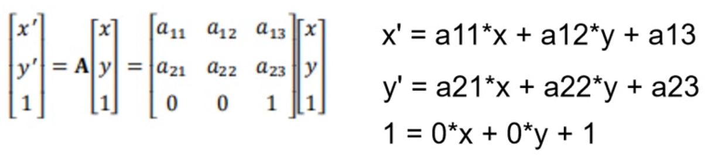 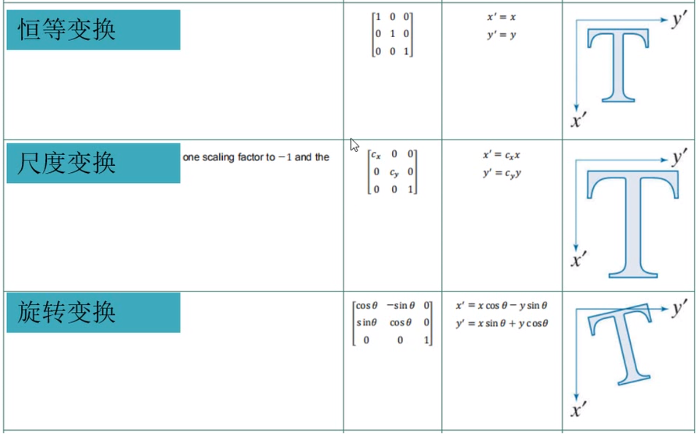
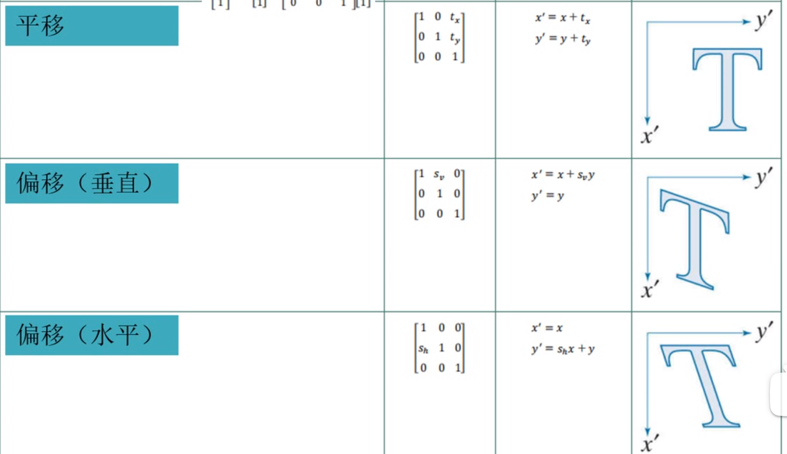

## 投影变换

### 投影方式

投影变换分为平行投影（正交投影）和中心投影（透视投影），如下图所示。

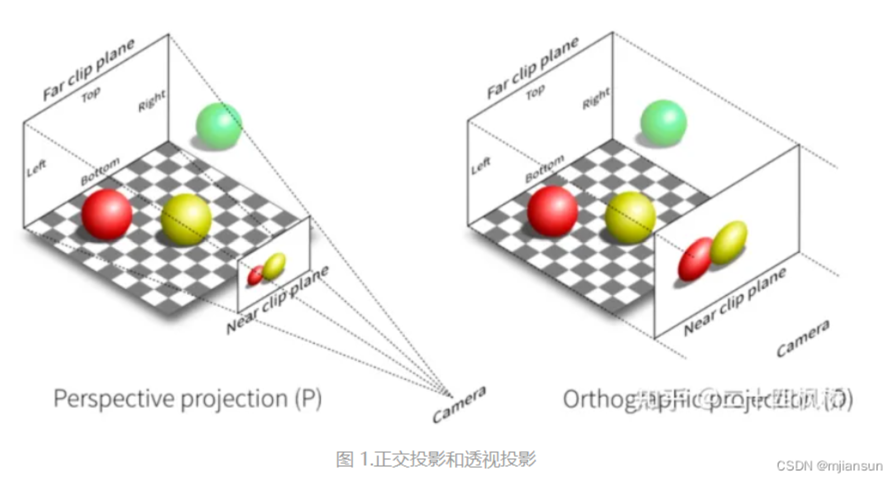

### 单应性变换

单应性的严谨定义非常复杂，这里给出一个不严谨的定义：用**无镜头畸变**的相机从不同位置拍摄**同一平面物体**的图像之间存在单应性，可以用**透视变换**表示。在计算机视觉中，平面的单应性被定义为从一个平面到另一个平面的投影映射(Projective Mapping)。

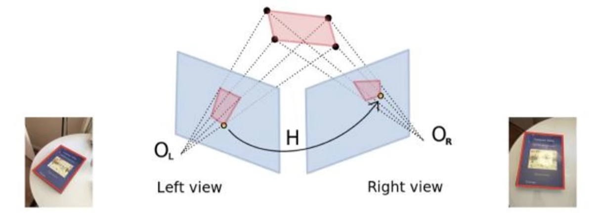

和仿射变换一样，单应性变换也可以通过一个矩阵来实现，这个矩阵就称为单应性变换矩阵，它主要用来解决两个问题：

- 通过透视变换实现把真实世界中一个平面变换到对应的图像上（三维到二维之间的变换）
- 通过透视变换实现图像从一种视图变换到另外一种视图（二维到二维之间的变换）

单应性变换的实际应用包括图像拼接时的对齐问题、计算机图形学中的纹理渲染和平面阴影计算、扭曲图像的校正等。

### 单应性变换矩阵

和仿射变换一样，单应性变换矩阵也是一个3×3的矩阵，所以可以简单表示为：
$$
    \begin{pmatrix}
        x' \\ y' \\ 1
    \end{pmatrix}
    =
    H_{3\times3} \times
    \begin{pmatrix}
        x \\ y \\ 1
    \end{pmatrix}
$$
写成更一般的情况则为：
$$
    \begin{pmatrix}
        x' \\ y' \\ 1
    \end{pmatrix}
    =
    \begin{pmatrix}
    h_{11} & h_{12} & h_{13} \\
    h_{21} & h_{22} & h_{23} \\
    h_{31} & h_{32} & h_{33}
    \end{pmatrix}
    \begin{pmatrix}
        x \\ y \\ 1
    \end{pmatrix}
    =
    \begin{pmatrix}
    h_{11}x+h_{12}y+h_{13} \\
    h_{21}x+h_{22}y+h_{23} \\
    h_{31}x+h_{32}y+h_{33}
    \end{pmatrix}
$$
从上式可以得到：
$$
    x' = \frac{h_{11}x+h_{12}y+h_{13}}{h_{31}x+h_{32}y+h_{33}} \\[10pt]
    y' = \frac{h_{21}x+h_{22}y+h_{23}}{h_{31}x+h_{32}y+h_{33}}
$$
经过进一步变换并写成矩阵$AX=0$的形式：
$$
    \begin{pmatrix}
    x & y & 1 & 0 & 0 & 0 & -x'x & -x'y & -x' \\
    0 & 0 & 0 & x & y & 1 & -y'x & -y'y & -y'
    \end{pmatrix}
    \begin{pmatrix}
    h_{11} \\ h_{12} \\ h_{13} \\
    h_{21} \\ h_{22} \\ h_{23} \\
    h_{31} \\ h_{32} \\ h_{33}
    \end{pmatrix}
    =
    0
$$
也就是说一组匹配点$(x,y) \rarr (x',y')$对应两个方程，我们只需要确定单应性变换矩阵的9个参数中有几个独立的参数，然后取一定数目的匹配点，就可以将矩阵解出来。仔细观察可以发现，如果在原来的单应性矩阵前乘上一个常数$a(a \neq 0)$，$x'$、$y'$的表达式并不会改变，即：
$$
    \begin{pmatrix}
        x' \\ y' \\ 1
    \end{pmatrix}
    =
    aH
    \begin{pmatrix}
        x \\ y \\ 1
    \end{pmatrix}
    \\[10pt]
    x' = \frac{h_{11}x+h_{12}y+h_{13}}{h_{31}x+h_{32}y+h_{33}} \\[10pt]
    y' = \frac{h_{21}x+h_{22}y+h_{23}}{h_{31}x+h_{32}y+h_{33}}
$$
因此，不妨令$a=\frac{1}{h_{33}}$，则：
$$
    H'=aH=
    \begin{pmatrix}
    \frac{h_{11}}{h_{33}} & \frac{h_{12}}{h_{33}} & \frac{h_{13}}{h_{33}} \\
    \frac{h_{21}}{h_{33}} & \frac{h_{22}}{h_{33}} & \frac{h_{23}}{h_{33}} \\
    \frac{h_{31}}{h_{33}} & \frac{h_{32}}{h_{33}} & 1
    \end{pmatrix}
    =
    \begin{pmatrix}
    h'_{11} & h'_{12} & h'_{13} \\
    h'_{21} & h'_{22} & h'_{23} \\
    h'_{31} & h'_{32} & 1
    \end{pmatrix}
$$
所以，单应性矩阵虽然有9个参数，但只有8个自由度，求解时一般令$h_{33}=1$。上文我们已经知道一组匹配点对应两个方程，因此只需四组对应点（不共线）即可解出单应性变换矩阵。

# 3D视觉

## 激光测距原理

$z=\frac{b*f}{d}$ &emsp;&emsp; $z$：待测距离 $b$：基线 $f$：焦距
$d$：光斑与CMOS中心的距离

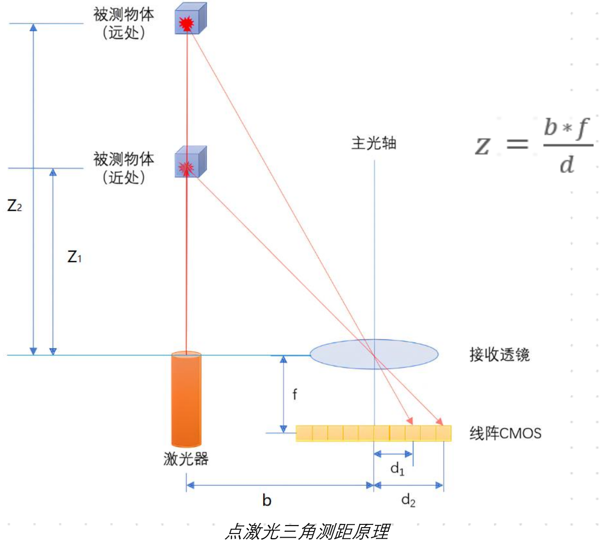

## 结构光

### 散斑结构光

投射编码散斑到物体上。

### 条纹结构光

投射多张编码条纹图，对每条竖线唯一编码，最后对每条竖线利用激光测距原理进行求解。由于需要多次投影和拍摄，速度较慢。

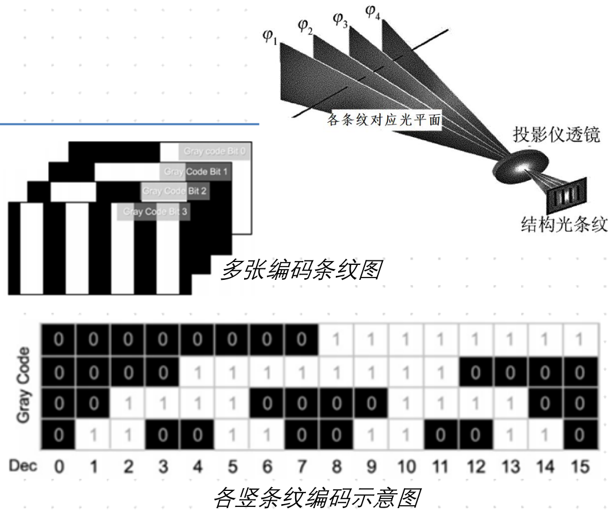

## 双目立体视觉

提取左右两张图像中的特征点，建立一一匹配关系，通过视差求解距离，计算量巨大，速度慢。

## TOF

### 测量原理

$d = \frac{\Delta t * c}{2}$
计算量很小，速度快，但精度较低，一般在cm量级。

### 两种方式

dTOF：直接测量时间，测量精度主要受限于时钟的精度。
iTOF：通过测量发射波和接受波之间的相位差间接测量时间。

## 小结

拍摄时间：条纹结构光（10+张）$>>$ 双目（2张）\> 散斑（1张）\> 线激光 \> 点激光
计算时间：双目 \> 条纹结构光 \> 散斑结构光 \> 线激光 \> 点激光
温漂影响：双目好于TOF好于结构光（一般带投射器的方案受温漂影响较大）
3D相机选型：相机视野、工作距离、成像时间、可靠性（防尘防水、振动防护等）、测量精度（绝对精度、重复度）、分辨率、点云密度等

# 相机标定

## 基本概念

内参矩阵：从相机坐标系转换到图像坐标系，$3 \times 3$矩阵。
外参矩阵：从世界坐标系转换到相机坐标系，$[R|T]$，$3 \times 4$矩阵。
畸变参数：$(k_{1},k_{2},p_{1},p_{2}[,k_{3}[,k_{4},k_{5},k_{6}]])$，其中$k$为径向畸变参数，$p$为切向畸变参数，一般取到$k_{3}$即可。

## 手眼标定

核心公式：$AX=XB$
解释：对于ETH，可通过标定板$\to$机器人末端$\to$机器人底座和标定板$\to$相机$\to$机器人底座两条路径列出标定板在机器人坐标系中的位置，其中相机坐标系和机器人底座的转换关系未知（待求），标定板和机器人末端的坐标转换未知（可消去）；对于EIH，可通过标定板$\to$机器人底座和标定板$\to$相机$\to$机器人末端$\to$机器人底座两条路径列出标定板在机器人坐标系中的位置，其中相机坐标系和机器人末端的转换关系未知（待求），标定板和机器人底座的坐标转换未知（可消去）。因此只要在两个不同位姿分别拍照，消去标定板和机器人末端/底座的坐标转换，即可化为$AX=XB$形式，其中$X$为待求坐标转换。

# 附录一 相机内参和畸变

## 简介

相机的四个坐标系：世界坐标系、相机坐标系、图像坐标系、像素坐标系。其中从世界坐标系到相机坐标系的变换也就是相机的外参矩阵，和相机在世界坐标系中的位姿有关，前文关于手眼标定的章节已有详述，此处不再赘述。而从相机坐标系到图像坐标系再到像素坐标系的变换即为相机的内参矩阵，和相机本身的结构尺寸有关，一般相机出厂时内参就确定下来了。

## 内参矩阵

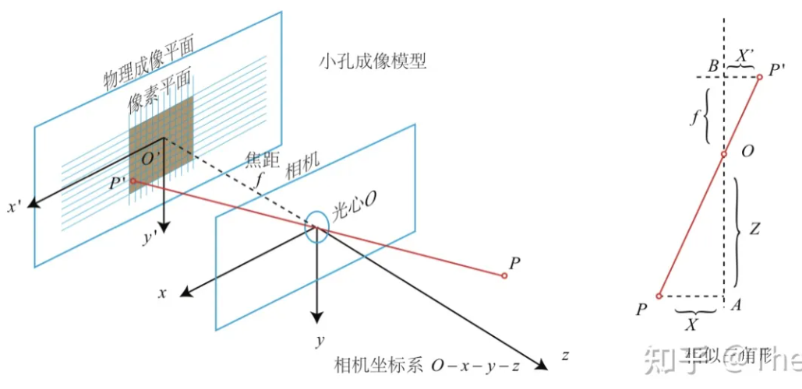

如上图所示，我们把相机看作是针孔，现实世界中的一点$P$经过相机的光心$O$，投影到物理成像平面（图像传感器）上，变为点$P'$。对这个模型进一步简化，可以看作右图所示的相似三角形。设$O-x-y-z$为相机坐标系，根据三角形相似关系，则有：
$$\frac{Z}{f} = -\frac{X}{X'} = -\frac{Y}{Y'}$$
其中$f$表示焦距，有负号是因为坐标轴方向，也表示了成的像是倒立的。为了表示方便，我们可以把成像平面从相机的后面对称到前面去，负号就没有了，如下图所示：

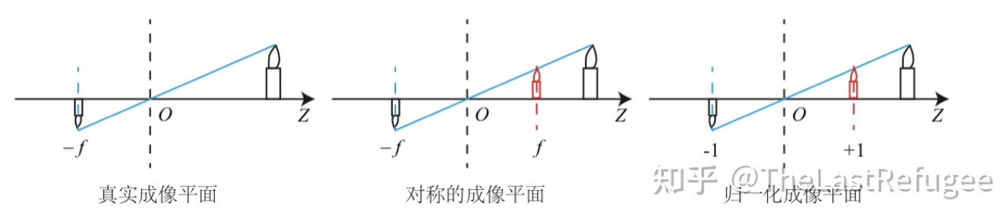

整理解出$P'$的坐标: $$X' = f\frac{X}{Z}
    \qquad
    Y' = f\frac{Y}{Z}$$
至此，我们就把真实世界中的一点$P$映射到了物理成像平面上，即从相机坐标系到图像坐标系。值得注意的是，此时$X'$、$Y'$的单位仍为长度单位，而不是像素，因此我们还需要进一步从图像坐标系转换到像素坐标系。像素坐标系$o-u-v$也位于物理成像平面上，其中原点$o$位于图像的左上角，$u$轴与$x$轴平行，$v$轴与$y$轴平行。设像素和长度在$u$轴上缩放倍数为$\alpha$，在$v$轴上缩放倍数为$\beta$，同时原点从成像平面中心移动到左上角移动了$[c_x, c_y]^T$，则点$P'$在像素坐标系中的坐标$[u,v]^T$为：
$$\begin{split}
    u = \alpha X' + c_x = \alpha f\frac{X}{Z}+c_x = f_x\frac{X}{Z}+c_x
    \\
    v = \beta Y' + c_y = \beta f\frac{Y}{Z}+c_y = f_y\frac{Y}{Z}+c_y
    \end{split}$$
其中$f_x=\alpha f$，$f_y = \beta f$。$f_x$，$f_y$的单位是像素。用齐次坐标
把上式写成矩阵的形式： $$\begin{pmatrix}
        u \\ v \\ 1
    \end{pmatrix}
    =
    \frac{1}{Z}
    \begin{pmatrix}
        f_x & 0 & c_x  \\
        0 & f_y & c_y  \\
        0 & 0 & 1
    \end{pmatrix}
    \begin{pmatrix}
        X \\ Y \\ Z
    \end{pmatrix}
    =
    \frac{1}{Z}\mathbf{K}\mathbf{P}$$ 如果把$Z$写到等式左边，就变成了：
$$Z
    \begin{pmatrix}
        u \\ v \\ 1
    \end{pmatrix}
    =
    \begin{pmatrix}
        f_x & 0 & c_x  \\
        0 & f_y & c_y  \\
        0 & 0 & 1
    \end{pmatrix}
    \begin{pmatrix}
        X \\ Y \\ Z
    \end{pmatrix}
    =
    \mathbf{K}\mathbf{P}$$ 其中的$\mathbf{K}$即为相机的内参矩阵。

## 畸变

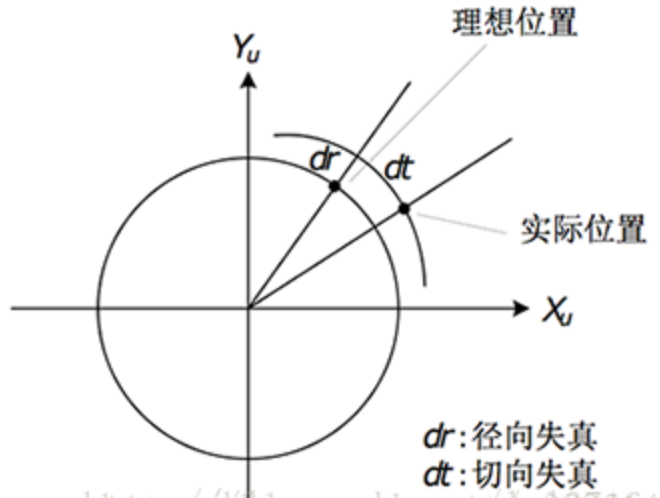

径向畸变（桶形畸变和枕形畸变）产生原因：光线在远离透镜中心的地方偏折更大。矫正公式：

$$\begin{split}
        x_{corrected} = x(1 + k_1 r^2 + k_2 r^4 + k_3 r^6) \\
        y_{corrected} = y(1 + k_1 r^2 + k_2 r^4 + k_3 r^6)
    \end{split}$$

切向畸变产生原因：透镜不完全平行于图像平面。矫正公式：

$$\begin{split}
        x_{corrected} = x + [2p_1 xy + p_2(r^2 + 2x^2)] \\
        y_{corrected} = y + [p_1(r^2 + 2y^2) + 2p_2 xy]
    \end{split}$$

由此得到相机的5个畸变参数：$D (k_1, k_2, k_3, p_1, p_2)$
