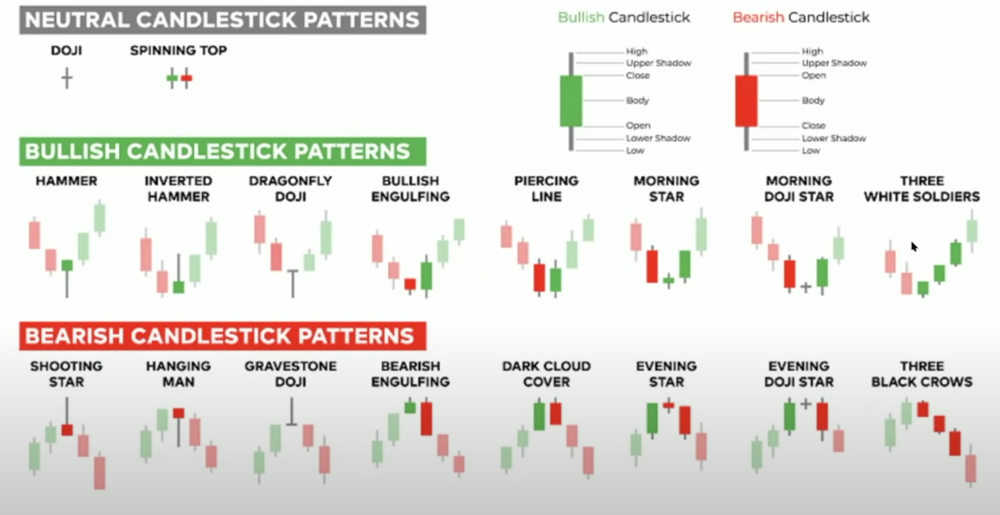
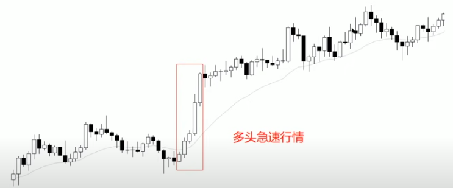
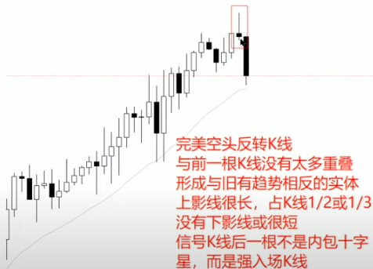

- [价格行为技术分析](#价格行为技术分析)
  - [基础K线形态](#基础k线形态)
    - [title 2](#title-2)

# 价格行为技术分析

## 基础K线形态

*市场只有两种运动状态：趋势运动和非趋势运动。K线也是一样，一根K线要么是趋势K线，要么是非趋势K线。*

- 趋势K线：实体占K线主要部分，实体越长影线越短代表趋势能量越强，即多空某一方完全控制了这根K线。但是，过长的趋势K线也可能是高潮行情，是多空某一方能量耗尽的表现。
  - 连续不重叠的同方向的趋势K线就是急速行情，代表趋势运动能量强劲。
  

- 非趋势K线：K线实体很小影线很长，影线占主要部分，也就是通常所说的十字星。非趋势K线意味着多空双方均未能控制这根K线，行情运动出现了停顿，没有明确方向。

- 反转K线：对前一根或数根K线的运行方向造成某种程度反转的K线。
  - 空头反转K线：与前一根K线没有太多重叠，实体为阴线，上影线很长，没有下影线或很短，后一根K线为强空头趋势K线而非十字星。
  
  长周期的空头反转K线在短周期上表现为一段多头急速行情后产生了空头突破，趋势反转。

### title 2